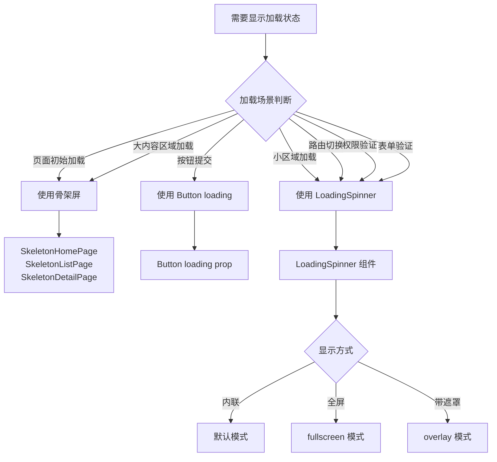

# Design Document

## Overview

本设计文档详细描述了 MovieFront 项目加载状态统一优化的技术架构和实现方案。系统将统一所有 LoadingSpinner 实现，建立清晰的加载状态使用规范，确保骨架屏和 spinner 在不同场景下的合理使用。

核心设计理念：
- **统一性**：所有 spinner 使用同一个 LoadingSpinner 组件
- **清晰性**：明确的使用场景规范（骨架屏 vs spinner）
- **可复用性**：LoadingSpinner 组件功能完善，适用于各种场景
- **性能优先**：使用 CSS 动画和硬件加速
- **可访问性**：遵循 WCAG 标准，对屏幕阅读器友好

## Architecture

### 加载状态决策树



### 组件层次结构

```
加载状态系统
├── 骨架屏系统 (Skeleton)
│   ├── SkeletonHomePage - 首页骨架屏
│   ├── SkeletonListPage - 列表页骨架屏
│   ├── SkeletonHero - Hero 区域骨架屏
│   ├── SkeletonMovieDetail - 影片详情骨架屏
│   └── SkeletonPhotoDetail - 写真详情骨架屏
│
└── Spinner 系统 (LoadingSpinner)
    ├── LoadingSpinner - 统一的 spinner 组件
    ├── Button (集成 LoadingSpinner)
    ├── RouteLoader (路由懒加载)
    └── AuthGuards (权限验证)
```

### 使用场景映射

| 场景 | 组件 | 说明 |
|------|------|------|
| 首页初始加载 | SkeletonHomePage | 完整页面骨架屏 |
| 列表页初始加载 | SkeletonListPage | 完整页面骨架屏 |
| 详情页初始加载 | SkeletonHero + SkeletonDetail | 分区域骨架屏 |
| 分页切换 | SkeletonCardGrid | 仅内容区骨架屏 |
| 按钮提交 | Button loading | 按钮内 spinner |
| 路由切换 | LoadingSpinner (fullscreen) | 全屏居中 spinner |
| 权限验证 | LoadingSpinner (fullscreen) | 全屏居中 spinner + 文本 |
| 小区域加载 | LoadingSpinner | 内联 spinner |
| 模态框加载 | LoadingSpinner (overlay) | 带遮罩 spinner |


## Components and Interfaces

### 1. LoadingSpinner 组件（重构）

统一的加载旋转器组件，支持多种尺寸、颜色和显示模式。

```typescript
interface LoadingSpinnerProps {
  /**
   * 旋转器尺寸
   * @default 'md'
   */
  size?: 'xs' | 'sm' | 'md' | 'lg' | 'xl'
  
  /**
   * 自定义类名
   */
  className?: string
  
  /**
   * 显示文本
   */
  text?: string
  
  /**
   * 自定义颜色
   * @default 'currentColor'
   */
  color?: string
  
  /**
   * 全屏模式 - 居中显示在全屏容器中
   * @default false
   */
  fullscreen?: boolean
  
  /**
   * 遮罩模式 - 显示半透明遮罩层
   * @default false
   */
  overlay?: boolean
  
  /**
   * 动画速度（秒）
   * @default 1
   */
  speed?: number
  
  /**
   * 是否禁用动画
   * @default false
   */
  disableAnimation?: boolean
}
```

**尺寸映射**：

```typescript
const sizeClasses = {
  xs: 'h-3 w-3 border', // 12x12px, 1px border
  sm: 'h-4 w-4 border', // 16x16px, 1px border
  md: 'h-8 w-8 border-2', // 32x32px, 2px border
  lg: 'h-12 w-12 border-2', // 48x48px, 2px border
  xl: 'h-16 w-16 border-3', // 64x64px, 3px border
}
```

### 2. RouteLoader 组件（新建）

统一的路由懒加载 fallback 组件。

```typescript
interface RouteLoaderProps {
  /**
   * 延迟显示时间（毫秒）
   * @default 200
   */
  delay?: number
  
  /**
   * 显示文本
   */
  text?: string
}
```

### 3. Button 组件（更新）

更新 Button 组件以使用统一的 LoadingSpinner。

**按钮尺寸与 Spinner 尺寸映射**：

```typescript
const buttonSizeToSpinnerSize: Record<ButtonSize, LoadingSpinnerSize> = {
  xs: 'xs',
  sm: 'xs',
  md: 'sm',
  lg: 'sm',
  xl: 'md',
}
```

## Data Models

### LoadingSpinner 配置

```typescript
interface LoadingSpinnerConfig {
  // 默认配置
  defaultSize: LoadingSpinnerSize
  defaultSpeed: number
  defaultColor: string
  
  // 场景配置
  scenarios: {
    route: {
      size: 'lg'
      fullscreen: true
      delay: 200
    }
    auth: {
      size: 'lg'
      fullscreen: true
      delay: 0
    }
    button: {
      size: 'xs' | 'sm' // 根据按钮尺寸
      inline: true
    }
    modal: {
      size: 'md'
      overlay: true
    }
    inline: {
      size: 'sm'
      inline: true
    }
  }
}
```

### 主题配置

```typescript
interface SpinnerThemeConfig {
  light: {
    borderColor: string // 底色
    accentColor: string // 高亮色
  }
  dark: {
    borderColor: string
    accentColor: string
  }
}

const defaultTheme: SpinnerThemeConfig = {
  light: {
    borderColor: '#d1d5db', // gray-300
    accentColor: '#2563eb', // blue-600
  },
  dark: {
    borderColor: '#4b5563', // gray-600
    accentColor: '#60a5fa', // blue-400
  },
}
```


## Testing Strategy

### 单元测试

#### LoadingSpinner 组件测试

```typescript
describe('LoadingSpinner', () => {
  it('should render with default props', () => {
    const { container } = render(<LoadingSpinner />)
    expect(container.querySelector('.animate-spin')).toBeInTheDocument()
  })
  
  it('should render with custom size', () => {
    const { container } = render(<LoadingSpinner size="lg" />)
    expect(container.querySelector('.h-12')).toBeInTheDocument()
  })
  
  it('should render in fullscreen mode', () => {
    const { container } = render(<LoadingSpinner fullscreen />)
    expect(container.querySelector('.min-h-screen')).toBeInTheDocument()
  })
  
  it('should render with text', () => {
    const { getByText } = render(<LoadingSpinner text="Loading..." />)
    expect(getByText('Loading...')).toBeInTheDocument()
  })
  
  it('should have correct ARIA attributes', () => {
    const { container } = render(<LoadingSpinner />)
    const spinner = container.querySelector('[role="status"]')
    expect(spinner).toHaveAttribute('aria-busy', 'true')
  })
})
```

#### Button 组件 loading 状态测试

```typescript
describe('Button loading state', () => {
  it('should show spinner when loading', () => {
    const { container } = render(<Button loading>Submit</Button>)
    expect(container.querySelector('.animate-spin')).toBeInTheDocument()
  })
  
  it('should be disabled when loading', () => {
    const { getByRole } = render(<Button loading>Submit</Button>)
    expect(getByRole('button')).toBeDisabled()
  })
})
```

### 集成测试

#### 路由懒加载测试

```typescript
describe('Route lazy loading', () => {
  it('should show RouteLoader while loading', async () => {
    const { getByRole, queryByRole } = render(
      <BrowserRouter>
        <Routes>
          <Route path="/" element={<LazyComponent />} />
        </Routes>
      </BrowserRouter>
    )
    
    expect(getByRole('status')).toBeInTheDocument()
    
    await waitFor(() => {
      expect(queryByRole('status')).not.toBeInTheDocument()
    })
  })
})
```

## Implementation Plan

### Phase 1: 重构 LoadingSpinner 组件（优先级：高）

1. 更新 LoadingSpinner 组件，添加新功能
   - 添加 text、color、fullscreen、overlay、speed 属性
   - 优化尺寸系统（xs/sm/md/lg/xl）
   - 添加主题支持
   - 添加可访问性属性
   - 添加减少动画偏好检测

2. 编写单元测试

### Phase 2: 创建 RouteLoader 组件（优先级：高）

1. 创建 RouteLoader 组件
   - 实现延迟显示逻辑
   - 使用 LoadingSpinner
   - 支持自定义文本

2. 更新 routes.tsx
   - 移除旧的 LoadingSpinner 实现
   - 使用新的 RouteLoader 组件

### Phase 3: 更新 Button 组件（优先级：高）

1. 重构 Button 组件的 loading 状态
   - 移除内联 SVG spinner
   - 使用统一的 LoadingSpinner
   - 实现按钮尺寸到 spinner 尺寸的映射

2. 更新 Button 组件测试

### Phase 4: 更新权限验证组件（优先级：中）

1. 更新 ProtectedRoute 组件
2. 更新 GuestRoute 组件
3. 更新 AdminRoute 组件
4. 编写集成测试

### Phase 5: 更新其他使用场景（优先级：中）

1. 更新 SettingsPage
2. 更新 DashboardPage
3. 检查并更新其他使用 spinner 的地方

### Phase 6: 清理和文档（优先级：低）

1. 清理重复的 spinner 样式定义
2. 创建加载状态使用文档
   - 使用场景决策树
   - API 文档
   - 最佳实践
   - 示例代码
3. 更新 Storybook

## Design Decisions and Rationales

### 为什么保留骨架屏和 Spinner 两种方式？

**决策**：保留骨架屏用于页面级加载，spinner 用于小区域和交互加载

**理由**：
1. **用户体验**：骨架屏提供更好的内容预期，spinner 更适合短时间等待
2. **性能**：骨架屏可以在 SSR 时渲染，spinner 更轻量
3. **场景适配**：不同场景有不同的最佳实践
4. **行业标准**：这是现代 Web 应用的通用做法

### 为什么统一 Spinner 实现？

**决策**：使用单一的 LoadingSpinner 组件替代所有重复实现

**理由**：
1. **一致性**：确保整个应用的 spinner 样式统一
2. **可维护性**：只需要维护一个组件
3. **功能完善**：统一组件可以提供更多功能
4. **减少代码**：消除重复代码

### 为什么添加延迟显示？

**决策**：RouteLoader 默认延迟 200ms 显示

**理由**：
1. **避免闪烁**：快速加载时不显示 spinner，避免视觉闪烁
2. **用户体验**：只在真正需要时显示加载指示器
3. **性能感知**：让应用感觉更快
4. **行业标准**：这是推荐的最佳实践

## Accessibility Considerations

### ARIA 属性

所有 LoadingSpinner 应包含：

```typescript
<div
  role="status"
  aria-busy="true"
  aria-label="Loading content"
>
  {/* spinner 内容 */}
</div>
```

### 减少动画偏好

```css
@media (prefers-reduced-motion: reduce) {
  .animate-spin {
    animation: none;
  }
}
```

## Performance Optimization

### 使用 CSS Transform

```css
/* ✅ 好 - 使用 transform */
.animate-spin {
  animation: spin 1s linear infinite;
}

@keyframes spin {
  from {
    transform: rotate(0deg);
  }
  to {
    transform: rotate(360deg);
  }
}
```

### 延迟显示

```typescript
// 避免快速加载时的闪烁
const [show, setShow] = useState(false)

useEffect(() => {
  const timer = setTimeout(() => setShow(true), 200)
  return () => clearTimeout(timer)
}, [])

if (!show) return null
```

## Migration Guide

### 从旧的 LoadingSpinner 迁移

#### 步骤 1: 更新导入

```typescript
// 保持不变
import { LoadingSpinner } from '@components/atoms'
```

#### 步骤 2: 更新使用方式

```typescript
// 旧的
<LoadingSpinner size="lg" />

// 新的（支持更多功能）
<LoadingSpinner 
  size="lg" 
  text="加载中..."
  fullscreen
/>
```

### 从内联 Spinner 迁移

#### routes.tsx

```typescript
// 旧的
const LoadingSpinner: React.FC = () => (
  <div className="flex min-h-screen items-center justify-center">
    <div className="h-32 w-32 animate-spin rounded-full border-b-2 border-blue-600"></div>
  </div>
)

// 新的
import { RouteLoader } from '@components/atoms'
const SuspenseWrapper: React.FC<{ children: React.ReactNode }> = ({
  children,
}) => <Suspense fallback={<RouteLoader />}>{children}</Suspense>
```

## Conclusion

本设计文档提供了一个完整的加载状态统一优化方案，通过统一 LoadingSpinner 实现、建立清晰的使用规范、优化组件功能，确保整个应用中加载状态的一致性和用户体验。系统既保留了骨架屏的优势，又提供了灵活的 spinner 解决方案，能够满足各种加载场景的需求。
