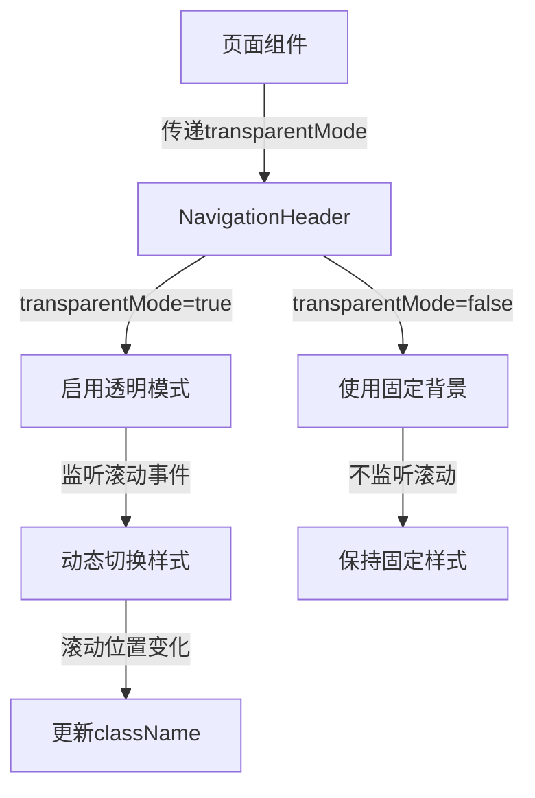

# Design Document

## Overview

本设计文档描述了导航栏透明度行为改进功能的技术实现方案。该功能通过为NavigationHeader组件添加transparentMode配置属性，实现首页和其他页面的差异化导航样式。首页导航将支持初始透明状态和滚动触发的背景显示，而其他页面将保持固定的模糊背景样式。

## Architecture

### 组件层次结构

```
NavigationHeader (organisms)
├── Props: transparentMode (新增)
├── Internal State: 背景样式状态
└── Effect: 滚动事件监听（条件性）

HomePage (pages)
└── NavigationHeader (transparentMode={true})

OtherPages (pages)
└── NavigationHeader (transparentMode={false} 或默认)
```

### 数据流



## Components and Interfaces

### 1. NavigationHeader组件接口扩展

**文件路径:** `MovieFront/src/presentation/components/organisms/Header/NavigationHeader.tsx`

**接口修改:**

```typescript
export interface NavigationHeaderProps {
  currentPage?: keyof typeof pageConfigs
  showSearch?: boolean
  showAuth?: boolean
  logoText?: string
  logoIcon?: string
  searchPlaceholder?: string
  loginText?: string
  registerText?: string
  className?: string
  transparentMode?: boolean // 新增：控制透明模式
}
```

**Props说明:**
- `transparentMode`: 可选布尔值，默认为false
  - `true`: 启用透明模式（首页使用）
  - `false`或未设置: 使用固定模糊背景（其他页面使用）

### 2. 样式类名定义

**透明模式样式类:**
```typescript
const TRANSPARENT_CLASSES = 'bg-transparent backdrop-blur-0'
```

**固定背景样式类:**
```typescript
const SOLID_CLASSES = 'bg-white/80 dark:bg-gray-900/80 backdrop-blur-md'
```

**基础样式类（始终应用）:**
```typescript
const BASE_CLASSES = 'fixed left-0 right-0 top-0 z-40 transition-colors duration-300'
```

### 3. 组件内部状态管理

使用React的useState管理当前背景样式状态：

```typescript
const [isTransparent, setIsTransparent] = useState(transparentMode)
```

## Implementation Details

### 1. NavigationHeader组件重构

**核心逻辑:**

```typescript
export const NavigationHeader = forwardRef<HTMLElement, NavigationHeaderProps>(
  (props, ref) => {
    const {
      transparentMode = false,
      className = '',
      // ... 其他props
    } = props

    const [isTransparent, setIsTransparent] = useState(transparentMode)

    // 滚动事件处理（仅在transparentMode=true时启用）
    useEffect(() => {
      if (!transparentMode) {
        // 非透明模式，不监听滚动
        return
      }

      const handleScroll = () => {
        const scrollY = window.scrollY
        const shouldBeTransparent = scrollY < 100 // 滚动阈值可调整
        
        if (shouldBeTransparent !== isTransparent) {
          setIsTransparent(shouldBeTransparent)
        }
      }

      // 初始检查
      handleScroll()

      // 添加滚动监听
      window.addEventListener('scroll', handleScroll, { passive: true })

      return () => {
        window.removeEventListener('scroll', handleScroll)
      }
    }, [transparentMode, isTransparent])

    // 动态计算className
    const headerClassName = `
      ${BASE_CLASSES}
      ${transparentMode && isTransparent ? TRANSPARENT_CLASSES : SOLID_CLASSES}
      ${className}
    `.trim()

    return (
      <header ref={ref} id="site-header" className={headerClassName}>
        {/* 组件内容保持不变 */}
      </header>
    )
  }
)
```

### 2. HomePage组件更新

**文件路径:** `MovieFront/src/presentation/pages/home/HomePage.tsx`

**修改内容:**

```typescript
const HomePage: React.FC = () => {
  const headerRef = useRef<HTMLElement>(null)
  const heroRef = useRef<HTMLElement>(null)

  // 移除现有的滚动效果useEffect（逻辑已移至NavigationHeader内部）

  return (
    <div className="min-h-screen">
      <NavigationHeader 
        ref={headerRef} 
        transparentMode={true}  // 启用透明模式
      />
      {/* 其他内容保持不变 */}
    </div>
  )
}
```

### 3. 其他页面组件

所有其他页面（MovieDetailPage, SpecialCollectionsPage等）保持现有代码不变，或显式传递`transparentMode={false}`：

```typescript
<NavigationHeader /> // 默认false
// 或
<NavigationHeader transparentMode={false} />
```

## Error Handling

### 1. Props验证

- `transparentMode`为可选属性，默认值为false，确保向后兼容
- 类型检查通过TypeScript接口定义保证

### 2. 滚动事件处理

- 使用`{ passive: true }`选项优化滚动性能
- 在组件卸载时正确清理事件监听器
- 滚动阈值可配置，避免频繁状态更新

### 3. 边界情况

- **快速滚动:** 使用状态比较避免不必要的重渲染
- **页面切换:** 组件卸载时自动清理监听器
- **主题切换:** CSS类名包含主题相关类，自动适配

## Testing Strategy

### 1. 单元测试

**测试文件:** `NavigationHeader.test.tsx`

**测试用例:**

```typescript
describe('NavigationHeader - Transparent Mode', () => {
  it('应该在transparentMode=false时始终显示固定背景', () => {
    render(<NavigationHeader transparentMode={false} />)
    const header = screen.getByRole('banner')
    expect(header).toHaveClass('bg-white/80')
    expect(header).toHaveClass('backdrop-blur-md')
  })

  it('应该在transparentMode=true且页面顶部时显示透明背景', () => {
    render(<NavigationHeader transparentMode={true} />)
    const header = screen.getByRole('banner')
    expect(header).toHaveClass('bg-transparent')
    expect(header).toHaveClass('backdrop-blur-0')
  })

  it('应该在transparentMode=true且滚动后显示固定背景', () => {
    render(<NavigationHeader transparentMode={true} />)
    
    // 模拟滚动
    window.scrollY = 150
    fireEvent.scroll(window)
    
    const header = screen.getByRole('banner')
    expect(header).toHaveClass('bg-white/80')
    expect(header).toHaveClass('backdrop-blur-md')
  })

  it('应该在组件卸载时清理滚动监听器', () => {
    const removeEventListenerSpy = jest.spyOn(window, 'removeEventListener')
    const { unmount } = render(<NavigationHeader transparentMode={true} />)
    
    unmount()
    
    expect(removeEventListenerSpy).toHaveBeenCalledWith('scroll', expect.any(Function))
  })
})
```

### 2. 集成测试

**测试场景:**

1. **首页透明效果测试**
   - 访问首页，验证导航栏初始透明
   - 滚动页面，验证导航栏背景出现
   - 滚动回顶部，验证导航栏恢复透明

2. **其他页面固定背景测试**
   - 访问详情页，验证导航栏始终有背景
   - 滚动页面，验证导航栏样式不变

3. **页面切换测试**
   - 从首页切换到详情页，验证导航栏样式正确更新
   - 从详情页返回首页，验证透明效果正确恢复

### 3. 视觉回归测试

使用Storybook创建不同状态的视觉测试用例：

```typescript
export const TransparentMode: Story = {
  args: {
    transparentMode: true,
  },
}

export const SolidMode: Story = {
  args: {
    transparentMode: false,
  },
}
```

### 4. 性能测试

- 监控滚动事件处理的性能影响
- 验证passive事件监听器的效果
- 确保状态更新不会导致不必要的重渲染

## Design Decisions

### 1. 为什么使用Props而不是Context？

**决策:** 使用`transparentMode` prop直接传递配置

**理由:**
- 配置简单明确，每个页面独立控制
- 避免引入额外的Context复杂度
- 更好的类型安全和IDE支持
- 便于测试和维护

### 2. 为什么将滚动逻辑移入NavigationHeader？

**决策:** 将滚动监听逻辑从HomePage移入NavigationHeader组件内部

**理由:**
- 关注点分离：导航样式逻辑应该由导航组件自己管理
- 可重用性：其他页面如需类似效果可直接启用
- 简化页面组件：页面只需传递配置，不需要管理ref和effect
- 更好的封装性：组件内部实现细节对外部透明

### 3. 滚动阈值设计

**决策:** 使用固定的100px滚动阈值

**理由:**
- 简单直观，适合大多数场景
- 可以后续扩展为可配置属性
- 避免与Hero区域高度耦合

### 4. 样式类名管理

**决策:** 使用常量定义样式类名组合

**理由:**
- 提高代码可读性和可维护性
- 便于统一修改样式
- 减少字符串拼接错误
- 支持样式复用

## Migration Plan

### 阶段1: 组件重构
1. 修改NavigationHeader接口，添加transparentMode属性
2. 实现内部滚动监听逻辑
3. 添加单元测试

### 阶段2: 页面更新
1. 更新HomePage组件，传递transparentMode={true}
2. 移除HomePage中的旧滚动逻辑
3. 验证其他页面使用默认行为

### 阶段3: 测试验证
1. 执行单元测试和集成测试
2. 进行视觉回归测试
3. 性能测试和优化

### 阶段4: 文档更新
1. 更新组件文档
2. 添加使用示例
3. 更新Storybook stories
