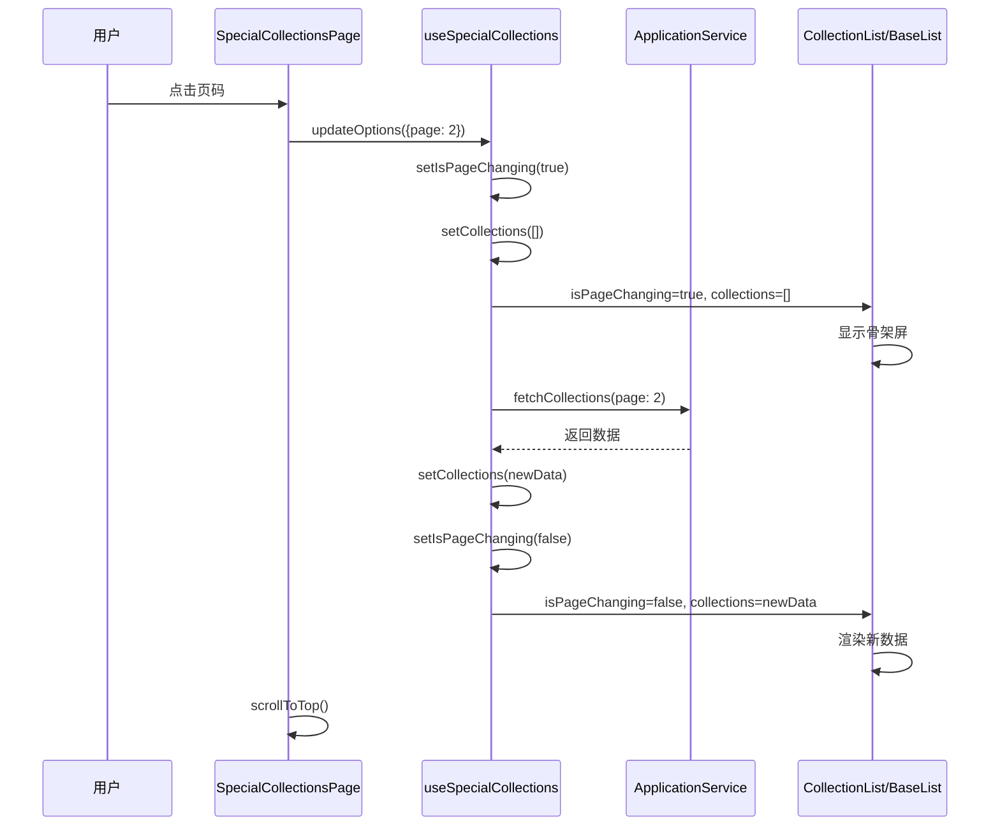

# Design Document

## Overview

本设计文档描述了如何修复专题合集页面的分页加载体验问题。当前实现中，用户切换页面时会看到旧数据残留并逐个被新数据替换，这是由于 React 状态更新的异步特性和组件渲染逻辑导致的。

核心问题在于：
1. `useSpecialCollections` hook 的 `updateOptions` 方法虽然调用了 `setCollections([])`，但由于 React 的批处理机制，状态更新不是立即生效的
2. `BaseList` 组件只在 `loading && items.length === 0` 时显示骨架屏，导致有数据时不显示加载状态
3. `useEffect` 依赖 `queryOptions` 对象，每次对象引用变化都会触发重新加载，存在死循环风险

解决方案采用以下策略：
- 引入独立的 `isPageChanging` 状态标志，明确标识页面切换过程
- 优化 `useEffect` 依赖，使用 `useRef` 存储稳定的查询参数
- 在 `BaseList` 中优先检查 `isPageChanging` 状态来显示骨架屏
- 添加请求取消机制，防止竞态条件
- 实现页面滚动到顶部的功能

## Architecture

### 组件层次结构

```
SpecialCollectionsPage (页面组件)
├── NavigationHeader (导航头部)
└── CollectionList (合集列表组件)
    └── BaseList (基础列表组件)
        ├── Skeleton (骨架屏 - 加载状态)
        ├── EmptyState (空状态)
        └── Grid Items (网格项目)
```

### 数据流



## Components and Interfaces

### 1. useSpecialCollections Hook 改进

#### 新增状态

```typescript
// 新增：页面切换标志，独立于 loading 状态
const [isPageChanging, setIsPageChanging] = useState<boolean>(false)

// 新增：使用 useRef 存储稳定的查询参数引用
const queryOptionsRef = useRef<SpecialCollectionQueryOptions>(queryOptions)

// 新增：请求取消控制器
const abortControllerRef = useRef<AbortController | null>(null)
```

#### 修改 updateOptions 方法

```typescript
const updateOptions = useCallback((newOptions: Partial<SpecialCollectionQueryOptions>) => {
  // 取消之前的请求
  if (abortControllerRef.current) {
    abortControllerRef.current.abort()
  }

  const updatedOptions = { ...queryOptionsRef.current, ...newOptions }
  
  // 检测是否是页面切换
  const isPageChange = newOptions.page !== undefined && 
                       newOptions.page !== queryOptionsRef.current.page
  
  if (isPageChange) {
    // 页面切换：立即设置标志并清空数据
    setIsPageChanging(true)
    setCollections([])
  } else if (newOptions.category !== undefined || 
             newOptions.sortBy !== undefined || 
             newOptions.includeVipOnly !== undefined) {
    // 筛选/排序变化：重置页码并清空数据
    updatedOptions.page = 1
    setCurrentPage(1)
    setIsPageChanging(true)
    setCollections([])
    setTotal(0)
  }
  
  // 更新 ref 而不是 state，避免触发 useEffect
  queryOptionsRef.current = updatedOptions
  
  // 手动触发数据加载
  fetchCollectionsWithOptions(updatedOptions)
}, [])
```

#### 修改 fetchCollections 方法

```typescript
const fetchCollectionsWithOptions = useCallback(async (
  fetchOptions: SpecialCollectionQueryOptions
) => {
  try {
    // 创建新的 AbortController
    const abortController = new AbortController()
    abortControllerRef.current = abortController

    setLoading(true)
    setError(null)

    console.log('🎬 [useSpecialCollections] 开始获取数据', fetchOptions)

    // 传递 signal 给服务层（如果支持）
    const fetchedCollections = await applicationService.getSpecialCollections(
      fetchOptions,
      { signal: abortController.signal }
    )
    
    // 检查请求是否被取消
    if (abortController.signal.aborted) {
      console.log('🎬 [useSpecialCollections] 请求已取消')
      return
    }

    // 图片优化处理
    const optimizedCollections = enableImageOptimization 
      ? fetchedCollections.map(collection => ({
          ...collection,
          imageUrl: getCollectionCover(collection.imageUrl, { 
            width: 400, 
            height: 500,
            quality: 85
          })
        }))
      : fetchedCollections

    // 更新数据
    setCollections(optimizedCollections)

    // 获取总数
    if (total === 0) {
      const totalCount = await applicationService.getSpecialCollectionsCount({
        category: fetchOptions.category,
        includeVipOnly: fetchOptions.includeVipOnly
      })
      setTotal(totalCount)
    }

    // 更新当前页码
    if (fetchOptions.page) {
      setCurrentPage(fetchOptions.page)
    }

    console.log('🎬 [useSpecialCollections] 数据获取成功', {
      count: optimizedCollections.length
    })

  } catch (err) {
    // 忽略取消错误
    if (err instanceof Error && err.name === 'AbortError') {
      console.log('🎬 [useSpecialCollections] 请求被取消')
      return
    }
    
    const errorMessage = err instanceof Error ? err.message : '获取数据失败'
    setError(errorMessage)
    console.error('🎬 [useSpecialCollections] 数据获取失败', err)
  } finally {
    setLoading(false)
    setIsPageChanging(false) // 重置页面切换标志
    abortControllerRef.current = null
  }
}, [applicationService, getCollectionCover, enableImageOptimization, total])
```

#### 修改 useEffect

```typescript
// 初始加载 - 只在组件挂载时执行一次
useEffect(() => {
  if (autoLoad) {
    fetchCollectionsWithOptions(queryOptionsRef.current)
  }
}, []) // 空依赖数组，只执行一次
```

#### 返回值新增

```typescript
return {
  // 状态
  collections,
  loading,
  error,
  total,
  hasMore,
  isPageChanging, // 新增：页面切换标志
  // 操作方法
  refresh,
  loadMore,
  updateOptions
}
```

### 2. CollectionList 组件改进

#### Props 新增

```typescript
export interface CollectionListProps {
  // ... 现有 props
  isPageChanging?: boolean // 新增：页面切换标志
}
```

#### 传递给 BaseList

```typescript
<BaseList
  items={getCurrentPageCollections()}
  variant={variant}
  columns={columns}
  loading={loading}
  isPageChanging={isPageChanging} // 新增：传递页面切换标志
  className="collection-list-container"
  renderItem={(collection) => {
    // ... 渲染逻辑
  }}
/>
```

### 3. BaseList 组件改进

#### Props 新增

```typescript
interface BaseListProps<T = any> {
  // ... 现有 props
  isPageChanging?: boolean // 新增：页面切换标志
}
```

#### 渲染逻辑修改

```typescript
export const BaseList = <T,>({
  items,
  columns = RESPONSIVE_CONFIGS.baseList,
  variant = 'grid',
  loading = false,
  isPageChanging = false, // 新增
  showEmptyState = true,
  emptyText = "暂无数据",
  className,
  renderItem,
}: BaseListProps<T>) => {
  // 优先检查页面切换状态 - 页面切换时始终显示骨架屏
  if (isPageChanging || (loading && (!items || items.length === 0))) {
    return (
      <div className={cn(
        "grid gap-4 sm:gap-6",
        generateColumnsClasses(columns),
        className
      )}>
        {Array.from({ length: 12 }).map((_, index) => (
          <div
            key={index}
            className="animate-pulse bg-gray-200 dark:bg-gray-700 rounded-lg aspect-[3/4]"
          />
        ))}
      </div>
    )
  }

  // ... 其余逻辑保持不变
}
```

### 4. SpecialCollectionsPage 组件改进

#### 使用新的 Hook 返回值

```typescript
const { 
  collections, 
  loading, 
  error, 
  total, 
  refresh, 
  updateOptions,
  isPageChanging // 新增：获取页面切换标志
} = useSpecialCollections({
  page: currentPage,
  pageSize: ITEMS_PER_PAGE,
  sortBy: 'latest',
  autoLoad: true,
  enableImageOptimization: true
})
```

#### 页面切换处理改进

```typescript
const handlePageChange = (page: number) => {
  if (page >= 1 && page <= totalPages && page !== currentPage) {
    // 更新本地状态（用于分页按钮高亮）
    setCurrentPage(page)
    
    // 通知 Hook 更新（触发数据加载）
    updateOptions({ page })
    
    // 滚动到页面顶部
    scrollToTop()
  }
}

// 平滑滚动到顶部
const scrollToTop = () => {
  window.scrollTo({
    top: 0,
    behavior: 'smooth'
  })
}
```

#### 传递给 CollectionList

```typescript
<CollectionList
  collections={collections}
  title="专题合集"
  loading={loading}
  isPageChanging={isPageChanging} // 新增：传递页面切换标志
  pagination={{
    currentPage,
    totalPages,
    onPageChange: handlePageChange,
    itemsPerPage: ITEMS_PER_PAGE,
  }}
  serverPaginated={true}
  onCollectionClick={handleCollectionClick}
  variant="grid"
  cardConfig={{
    hoverEffect: true,
    aspectRatio: 'portrait',
    showVipBadge: true,
  }}
  columns={RESPONSIVE_CONFIGS.specialPage}
/>
```

## Data Models

### SpecialCollectionQueryOptions (现有)

```typescript
export interface SpecialCollectionQueryOptions {
  page?: number
  pageSize?: number
  category?: string
  sortBy?: 'latest' | 'popular' | 'rating'
  includeVipOnly?: boolean
}
```

### UseSpecialCollectionsReturn (修改)

```typescript
export interface UseSpecialCollectionsReturn {
  // 状态
  collections: CollectionItem[]
  loading: boolean
  error: string | null
  total: number
  hasMore: boolean
  isPageChanging: boolean // 新增
  
  // 操作方法
  refresh: () => Promise<void>
  loadMore: () => Promise<void>
  updateOptions: (newOptions: Partial<SpecialCollectionQueryOptions>) => void
}
```

## Error Handling

### 1. 请求取消处理

```typescript
try {
  // ... 数据加载
} catch (err) {
  // 忽略取消错误
  if (err instanceof Error && err.name === 'AbortError') {
    console.log('请求被取消')
    return
  }
  
  // 处理其他错误
  setError(err.message)
}
```

### 2. 加载失败处理

在 `SpecialCollectionsPage` 中已有错误处理UI：

```typescript
if (error) {
  return (
    <div className="min-h-screen bg-background-light dark:bg-background-dark">
      <NavigationHeader />
      <main className="container mx-auto px-4 pb-8 pt-24 sm:px-6 lg:px-8">
        <div className="flex items-center justify-center py-12">
          <div className="text-center">
            <h2 className="text-2xl font-bold text-text-primary mb-4">加载失败</h2>
            <p className="text-text-secondary mb-6">{error}</p>
            <button 
              onClick={() => refresh()} 
              className="px-6 py-2 bg-primary text-white rounded-lg hover:bg-primary-dark transition-colors"
            >
              重新加载
            </button>
          </div>
        </div>
      </main>
    </div>
  )
}
```

### 3. 竞态条件处理

使用 `AbortController` 确保只有最新的请求结果会被应用：

```typescript
// 在 updateOptions 中取消旧请求
if (abortControllerRef.current) {
  abortControllerRef.current.abort()
}

// 在 fetchCollections 中检查取消状态
if (abortController.signal.aborted) {
  return
}
```

## Testing Strategy

### 1. 单元测试

#### useSpecialCollections Hook 测试

```typescript
describe('useSpecialCollections', () => {
  it('should set isPageChanging to true when page changes', async () => {
    const { result } = renderHook(() => useSpecialCollections())
    
    act(() => {
      result.current.updateOptions({ page: 2 })
    })
    
    expect(result.current.isPageChanging).toBe(true)
    expect(result.current.collections).toEqual([])
  })

  it('should cancel previous request when page changes quickly', async () => {
    const { result } = renderHook(() => useSpecialCollections())
    
    act(() => {
      result.current.updateOptions({ page: 2 })
      result.current.updateOptions({ page: 3 })
    })
    
    // 应该只有最后一个请求生效
    await waitFor(() => {
      expect(result.current.currentPage).toBe(3)
    })
  })

  it('should not trigger infinite loop', async () => {
    const fetchSpy = jest.spyOn(console, 'log')
    
    renderHook(() => useSpecialCollections({ autoLoad: true }))
    
    await waitFor(() => {
      const fetchCalls = fetchSpy.mock.calls.filter(
        call => call[0].includes('开始获取数据')
      )
      expect(fetchCalls.length).toBe(1) // 只应该调用一次
    })
  })
})
```

#### BaseList 组件测试

```typescript
describe('BaseList', () => {
  it('should show skeleton when isPageChanging is true', () => {
    const { container } = render(
      <BaseList
        items={[{ id: 1 }]}
        isPageChanging={true}
        renderItem={(item) => <div>{item.id}</div>}
      />
    )
    
    expect(container.querySelector('.animate-pulse')).toBeInTheDocument()
  })

  it('should show skeleton when loading and no items', () => {
    const { container } = render(
      <BaseList
        items={[]}
        loading={true}
        renderItem={(item) => <div>{item.id}</div>}
      />
    )
    
    expect(container.querySelector('.animate-pulse')).toBeInTheDocument()
  })

  it('should show items when not loading and not page changing', () => {
    const { getByText } = render(
      <BaseList
        items={[{ id: 1 }]}
        loading={false}
        isPageChanging={false}
        renderItem={(item) => <div>{item.id}</div>}
      />
    )
    
    expect(getByText('1')).toBeInTheDocument()
  })
})
```

### 2. 集成测试

```typescript
describe('SpecialCollectionsPage pagination', () => {
  it('should show skeleton and clear data when changing page', async () => {
    render(<SpecialCollectionsPage />)
    
    // 等待初始数据加载
    await waitFor(() => {
      expect(screen.queryByText('加载中')).not.toBeInTheDocument()
    })
    
    // 点击第2页
    const page2Button = screen.getByText('2')
    fireEvent.click(page2Button)
    
    // 应该立即显示骨架屏
    expect(screen.getByTestId('skeleton')).toBeInTheDocument()
    
    // 等待新数据加载
    await waitFor(() => {
      expect(screen.queryByTestId('skeleton')).not.toBeInTheDocument()
    })
  })

  it('should scroll to top when changing page', async () => {
    const scrollToSpy = jest.spyOn(window, 'scrollTo')
    
    render(<SpecialCollectionsPage />)
    
    await waitFor(() => {
      expect(screen.queryByText('加载中')).not.toBeInTheDocument()
    })
    
    const page2Button = screen.getByText('2')
    fireEvent.click(page2Button)
    
    expect(scrollToSpy).toHaveBeenCalledWith({
      top: 0,
      behavior: 'smooth'
    })
  })
})
```

### 3. 性能测试

```typescript
describe('Performance', () => {
  it('should not cause memory leaks with rapid page changes', async () => {
    const { result } = renderHook(() => useSpecialCollections())
    
    // 快速切换多个页面
    for (let i = 1; i <= 10; i++) {
      act(() => {
        result.current.updateOptions({ page: i })
      })
    }
    
    // 等待最后一个请求完成
    await waitFor(() => {
      expect(result.current.loading).toBe(false)
    })
    
    // 验证只有最后一个页面的数据
    expect(result.current.currentPage).toBe(10)
  })
})
```

## Implementation Notes

### 关键点

1. **使用 `useRef` 而不是 `useState` 存储 `queryOptions`**
   - 避免对象引用变化导致 `useEffect` 重复触发
   - 保持查询参数的稳定性

2. **独立的 `isPageChanging` 状态**
   - 与 `loading` 状态分离，更精确地控制UI显示
   - 在页面切换开始时立即设置为 `true`，数据加载完成后设置为 `false`

3. **请求取消机制**
   - 使用 `AbortController` 取消过时的请求
   - 防止竞态条件和内存泄漏

4. **手动触发数据加载**
   - 不依赖 `useEffect` 的自动触发
   - 在 `updateOptions` 中直接调用 `fetchCollectionsWithOptions`

5. **骨架屏数量**
   - 显示12个骨架屏卡片，与实际每页显示数量一致
   - 提供更真实的加载体验

### 潜在风险

1. **ApplicationService 不支持 AbortSignal**
   - 如果底层服务不支持请求取消，需要在服务层添加支持
   - 或者在 Hook 层面通过忽略过时响应来处理

2. **图片加载延迟**
   - 即使数据加载完成，图片可能还在加载中
   - 可以考虑添加图片预加载或懒加载优化

3. **滚动行为**
   - 平滑滚动可能在某些浏览器上不支持
   - 需要添加 polyfill 或降级方案

### 优化建议

1. **添加过渡动画**
   - 在数据切换时添加淡入淡出效果
   - 提升视觉体验

2. **预加载相邻页面**
   - 在用户浏览当前页面时预加载下一页数据
   - 提升切换速度

3. **缓存已加载的页面**
   - 使用 Map 或对象缓存已加载的页面数据
   - 用户返回已浏览页面时无需重新加载
