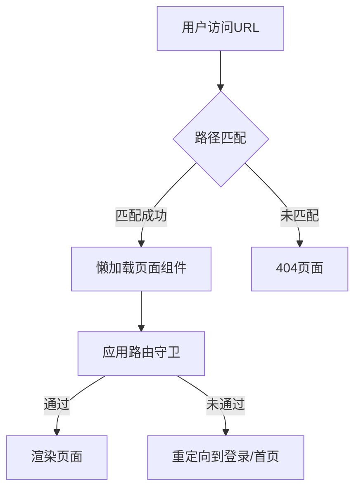

# Design Document

## Overview

本设计文档描述了路由结构重构的技术方案，包括路由路径调整和路由模块化拆分两个核心部分。重构的目标是：

1. **路由路径标准化** - 将路由路径调整为符合业务链路的 RESTful 风格
2. **路由模块化** - 将 400+ 行的单一路由文件拆分为按功能域组织的模块
3. **可维护性** - 提高代码的可读性、可测试性和可扩展性

**注意**: 项目未上线，无需考虑向后兼容性，直接使用新路径，不需要重定向配置。

## Architecture

### 目录结构设计

```
src/presentation/router/
├── index.ts                    # 主入口，导出 router 和 ROUTES
├── routes.tsx                  # 路由组合器（<100行）
├── routePaths.ts              # 路由路径常量定义
└── modules/                   # 路由模块目录
    ├── authRoutes.ts          # 认证路由模块
    ├── userRoutes.ts          # 用户路由模块
    ├── movieRoutes.ts         # 影片路由模块
    ├── photoRoutes.ts         # 写真路由模块
    ├── collectionRoutes.ts    # 合集路由模块
    ├── contentRoutes.ts       # 内容浏览路由（最新、热门）
    ├── adminRoutes.ts         # 管理员路由模块
    ├── testRoutes.ts          # 测试路由模块
    └── errorRoutes.ts         # 错误页面路由模块
```

### 新路由路径设计

| 功能 | 路径 | 说明 |
|------|------|------|
| 首页 | `/` | 应用入口 |
| 合集列表 | `/collections` | 使用复数形式，RESTful 风格 |
| 合集详情 | `/collections/:id` | 合集详情页，包含该合集的影片列表 |
| 影片详情 | `/movies/:id` | 使用复数形式，RESTful 风格 |
| 影片搜索 | `/movies/search` | 影片搜索功能 |
| 影片分类 | `/movies/category/:cat` | 按分类浏览影片 |
| 写真列表 | `/photos` | 使用复数形式，RESTful 风格 |
| 写真详情 | `/photos/:id` | 写真详情页 |
| 最新更新 | `/latest` | 简化路径，展示最新内容 |
| 7天最热 | `/hot/weekly` | 层级化路径，展示热门内容 |

### 数据流设计



## Components and Interfaces

### 1. 路由路径常量 (routePaths.ts)

```typescript
/**
 * 路由路径常量定义
 * 集中管理所有路由路径，提供类型安全的路径生成函数
 */
export const ROUTES = {
  HOME: '/',

  // 影片路由
  MOVIES: {
    DETAIL: (id: number | string) => `/movies/${id}`,
    SEARCH: '/movies/search',
    CATEGORY: (cat: string) => `/movies/category/${cat}`,
  },

  // 合集路由
  COLLECTIONS: {
    LIST: '/collections',
    DETAIL: (id: number | string) => `/collections/${id}`,
  },

  // 写真路由
  PHOTOS: {
    LIST: '/photos',
    DETAIL: (id: number | string) => `/photos/${id}`,
  },

  // 发现/浏览路由
  LATEST: '/latest',
  HOT: {
    WEEKLY: '/hot/weekly',
  },

  // 用户路由
  USER: {
    DASHBOARD: '/user/dashboard',
    PROFILE: '/user/profile',
    SETTINGS: '/user/settings',
    DOWNLOADS: '/user/downloads',
    FAVORITES: '/user/favorites',
    MESSAGES: '/user/messages',
  },

  // 认证路由
  AUTH: {
    LOGIN: '/auth/login',
    REGISTER: '/auth/register',
    FORGOT_PASSWORD: '/auth/forgot-password',
    RESET_PASSWORD: '/auth/reset-password',
  },

  // 管理员路由
  ADMIN: {
    DASHBOARD: '/admin/dashboard',
    USERS: '/admin/users',
    MOVIES: '/admin/movies',
    SYSTEM: '/admin/system',
  },

  // 错误页面
  NOT_FOUND: '/404',
} as const
```

### 2. 路由模块接口

每个路由模块都遵循统一的接口设计：

```typescript
import type { RouteObject } from 'react-router-dom'

/**
 * 路由模块接口
 * 每个路由模块必须实现此接口
 */
export interface RouteModule {
  /**
   * 获取路由配置
   * @returns RouteObject数组
   */
  getRoutes: () => RouteObject[]
}
```

### 3. 路由模块示例 (collectionRoutes.ts)

```typescript
/**
 * @fileoverview 合集路由模块
 * @description 定义合集相关的所有路由配置
 */

import React, { Suspense } from 'react'
import type { RouteObject } from 'react-router-dom'

// 懒加载组件
const CollectionsListPage = React.lazy(
  () => import('@pages/collections/CollectionsListPage')
)
const CollectionDetailPage = React.lazy(
  () => import('@pages/collections/CollectionDetailPage')
)

// Suspense 包装器
const SuspenseWrapper: React.FC<{ children: React.ReactNode }> = ({
  children,
}) => <Suspense fallback={null}>{children}</Suspense>

/**
 * 获取合集路由配置
 */
export const getCollectionRoutes = (): RouteObject[] => [
  {
    path: '/collections',
    children: [
      {
        index: true,
        element: (
          <SuspenseWrapper>
            <CollectionsListPage />
          </SuspenseWrapper>
        ),
      },
      {
        path: ':id',
        element: (
          <SuspenseWrapper>
            <CollectionDetailPage />
          </SuspenseWrapper>
        ),
      },
    ],
  },
]
```

### 4. 主路由文件 (routes.tsx)

```typescript
/**
 * @fileoverview 应用路由配置
 * @description 组合所有路由模块，创建路由器实例
 */

import { createBrowserRouter } from 'react-router-dom'
import type { RouteObject } from 'react-router-dom'

// 导入路由模块
import { getAuthRoutes } from './modules/authRoutes'
import { getUserRoutes } from './modules/userRoutes'
import { getMovieRoutes } from './modules/movieRoutes'
import { getPhotoRoutes } from './modules/photoRoutes'
import { getCollectionRoutes } from './modules/collectionRoutes'
import { getContentRoutes } from './modules/contentRoutes'
import { getAdminRoutes } from './modules/adminRoutes'
import { getTestRoutes } from './modules/testRoutes'
import { getErrorRoutes } from './modules/errorRoutes'

// 导入首页路由
import HomePage from '@pages/home/HomePage'
import ErrorPage from '@pages/error/ErrorPage'
import React, { Suspense } from 'react'

const SuspenseWrapper: React.FC<{ children: React.ReactNode }> = ({
  children,
}) => <Suspense fallback={null}>{children}</Suspense>

// 组合所有路由配置
const routeConfig: RouteObject[] = [
  // 首页路由
  {
    path: '/',
    element: (
      <SuspenseWrapper>
        <HomePage />
      </SuspenseWrapper>
    ),
    errorElement: <ErrorPage />,
  },

  // 功能路由模块
  ...getAuthRoutes(),
  ...getUserRoutes(),
  ...getMovieRoutes(),
  ...getPhotoRoutes(),
  ...getCollectionRoutes(),
  ...getContentRoutes(),
  ...getAdminRoutes(),
  ...getTestRoutes(),

  // 错误路由
  ...getErrorRoutes(),
]

// 创建路由器实例
export const router = createBrowserRouter(routeConfig)
```

## Data Models

### RouteConfig 类型定义

```typescript
import type { RouteObject } from 'react-router-dom'

/**
 * 扩展的路由配置类型
 */
export interface ExtendedRouteObject extends RouteObject {
  /** 路由元数据 */
  meta?: {
    /** 路由标题 */
    title?: string
    /** 是否需要认证 */
    requiresAuth?: boolean
    /** 需要的角色 */
    roles?: string[]
    /** 需要的权限 */
    permissions?: string[]
  }
}
```

### Mock 数据 ID 格式调整

**当前问题**：Mock 数据使用字符串 ID（`movie_1`, `collection_1`），与 RESTful 路径不匹配

**解决方案**：调整 Mock 数据生成逻辑，使用纯数字 ID

```typescript
// ❌ 当前格式（字符串 ID）
const id = `movie_${index + 1}`  // "movie_1", "movie_2"

// ✅ 新格式（数字 ID）
const id = index + 1  // 1, 2, 3...
```

**影响范围**：
- `MockDataService.generateMockCollections()` - 合集 ID
- `MockDataService.generateMockMovies()` - 影片 ID
- `MockDataService.generateMockPhotos()` - 写真 ID
- 所有使用这些 ID 的类型定义需要从 `string` 改为 `number`

**类型定义调整**：
```typescript
// 在 @types-movie 中
export interface BaseContentItem {
  id: number  // 从 string 改为 number
  title: string
  imageUrl: string
  contentType: 'movie' | 'photo' | 'collection'
  // ...
}
```

**路由路径示例**：
- `/movies/1` - 影片详情
- `/collections/59` - 合集详情
- `/photos/2` - 写真详情

## Error Handling

### 1. 路由错误处理

- **404 错误**: 所有未匹配的路由重定向到 `/404`
- **加载错误**: 使用 `errorElement` 捕获组件加载错误
- **权限错误**: 路由守卫组件处理权限不足的情况

### 2. 懒加载错误处理

```typescript
const SuspenseWrapper: React.FC<{ children: React.ReactNode }> = ({
  children,
}) => (
  <Suspense fallback={null}>
    <ErrorBoundary fallback={<ErrorPage />}>
      {children}
    </ErrorBoundary>
  </Suspense>
)
```

## Testing Strategy

### 1. 单元测试

**测试目标**: 路由路径生成函数

```typescript
// routePaths.test.ts
describe('ROUTES', () => {
  it('should generate correct movie detail path', () => {
    expect(ROUTES.MOVIES.DETAIL(123)).toBe('/movies/123')
    expect(ROUTES.MOVIES.DETAIL('abc')).toBe('/movies/abc')
  })

  it('should generate correct collection detail path', () => {
    expect(ROUTES.COLLECTIONS.DETAIL(59)).toBe('/collections/59')
  })
})
```

### 2. 集成测试

**测试目标**: 路由模块组合

```typescript
// routes.test.tsx
describe('Route Configuration', () => {
  it('should include all route modules', () => {
    const routes = router.routes
    expect(routes).toBeDefined()
    expect(routes.length).toBeGreaterThan(0)
  })

  it('should have home route', () => {
    const homeRoute = router.routes.find(r => r.path === '/')
    expect(homeRoute).toBeDefined()
  })
})
```

### 3. 端到端测试

**测试目标**: 路由导航

```typescript
// navigation.e2e.test.ts
describe('Navigation', () => {
  it('should navigate from collections list to detail', async () => {
    await page.goto('/collections')
    await page.click('[data-testid="collection-card-59"]')
    expect(page.url()).toContain('/collections/59')
  })

  it('should navigate from home to photos list', async () => {
    await page.goto('/')
    await page.click('[data-testid="photos-more-link"]')
    expect(page.url()).toContain('/photos')
  })
})
```

## Migration Strategy

### 阶段 1: 准备阶段

1. 创建新的路由模块目录结构
2. 创建 `routePaths.ts` 文件，定义新的路由路径常量

### 阶段 2: 模块拆分

1. 按功能域创建路由模块文件
2. 将懒加载导入移动到各自的模块文件
3. 将路由配置移动到各自的模块文件
4. 保持路由守卫的使用方式不变

### 阶段 3: 主文件重构

1. 重构 `routes.tsx`，导入并组合所有模块
2. 验证路由器实例创建正确

### 阶段 4: 更新引用

1. 更新所有使用旧路径的组件
2. 更新导航链接使用新的 ROUTES 常量
3. 更新测试文件

### 阶段 5: 验证和清理

1. 运行所有测试确保功能正常
2. 手动测试所有路由导航
3. 清理旧的路由配置代码

## Performance Considerations

### 1. 懒加载优化

- 保持现有的 React.lazy 懒加载机制
- 使用 Suspense 包装器避免闪烁
- 考虑使用路由预加载（可选）

### 2. 代码分割

- 每个路由模块独立打包
- 减少主 bundle 大小
- 按需加载路由配置

### 3. 路由匹配性能

- 使用精确路径匹配避免不必要的计算
- 合理组织路由顺序，常用路由放在前面
- 避免过深的路由嵌套

## Security Considerations

### 1. 路由守卫

- 保持现有的 ProtectedRoute、AdminRoute、GuestRoute 机制
- 在路由模块中正确应用守卫组件
- 确保敏感路由受到保护

### 2. 参数处理

```typescript
// 在路由组件中处理参数
const CollectionDetailPage: React.FC = () => {
  const { id } = useParams()
  
  // 只检查 ID 是否存在，格式验证由后端 API 处理
  if (!id) {
    return <Navigate to="/404" replace />
  }
  
  // 使用 Hook 获取数据，后端会返回 404 如果 ID 无效
  const { data, error } = useCollection(id)
  
  if (error?.status === 404) {
    return <NotFoundPage />
  }
  
  // 继续处理...
}
```

**设计原则**：
- 前端不验证 ID 的具体格式（数字、UUID 等）
- ID 格式由后端定义和验证
- 前端只确保 ID 参数存在
- 依赖后端 API 返回 404 处理无效 ID

### 3. 权限检查

- 在路由守卫中检查用户权限
- 未授权访问重定向到登录页或首页
- 记录未授权访问尝试（可选）

## Accessibility Considerations

### 1. 语义化路由

- 使用清晰、描述性的路由路径
- 遵循 RESTful 约定
- 使用复数形式表示资源集合

### 2. 页面标题

```typescript
// 在每个页面组件中设置标题
useEffect(() => {
  document.title = `${collectionInfo?.title || '合集'} - MovieFront`
}, [collectionInfo])
```

### 3. 焦点管理

- 路由切换后将焦点移到主内容区
- 使用 `scrollToTop` 确保页面从顶部开始
- 支持键盘导航

## Documentation

### 1. 代码注释

- 每个路由模块文件包含 JSDoc 注释
- 说明路由的用途和配置
- 标注路由守卫和权限要求

### 2. 路由映射文档

- 维护路由路径映射表
- 记录所有可用路由及其用途
- 提供路由使用示例

### 3. 迁移指南

- 为开发者提供迁移步骤
- 说明如何更新现有代码
- 提供常见问题解答
