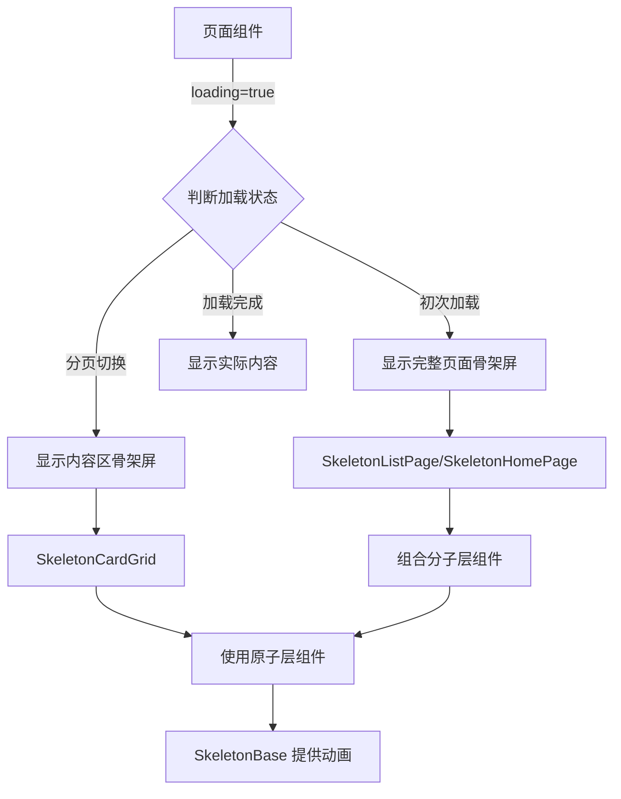

# Design Document

## Overview

本设计文档详细描述了 MovieFront 项目骨架屏加载系统的技术架构和实现方案。系统采用原子设计方法论,构建从基础动画到页面级组件的完整骨架屏体系,确保在数据加载过程中提供流畅、一致的用户体验。

核心设计理念:
- **统一性**: 所有骨架屏使用统一的 shimmer 动画效果
- **可复用性**: 原子级组件可灵活组合构建复杂布局
- **性能优先**: 使用 CSS 动画和硬件加速确保流畅性
- **主题适配**: 完美支持明暗两种主题模式
- **可访问性**: 遵循 WCAG 标准,对屏幕阅读器友好

## Architecture

### 组件层次结构

```
骨架屏系统
├── 核心层 (Core)
│   ├── SkeletonBase - 基础骨架屏组件(提供 shimmer 动画)
│   └── shimmer.css - 动画样式定义
│
├── 原子层 (Atoms)
│   ├── SkeletonBox - 基础矩形骨架屏
│   ├── SkeletonCircle - 圆形骨架屏
│   ├── SkeletonText - 文本骨架屏
│   ├── SkeletonAvatar - 头像骨架屏
│   └── SkeletonCard - 卡片骨架屏(已存在,需重构)
│
├── 分子层 (Molecules)
│   ├── SkeletonPageHeader - 页面标题骨架屏
│   ├── SkeletonSectionHeader - Section 标题骨架屏
│   ├── SkeletonCardGrid - 卡片网格骨架屏
│   └── SkeletonPagination - 分页器骨架屏
│
└── 页面层 (Pages)
    ├── SkeletonHomePage - 首页骨架屏
    ├── SkeletonListPage - 列表页骨架屏
    └── SkeletonDetailPage - 详情页骨架屏(重构现有)
```

### 数据流



## Components and Interfaces

### 1. 核心层组件

#### SkeletonBase

基础骨架屏组件,提供统一的 shimmer 动画效果。

```typescript
interface SkeletonBaseProps {
  /**
   * 自定义类名
   */
  className?: string
  
  /**
   * 宽度
   */
  width?: string | number
  
  /**
   * 高度
   */
  height?: string | number
  
  /**
   * 圆角大小
   */
  borderRadius?: string | number
  
  /**
   * 是否禁用动画
   */
  disableAnimation?: boolean
  
  /**
   * 子元素(用于包裹其他骨架屏组件)
   */
  children?: React.ReactNode
}
```

**实现要点**:
- 使用 CSS `@keyframes` 定义 shimmer 动画
- 使用 `linear-gradient` 创建光泽效果
- 使用 `transform: translateX()` 实现从左到右的移动
- 动画持续时间: 1.5s
- 动画函数: ease-in-out
- 无限循环播放

**CSS 动画实现**:

```css
@keyframes shimmer {
  0% {
    transform: translateX(-100%);
  }
  100% {
    transform: translateX(100%);
  }
}

.skeleton-shimmer {
  position: relative;
  overflow: hidden;
  background-color: var(--skeleton-bg);
}

.skeleton-shimmer::after {
  content: '';
  position: absolute;
  top: 0;
  right: 0;
  bottom: 0;
  left: 0;
  transform: translateX(-100%);
  background: linear-gradient(
    90deg,
    transparent 0%,
    var(--skeleton-shimmer) 50%,
    transparent 100%
  );
  animation: shimmer 1.5s ease-in-out infinite;
}

/* 明亮主题 */
:root {
  --skeleton-bg: #e5e7eb;
  --skeleton-shimmer: rgba(255, 255, 255, 0.8);
}

/* 暗黑主题 */
.dark {
  --skeleton-bg: #374151;
  --skeleton-shimmer: rgba(75, 85, 99, 0.8);
}

/* 减少动画偏好 */
@media (prefers-reduced-motion: reduce) {
  .skeleton-shimmer::after {
    animation: none;
  }
}
```

### 2. 原子层组件

#### SkeletonBox

基础矩形骨架屏,最灵活的原子组件。

```typescript
interface SkeletonBoxProps {
  width?: string | number
  height?: string | number
  borderRadius?: string | number
  className?: string
}
```

#### SkeletonCircle

圆形骨架屏,用于头像等圆形元素。

```typescript
interface SkeletonCircleProps {
  size?: string | number
  className?: string
}
```

#### SkeletonText (重构现有)

文本骨架屏,支持单行和多行。

```typescript
interface SkeletonTextProps {
  /**
   * 行数
   */
  lines?: number
  
  /**
   * 宽度(可以是数组,为每行指定不同宽度)
   */
  width?: string | number | Array<string | number>
  
  /**
   * 高度
   */
  height?: string | number
  
  /**
   * 行间距
   */
  spacing?: string | number
  
  className?: string
}
```

### 3. 分子层组件

#### SkeletonPageHeader

页面标题区域骨架屏。

```typescript
interface SkeletonPageHeaderProps {
  /**
   * 是否显示描述
   */
  showDescription?: boolean
  
  /**
   * 是否显示统计信息
   */
  showStats?: boolean
  
  className?: string
}
```

**布局结构**:
```
┌─────────────────────────────────────┐
│ ████████████████ (标题)              │
│ ████████████████████ (描述 - 可选)   │
│ ████ 个内容 (统计 - 可选)            │
└─────────────────────────────────────┘
```

#### SkeletonSectionHeader

Section 标题骨架屏。

```typescript
interface SkeletonSectionHeaderProps {
  /**
   * 是否显示"查看更多"链接
   */
  showMoreLink?: boolean
  
  className?: string
}
```

**布局结构**:
```
┌─────────────────────────────────────┐
│ ████████████        查看更多 >       │
└─────────────────────────────────────┘
```

#### SkeletonCardGrid

卡片网格骨架屏,支持响应式布局。

```typescript
interface SkeletonCardGridProps {
  /**
   * 卡片数量
   */
  count?: number
  
  /**
   * 响应式列数配置
   */
  columns?: ResponsiveColumnsConfig
  
  /**
   * 卡片宽高比
   */
  aspectRatio?: 'square' | 'video' | 'portrait' | 'landscape'
  
  /**
   * 是否显示卡片标题
   */
  showTitle?: boolean
  
  /**
   * 是否显示卡片描述
   */
  showDescription?: boolean
  
  className?: string
}
```

#### SkeletonPagination

分页器骨架屏。

```typescript
interface SkeletonPaginationProps {
  /**
   * 分页器模式
   */
  mode?: 'simple' | 'full'
  
  className?: string
}
```

**布局结构**:
```
Simple 模式:
┌─────────────────────────────────────┐
│     ◄ 上一页    1 / 10    下一页 ►   │
└─────────────────────────────────────┘

Full 模式:
┌─────────────────────────────────────┐
│  ◄  ██  ██  ██  ██  ██  ██  ██  ►   │
└─────────────────────────────────────┘
```

### 4. 页面层组件

#### SkeletonHomePage

首页骨架屏,包含 Hero 和多个 Section。

```typescript
interface SkeletonHomePageProps {
  /**
   * 是否显示 Hero 区域
   */
  showHero?: boolean
  
  /**
   * Section 数量
   */
  sectionCount?: number
  
  /**
   * 每个 Section 的卡片数量
   */
  cardsPerSection?: number
  
  className?: string
}
```

**布局结构**:
```
┌─────────────────────────────────────┐
│                                     │
│         Hero 区域骨架屏              │
│                                     │
├─────────────────────────────────────┤
│ Section 标题        查看更多 >       │
│ ┌───┐ ┌───┐ ┌───┐ ┌───┐ ┌───┐      │
│ │   │ │   │ │   │ │   │ │   │      │
│ └───┘ └───┘ └───┘ └───┘ └───┘      │
├─────────────────────────────────────┤
│ Section 标题        查看更多 >       │
│ ┌───┐ ┌───┐ ┌───┐ ┌───┐ ┌───┐      │
│ │   │ │   │ │   │ │   │ │   │      │
│ └───┘ └───┘ └───┘ └───┘ └───┘      │
└─────────────────────────────────────┘
```

#### SkeletonListPage

列表页骨架屏,包含标题、内容网格和分页器。

```typescript
interface SkeletonListPageProps {
  /**
   * 是否显示页面标题
   */
  showPageHeader?: boolean
  
  /**
   * 卡片数量
   */
  cardCount?: number
  
  /**
   * 响应式列数配置
   */
  columns?: ResponsiveColumnsConfig
  
  /**
   * 是否显示分页器
   */
  showPagination?: boolean
  
  /**
   * 卡片宽高比
   */
  aspectRatio?: 'square' | 'video' | 'portrait' | 'landscape'
  
  className?: string
}
```

**布局结构**:
```
┌─────────────────────────────────────┐
│ ████████████████ (页面标题)          │
│ ████ 个内容 (统计信息)               │
├─────────────────────────────────────┤
│ ┌───┐ ┌───┐ ┌───┐ ┌───┐ ┌───┐      │
│ │   │ │   │ │   │ │   │ │   │      │
│ └───┘ └───┘ └───┘ └───┘ └───┘      │
│ ┌───┐ ┌───┐ ┌───┐ ┌───┐ ┌───┐      │
│ │   │ │   │ │   │ │   │ │   │      │
│ └───┘ └───┘ └───┘ └───┘ └───┘      │
├─────────────────────────────────────┤
│     ◄  ██  ██  ██  ██  ██  ██  ►    │
└─────────────────────────────────────┘
```

## Data Models

### 响应式列数配置

```typescript
interface ResponsiveColumnsConfig {
  xs?: number  // < 640px
  sm?: number  // >= 640px
  md?: number  // >= 768px
  lg?: number  // >= 1024px
  xl?: number  // >= 1280px
  xxl?: number // >= 1536px
}
```

### 主题配置

```typescript
interface SkeletonThemeConfig {
  light: {
    backgroundColor: string
    shimmerColor: string
  }
  dark: {
    backgroundColor: string
    shimmerColor: string
  }
}

const defaultTheme: SkeletonThemeConfig = {
  light: {
    backgroundColor: '#e5e7eb', // gray-200
    shimmerColor: 'rgba(255, 255, 255, 0.8)'
  },
  dark: {
    backgroundColor: '#374151', // gray-700
    shimmerColor: 'rgba(75, 85, 99, 0.8)' // gray-600 with opacity
  }
}
```

## Error Handling

### 动画性能降级

```typescript
// 检测用户偏好设置
const prefersReducedMotion = window.matchMedia(
  '(prefers-reduced-motion: reduce)'
).matches

// 检测设备性能
const isLowEndDevice = () => {
  const memory = (navigator as any).deviceMemory
  return memory && memory < 4
}

// 根据条件禁用动画
const shouldDisableAnimation = prefersReducedMotion || isLowEndDevice()
```

### 组件错误边界

所有骨架屏组件应该有容错机制:

```typescript
const SkeletonWrapper: React.FC<{ children: React.ReactNode }> = ({ children }) => {
  try {
    return <>{children}</>
  } catch (error) {
    console.error('Skeleton component error:', error)
    // 降级为简单的灰色块
    return <div className="bg-gray-200 dark:bg-gray-700 rounded" />
  }
}
```

## Testing Strategy

### 单元测试

测试每个骨架屏组件的:
1. 正确渲染
2. Props 传递
3. 主题切换
4. 动画效果
5. 可访问性属性

```typescript
describe('SkeletonBase', () => {
  it('should render with shimmer animation', () => {
    const { container } = render(<SkeletonBase />)
    expect(container.querySelector('.skeleton-shimmer')).toBeInTheDocument()
  })
  
  it('should disable animation when prefersReducedMotion is true', () => {
    // Mock matchMedia
    window.matchMedia = jest.fn().mockImplementation(query => ({
      matches: query === '(prefers-reduced-motion: reduce)',
      media: query,
      onchange: null,
      addListener: jest.fn(),
      removeListener: jest.fn(),
    }))
    
    const { container } = render(<SkeletonBase />)
    expect(container.querySelector('.skeleton-shimmer')).toHaveStyle({
      animation: 'none'
    })
  })
  
  it('should have correct ARIA attributes', () => {
    const { container } = render(<SkeletonBase />)
    expect(container.firstChild).toHaveAttribute('role', 'status')
    expect(container.firstChild).toHaveAttribute('aria-busy', 'true')
  })
})
```

### 集成测试

测试骨架屏在实际页面中的表现:

```typescript
describe('HomePage with Skeleton', () => {
  it('should show skeleton while loading', async () => {
    const { getByRole } = render(<HomePage />)
    
    // 初始状态应该显示骨架屏
    expect(getByRole('status')).toBeInTheDocument()
    
    // 等待数据加载
    await waitFor(() => {
      expect(screen.queryByRole('status')).not.toBeInTheDocument()
    })
  })
})
```

### 视觉回归测试

使用 Storybook + Chromatic 进行视觉测试:

```typescript
// SkeletonBase.stories.tsx
export default {
  title: 'Atoms/Skeleton/SkeletonBase',
  component: SkeletonBase,
} as Meta

export const Default: Story = {
  args: {
    width: 200,
    height: 20,
  },
}

export const DarkMode: Story = {
  args: {
    width: 200,
    height: 20,
  },
  parameters: {
    backgrounds: { default: 'dark' },
  },
}
```

### 性能测试

测试动画性能:

```typescript
describe('Skeleton Performance', () => {
  it('should not cause layout thrashing', () => {
    const { container } = render(
      <SkeletonCardGrid count={50} />
    )
    
    // 测量渲染时间
    const startTime = performance.now()
    container.querySelectorAll('.skeleton-shimmer')
    const endTime = performance.now()
    
    expect(endTime - startTime).toBeLessThan(100) // 应该在 100ms 内完成
  })
})
```

## Implementation Plan

### Phase 1: 核心层实现 (优先级: 高)

1. 创建 `SkeletonBase` 组件
2. 实现 shimmer 动画 CSS
3. 添加主题支持
4. 添加可访问性属性
5. 编写单元测试

### Phase 2: 原子层实现 (优先级: 高)

1. 创建 `SkeletonBox` 组件
2. 创建 `SkeletonCircle` 组件
3. 重构 `SkeletonText` 组件
4. 重构 `SkeletonCard` 组件
5. 重构 `SkeletonAvatar` 组件
6. 编写单元测试

### Phase 3: 分子层实现 (优先级: 中)

1. 创建 `SkeletonPageHeader` 组件
2. 创建 `SkeletonSectionHeader` 组件
3. 创建 `SkeletonCardGrid` 组件
4. 创建 `SkeletonPagination` 组件
5. 编写单元测试

### Phase 4: 页面层实现 (优先级: 中)

1. 创建 `SkeletonHomePage` 组件
2. 创建 `SkeletonListPage` 组件
3. 重构 `SkeletonDetailPage` 组件
4. 编写集成测试

### Phase 5: 页面集成 (优先级: 高)

1. 在 `HomePage` 中集成骨架屏
2. 在 `HotListPage` 中集成骨架屏
3. 在 `PhotoListPage` 中集成骨架屏
4. 在 `LatestUpdateListPage` 中集成骨架屏
5. 在 `SpecialCollectionsPage` 中集成骨架屏
6. 在 `CollectionDetailPage` 中集成骨架屏
7. 优化 `BaseList` 组件的骨架屏逻辑

### Phase 6: 优化和文档 (优先级: 低)

1. 性能优化
2. 编写 Storybook 文档
3. 编写使用指南
4. 视觉回归测试

## Design Decisions and Rationales

### 为什么使用 CSS 动画而不是 JavaScript?

**决策**: 使用纯 CSS `@keyframes` 实现 shimmer 动画

**理由**:
1. **性能**: CSS 动画由浏览器的合成器线程处理,不会阻塞主线程
2. **硬件加速**: 使用 `transform` 属性可以触发 GPU 加速
3. **简单性**: 不需要管理动画状态和清理
4. **兼容性**: 所有现代浏览器都支持 CSS 动画

### 为什么采用原子设计方法论?

**决策**: 将骨架屏组件分为原子层、分子层和页面层

**理由**:
1. **可复用性**: 原子组件可以灵活组合
2. **一致性**: 所有组件使用相同的基础构建块
3. **可维护性**: 修改基础组件会自动影响所有使用它的组件
4. **可扩展性**: 容易添加新的组合组件

### 为什么使用 CSS 变量管理主题?

**决策**: 使用 CSS 自定义属性(变量)管理颜色

**理由**:
1. **动态切换**: 可以在运行时切换主题
2. **性能**: 不需要重新渲染组件
3. **简洁**: 不需要在每个组件中传递主题 props
4. **标准化**: 与项目现有的主题系统一致

### 为什么分离初次加载和分页切换的骨架屏?

**决策**: 初次加载显示完整骨架屏,分页切换只显示内容区骨架屏

**理由**:
1. **用户体验**: 分页切换时保留页面标题,减少视觉跳动
2. **性能**: 减少不必要的 DOM 操作
3. **清晰度**: 用户知道自己还在同一个页面

## Accessibility Considerations

### ARIA 属性

所有骨架屏组件应包含:

```typescript
<div
  role="status"
  aria-busy="true"
  aria-label="Loading content"
>
  {/* 骨架屏内容 */}
</div>
```

### 屏幕阅读器支持

```typescript
<div role="status" aria-live="polite">
  <span className="sr-only">Loading, please wait...</span>
  {/* 骨架屏内容 */}
</div>
```

### 键盘导航

骨架屏不应该是可聚焦的:

```css
.skeleton-shimmer {
  pointer-events: none;
  user-select: none;
}
```

### 减少动画偏好

尊重用户的系统设置:

```css
@media (prefers-reduced-motion: reduce) {
  .skeleton-shimmer::after {
    animation: none;
  }
}
```

## Performance Optimization

### 使用 CSS Transform

```css
/* ✅ 好 - 使用 transform */
.skeleton-shimmer::after {
  transform: translateX(-100%);
  animation: shimmer 1.5s ease-in-out infinite;
}

/* ❌ 差 - 使用 left */
.skeleton-shimmer-bad::after {
  left: -100%;
  animation: shimmer-bad 1.5s ease-in-out infinite;
}
```

### 使用 will-change

对于复杂的骨架屏布局:

```css
.skeleton-shimmer::after {
  will-change: transform;
}
```

### 避免过多的 DOM 节点

```typescript
// ✅ 好 - 使用单个元素 + ::after 伪元素
<div className="skeleton-shimmer" />

// ❌ 差 - 使用多个嵌套元素
<div className="skeleton-wrapper">
  <div className="skeleton-bg">
    <div className="skeleton-shimmer" />
  </div>
</div>
```

### 懒加载骨架屏

对于不在视口内的骨架屏,可以延迟渲染:

```typescript
const SkeletonCardGrid: React.FC<SkeletonCardGridProps> = ({ count }) => {
  const [visibleCount, setVisibleCount] = useState(6)
  
  useEffect(() => {
    const timer = setTimeout(() => {
      setVisibleCount(count)
    }, 100)
    return () => clearTimeout(timer)
  }, [count])
  
  return (
    <div className="grid">
      {Array.from({ length: visibleCount }).map((_, i) => (
        <SkeletonCard key={i} />
      ))}
    </div>
  )
}
```

## Browser Compatibility

### 目标浏览器

- Chrome/Edge: 最新版本
- Firefox: 最新版本
- Safari: 最新版本
- Mobile Safari: iOS 12+
- Chrome Mobile: 最新版本

### Polyfills

不需要 polyfills,所有使用的 CSS 特性都有良好的浏览器支持:
- CSS Custom Properties (CSS Variables)
- CSS Grid
- CSS Flexbox
- CSS Animations
- CSS Transform

### 降级策略

对于不支持 CSS 变量的旧浏览器:

```css
/* 降级方案 */
.skeleton-shimmer {
  background-color: #e5e7eb; /* 默认颜色 */
  background-color: var(--skeleton-bg); /* 如果支持则使用变量 */
}
```

## Migration Guide

### 从现有骨架屏迁移

#### 步骤 1: 更新导入

```typescript
// 旧的
import { SkeletonCard } from '@components/atoms/Skeleton'

// 新的(保持不变,但内部实现已更新)
import { SkeletonCard } from '@components/atoms/Skeleton'
```

#### 步骤 2: 使用新的页面级组件

```typescript
// 旧的 - 手动组合
{loading && (
  <div className="grid grid-cols-5 gap-4">
    {Array.from({ length: 12 }).map((_, i) => (
      <SkeletonCard key={i} />
    ))}
  </div>
)}

// 新的 - 使用页面级组件
{loading && (
  <SkeletonListPage
    cardCount={12}
    columns={RESPONSIVE_CONFIGS.hot}
  />
)}
```

#### 步骤 3: 更新 BaseList 组件

```typescript
// BaseList 组件会自动使用新的骨架屏系统
// 不需要修改使用 BaseList 的代码
```

### 向后兼容性

所有现有的骨架屏组件 API 保持不变,只是内部实现更新为使用新的动画系统。

## Future Enhancements

### 可能的未来改进

1. **自定义动画速度**: 允许配置动画持续时间
2. **多种动画效果**: 除了 shimmer,还可以添加 pulse、wave 等效果
3. **智能骨架屏**: 根据实际内容自动生成骨架屏布局
4. **骨架屏预览工具**: 开发工具,可视化预览骨架屏效果
5. **SSR 支持**: 服务端渲染骨架屏,提升首屏加载体验

### 技术债务

1. 现有的 `SkeletonHero` 和 `SkeletonDetail` 组件需要重构
2. 某些页面的骨架屏逻辑分散在多个组件中,需要统一
3. 缺少统一的骨架屏配置管理

## Conclusion

本设计文档提供了一个完整的骨架屏加载系统架构,从基础动画到页面级组件,确保在整个应用中提供一致、流畅的加载体验。通过采用原子设计方法论和性能优化最佳实践,系统既灵活又高效,能够满足当前和未来的需求。
