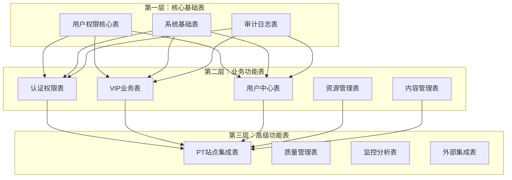
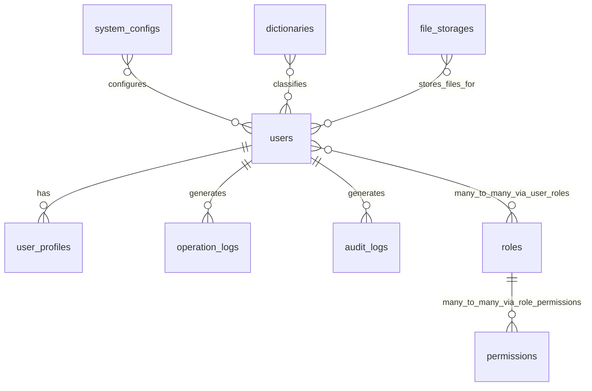

# 数据库分层设计原则

## 🏗️ 数据库分层设计架构

本文档基于《数据库架构规范制定》、《索引设计指导原则》、《数据库版本管理指南》、《数据完整性规则》和《数据库命名规范》制定影视资源下载网站的数据库分层设计原则，严格按照"规范先行，为所有数据库设计提供标准和约束"的核心原则进行设计。

---

## 🎯 设计目标与原则

### 1.1.2 阶段目标
为项目第一阶段建立清晰的数据库分层架构，包括：
- 三层数据库架构设计
- 核心基础表结构设计
- 业务表扩展策略
- 数据演进路径规划

### 分层设计原则

#### 依赖关系原则
- **基础优先**：核心基础表无依赖，必须最先设计
- **渐进扩展**：业务功能表基于核心表扩展设计
- **模块独立**：各业务模块表间减少直接依赖

#### 性能优化原则
- **读写分离准备**：为后期读写分离预留设计空间
- **索引前置**：在设计阶段就考虑索引优化策略
- **缓存友好**：表结构设计考虑缓存模式

#### 扩展性原则
- **垂直扩展**：支持表字段的增量扩展
- **水平扩展**：为后期分库分表预留设计空间
- **版本兼容**：支持数据库结构的平滑升级

---

## 📊 三层数据库架构设计

### 架构概览



---

## 🔧 第一层：核心基础表设计（第一阶段）

### 设计原则
遵循以下核心规范：
- **命名规范**：使用小写字母 + 下划线，采用复数形式
- **通用字段**：所有表都包含 id, created_at, updated_at, deleted_at
- **字段类型**：严格遵循字段类型规范和长度标准
- **约束规范**：按照字段约束规范设置 NOT NULL、DEFAULT、CHECK 等

### 1.1 用户权限核心表

#### users - 用户基础信息表
```sql
CREATE TABLE users (
    id BIGINT UNSIGNED NOT NULL AUTO_INCREMENT COMMENT '用户唯一标识',
    username VARCHAR(50) NOT NULL COMMENT '用户名',
    email VARCHAR(255) NOT NULL COMMENT '邮箱地址',
    password_hash VARCHAR(255) NOT NULL COMMENT '密码哈希值',
    phone VARCHAR(20) NULL COMMENT '手机号码',
    avatar_url VARCHAR(500) NULL COMMENT '头像URL',
    status ENUM('active', 'inactive', 'suspended', 'deleted') NOT NULL DEFAULT 'inactive' COMMENT '账户状态',
    email_verified BOOLEAN NOT NULL DEFAULT FALSE COMMENT '邮箱是否验证',
    phone_verified BOOLEAN NOT NULL DEFAULT FALSE COMMENT '手机是否验证',
    last_login_at TIMESTAMP NULL COMMENT '最后登录时间',
    last_login_ip VARCHAR(45) NULL COMMENT '最后登录IP',
    login_attempts TINYINT UNSIGNED NOT NULL DEFAULT 0 COMMENT '登录尝试次数',
    locked_until TIMESTAMP NULL COMMENT '账户锁定到期时间',
    created_at TIMESTAMP NOT NULL DEFAULT CURRENT_TIMESTAMP COMMENT '创建时间',
    updated_at TIMESTAMP NOT NULL DEFAULT CURRENT_TIMESTAMP ON UPDATE CURRENT_TIMESTAMP COMMENT '更新时间',
    deleted_at TIMESTAMP NULL COMMENT '删除时间',

    PRIMARY KEY (id),
    UNIQUE KEY uk_users_username (username),
    UNIQUE KEY uk_users_email (email),
    KEY idx_users_status (status),
    KEY idx_users_created_at (created_at),
    KEY idx_users_last_login_at (last_login_at),

    CONSTRAINT chk_users_username_length CHECK (CHAR_LENGTH(username) >= 3),
    CONSTRAINT chk_users_email_format CHECK (email REGEXP '^[A-Za-z0-9._%+-]+@[A-Za-z0-9.-]+\\.[A-Za-z]{2,}$'),
    CONSTRAINT chk_users_phone_format CHECK (phone IS NULL OR phone REGEXP '^1[3-9]\\d{9}$'),
    CONSTRAINT chk_users_status_valid CHECK (status IN ('active', 'inactive', 'suspended', 'deleted')),
    CONSTRAINT chk_users_login_attempts CHECK (login_attempts <= 10)
) ENGINE=InnoDB DEFAULT CHARSET=utf8mb4 COLLATE=utf8mb4_unicode_ci COMMENT='用户基础信息表';
```

#### user_profiles - 用户扩展信息表
```sql
CREATE TABLE user_profiles (
    id BIGINT UNSIGNED NOT NULL AUTO_INCREMENT COMMENT '主键ID',
    user_id BIGINT UNSIGNED NOT NULL COMMENT '用户ID',
    nickname VARCHAR(50) NULL COMMENT '昵称',
    gender ENUM('male', 'female', 'other', 'unknown') NULL DEFAULT 'unknown' COMMENT '性别',
    birthday DATE NULL COMMENT '生日',
    bio TEXT NULL COMMENT '个人简介',
    location VARCHAR(100) NULL COMMENT '所在地',
    website VARCHAR(255) NULL COMMENT '个人网站',
    company VARCHAR(100) NULL COMMENT '公司',
    occupation VARCHAR(100) NULL COMMENT '职业',
    preferences JSON NULL COMMENT '用户偏好设置',
    timezone VARCHAR(50) NOT NULL DEFAULT 'Asia/Shanghai' COMMENT '时区设置',
    language VARCHAR(10) NOT NULL DEFAULT 'zh-CN' COMMENT '语言设置',
    created_at TIMESTAMP NOT NULL DEFAULT CURRENT_TIMESTAMP COMMENT '创建时间',
    updated_at TIMESTAMP NOT NULL DEFAULT CURRENT_TIMESTAMP ON UPDATE CURRENT_TIMESTAMP COMMENT '更新时间',
    deleted_at TIMESTAMP NULL COMMENT '删除时间',

    PRIMARY KEY (id),
    UNIQUE KEY uk_user_profiles_user_id (user_id),
    KEY idx_user_profiles_nickname (nickname),
    KEY idx_user_profiles_location (location),
    KEY idx_user_profiles_created_at (created_at),

    CONSTRAINT fk_user_profiles_user_id FOREIGN KEY (user_id) REFERENCES users(id) ON DELETE CASCADE,
    CONSTRAINT chk_user_profiles_nickname_length CHECK (nickname IS NULL OR CHAR_LENGTH(nickname) >= 2),
    CONSTRAINT chk_user_profiles_birthday_range CHECK (birthday IS NULL OR birthday BETWEEN '1900-01-01' AND CURDATE()),
    CONSTRAINT chk_user_profiles_bio_length CHECK (bio IS NULL OR CHAR_LENGTH(bio) <= 1000)
) ENGINE=InnoDB DEFAULT CHARSET=utf8mb4 COLLATE=utf8mb4_unicode_ci COMMENT='用户扩展信息表';
```

#### roles - 角色定义表
```sql
CREATE TABLE roles (
    id BIGINT UNSIGNED NOT NULL AUTO_INCREMENT COMMENT '角色唯一标识',
    name VARCHAR(50) NOT NULL COMMENT '角色名称',
    display_name VARCHAR(100) NOT NULL COMMENT '角色显示名称',
    description TEXT NULL COMMENT '角色描述',
    level TINYINT UNSIGNED NOT NULL DEFAULT 0 COMMENT '角色等级，数字越大权限越高',
    is_system BOOLEAN NOT NULL DEFAULT FALSE COMMENT '是否为系统角色',
    is_active BOOLEAN NOT NULL DEFAULT TRUE COMMENT '是否启用',
    created_at TIMESTAMP NOT NULL DEFAULT CURRENT_TIMESTAMP COMMENT '创建时间',
    updated_at TIMESTAMP NOT NULL DEFAULT CURRENT_TIMESTAMP ON UPDATE CURRENT_TIMESTAMP COMMENT '更新时间',
    deleted_at TIMESTAMP NULL COMMENT '删除时间',

    PRIMARY KEY (id),
    UNIQUE KEY uk_roles_name (name),
    KEY idx_roles_level (level),
    KEY idx_roles_is_active (is_active),
    KEY idx_roles_created_at (created_at),

    CONSTRAINT chk_roles_name_length CHECK (CHAR_LENGTH(name) >= 2),
    CONSTRAINT chk_roles_display_name_length CHECK (CHAR_LENGTH(display_name) >= 2),
    CONSTRAINT chk_roles_level_range CHECK (level <= 100),
    CONSTRAINT chk_roles_description_length CHECK (description IS NULL OR CHAR_LENGTH(description) <= 1000)
) ENGINE=InnoDB DEFAULT CHARSET=utf8mb4 COLLATE=utf8mb4_unicode_ci COMMENT='角色定义表';
```

#### permissions - 权限定义表
```sql
CREATE TABLE permissions (
    id BIGINT UNSIGNED NOT NULL AUTO_INCREMENT COMMENT '权限唯一标识',
    name VARCHAR(100) NOT NULL COMMENT '权限名称',
    display_name VARCHAR(100) NOT NULL COMMENT '权限显示名称',
    description TEXT NULL COMMENT '权限描述',
    resource VARCHAR(50) NOT NULL COMMENT '资源标识',
    action VARCHAR(50) NOT NULL COMMENT '操作标识',
    module VARCHAR(50) NOT NULL COMMENT '模块标识',
    is_system BOOLEAN NOT NULL DEFAULT FALSE COMMENT '是否为系统权限',
    created_at TIMESTAMP NOT NULL DEFAULT CURRENT_TIMESTAMP COMMENT '创建时间',
    updated_at TIMESTAMP NOT NULL DEFAULT CURRENT_TIMESTAMP ON UPDATE CURRENT_TIMESTAMP COMMENT '更新时间',
    deleted_at TIMESTAMP NULL COMMENT '删除时间',

    PRIMARY KEY (id),
    UNIQUE KEY uk_permissions_name (name),
    UNIQUE KEY uk_permissions_resource_action (resource, action),
    KEY idx_permissions_module (module),
    KEY idx_permissions_resource (resource),
    KEY idx_permissions_action (action),
    KEY idx_permissions_created_at (created_at),

    CONSTRAINT chk_permissions_name_length CHECK (CHAR_LENGTH(name) >= 3),
    CONSTRAINT chk_permissions_display_name_length CHECK (CHAR_LENGTH(display_name) >= 2),
    CONSTRAINT chk_permissions_description_length CHECK (description IS NULL OR CHAR_LENGTH(description) <= 500)
) ENGINE=InnoDB DEFAULT CHARSET=utf8mb4 COLLATE=utf8mb4_unicode_ci COMMENT='权限定义表';
```

### 1.2 系统基础表

#### system_configs - 系统配置表
```sql
CREATE TABLE system_configs (
    id BIGINT UNSIGNED NOT NULL AUTO_INCREMENT COMMENT '配置唯一标识',
    config_key VARCHAR(100) NOT NULL COMMENT '配置键名',
    config_value TEXT NOT NULL COMMENT '配置值',
    config_type ENUM('string', 'number', 'boolean', 'json') NOT NULL DEFAULT 'string' COMMENT '配置值类型',
    description VARCHAR(500) NULL COMMENT '配置描述',
    module VARCHAR(50) NOT NULL COMMENT '所属模块',
    is_public BOOLEAN NOT NULL DEFAULT FALSE COMMENT '是否为公开配置',
    is_editable BOOLEAN NOT NULL DEFAULT TRUE COMMENT '是否可编辑',
    sort_order INT UNSIGNED NOT NULL DEFAULT 0 COMMENT '排序顺序',
    created_at TIMESTAMP NOT NULL DEFAULT CURRENT_TIMESTAMP COMMENT '创建时间',
    updated_at TIMESTAMP NOT NULL DEFAULT CURRENT_TIMESTAMP ON UPDATE CURRENT_TIMESTAMP COMMENT '更新时间',
    deleted_at TIMESTAMP NULL COMMENT '删除时间',

    PRIMARY KEY (id),
    UNIQUE KEY uk_system_configs_config_key (config_key),
    KEY idx_system_configs_module (module),
    KEY idx_system_configs_is_public (is_public),
    KEY idx_system_configs_sort_order (sort_order),
    KEY idx_system_configs_created_at (created_at),

    CONSTRAINT chk_system_configs_config_key_length CHECK (CHAR_LENGTH(config_key) >= 3),
    CONSTRAINT chk_system_configs_config_value_not_empty CHECK (CHAR_LENGTH(TRIM(config_value)) > 0),
    CONSTRAINT chk_system_configs_description_length CHECK (description IS NULL OR CHAR_LENGTH(description) <= 500)
) ENGINE=InnoDB DEFAULT CHARSET=utf8mb4 COLLATE=utf8mb4_unicode_ci COMMENT='系统配置表';
```

#### dictionaries - 数据字典表
```sql
CREATE TABLE dictionaries (
    id BIGINT UNSIGNED NOT NULL AUTO_INCREMENT COMMENT '字典项唯一标识',
    dict_type VARCHAR(50) NOT NULL COMMENT '字典类型',
    dict_key VARCHAR(100) NOT NULL COMMENT '字典键名',
    dict_value VARCHAR(255) NOT NULL COMMENT '字典值',
    display_name VARCHAR(100) NOT NULL COMMENT '显示名称',
    description VARCHAR(500) NULL COMMENT '字典项描述',
    parent_id BIGINT UNSIGNED NULL COMMENT '父级字典项ID',
    level TINYINT UNSIGNED NOT NULL DEFAULT 1 COMMENT '层级深度',
    sort_order INT UNSIGNED NOT NULL DEFAULT 0 COMMENT '排序顺序',
    is_active BOOLEAN NOT NULL DEFAULT TRUE COMMENT '是否启用',
    is_system BOOLEAN NOT NULL DEFAULT FALSE COMMENT '是否为系统字典',
    created_at TIMESTAMP NOT NULL DEFAULT CURRENT_TIMESTAMP COMMENT '创建时间',
    updated_at TIMESTAMP NOT NULL DEFAULT CURRENT_TIMESTAMP ON UPDATE CURRENT_TIMESTAMP COMMENT '更新时间',
    deleted_at TIMESTAMP NULL COMMENT '删除时间',

    PRIMARY KEY (id),
    UNIQUE KEY uk_dictionaries_type_key (dict_type, dict_key),
    KEY idx_dictionaries_dict_type (dict_type),
    KEY idx_dictionaries_parent_id (parent_id),
    KEY idx_dictionaries_level (level),
    KEY idx_dictionaries_sort_order (sort_order),
    KEY idx_dictionaries_is_active (is_active),
    KEY idx_dictionaries_created_at (created_at),

    CONSTRAINT fk_dictionaries_parent_id FOREIGN KEY (parent_id) REFERENCES dictionaries(id) ON DELETE SET NULL,
    CONSTRAINT chk_dictionaries_dict_type_length CHECK (CHAR_LENGTH(dict_type) >= 2),
    CONSTRAINT chk_dictionaries_dict_key_length CHECK (CHAR_LENGTH(dict_key) >= 2),
    CONSTRAINT chk_dictionaries_dict_value_length CHECK (CHAR_LENGTH(dict_value) >= 1),
    CONSTRAINT chk_dictionaries_display_name_length CHECK (CHAR_LENGTH(display_name) >= 2),
    CONSTRAINT chk_dictionaries_description_length CHECK (description IS NULL OR CHAR_LENGTH(description) <= 500),
    CONSTRAINT chk_dictionaries_level_range CHECK (level BETWEEN 1 AND 10)
) ENGINE=InnoDB DEFAULT CHARSET=utf8mb4 COLLATE=utf8mb4_unicode_ci COMMENT='数据字典表';
```

#### file_storages - 文件存储配置表
```sql
CREATE TABLE file_storages (
    id BIGINT UNSIGNED NOT NULL AUTO_INCREMENT COMMENT '存储配置唯一标识',
    name VARCHAR(100) NOT NULL COMMENT '存储配置名称',
    storage_type ENUM('local', 'oss', 'cos', 'obs', 's3') NOT NULL COMMENT '存储类型',
    bucket_name VARCHAR(255) NULL COMMENT '存储桶名称',
    endpoint VARCHAR(500) NULL COMMENT '访问端点',
    access_key VARCHAR(255) NULL COMMENT '访问密钥',
    secret_key VARCHAR(500) NULL COMMENT '密钥',
    region VARCHAR(100) NULL COMMENT '区域',
    domain VARCHAR(500) NULL COMMENT '自定义域名',
    base_path VARCHAR(255) NOT NULL DEFAULT '/' COMMENT '基础路径',
    max_file_size BIGINT UNSIGNED NOT NULL DEFAULT 104857600 COMMENT '最大文件大小(字节)',
    allowed_extensions JSON NULL COMMENT '允许的文件扩展名',
    is_public BOOLEAN NOT NULL DEFAULT FALSE COMMENT '是否为公开访问',
    is_active BOOLEAN NOT NULL DEFAULT TRUE COMMENT '是否启用',
    is_default BOOLEAN NOT NULL DEFAULT FALSE COMMENT '是否为默认存储',
    priority INT UNSIGNED NOT NULL DEFAULT 0 COMMENT '优先级',
    config JSON NULL COMMENT '其他配置信息',
    created_at TIMESTAMP NOT NULL DEFAULT CURRENT_TIMESTAMP COMMENT '创建时间',
    updated_at TIMESTAMP NOT NULL DEFAULT CURRENT_TIMESTAMP ON UPDATE CURRENT_TIMESTAMP COMMENT '更新时间',
    deleted_at TIMESTAMP NULL COMMENT '删除时间',

    PRIMARY KEY (id),
    UNIQUE KEY uk_file_storages_name (name),
    KEY idx_file_storages_storage_type (storage_type),
    KEY idx_file_storages_is_active (is_active),
    KEY idx_file_storages_is_default (is_default),
    KEY idx_file_storages_priority (priority),
    KEY idx_file_storages_created_at (created_at),

    CONSTRAINT chk_file_storages_name_length CHECK (CHAR_LENGTH(name) >= 2),
    CONSTRAINT chk_file_storages_bucket_name_length CHECK (bucket_name IS NULL OR CHAR_LENGTH(bucket_name) >= 3),
    CONSTRAINT chk_file_storages_endpoint_length CHECK (endpoint IS NULL OR CHAR_LENGTH(endpoint) >= 10),
    CONSTRAINT chk_file_storages_max_file_size_range CHECK (max_file_size > 0 AND max_file_size <= 10737418240),
    CONSTRAINT chk_file_storages_base_path_format CHECK (base_path REGEXP '^/.*$'),
    CONSTRAINT chk_file_storages_priority_range CHECK (priority <= 1000)
) ENGINE=InnoDB DEFAULT CHARSET=utf8mb4 COLLATE=utf8mb4_unicode_ci COMMENT='文件存储配置表';
```

### 1.3 审计日志表

#### operation_logs - 操作日志表
```sql
CREATE TABLE operation_logs (
    id BIGINT UNSIGNED NOT NULL AUTO_INCREMENT COMMENT '日志唯一标识',
    user_id BIGINT UNSIGNED NULL COMMENT '操作用户ID',
    username VARCHAR(50) NULL COMMENT '操作用户名',
    module VARCHAR(50) NOT NULL COMMENT '操作模块',
    action VARCHAR(50) NOT NULL COMMENT '操作动作',
    resource_type VARCHAR(50) NULL COMMENT '资源类型',
    resource_id VARCHAR(100) NULL COMMENT '资源ID',
    description VARCHAR(500) NULL COMMENT '操作描述',
    request_method VARCHAR(10) NULL COMMENT '请求方法',
    request_url VARCHAR(1000) NULL COMMENT '请求URL',
    request_params JSON NULL COMMENT '请求参数',
    response_data JSON NULL COMMENT '响应数据',
    ip_address VARCHAR(45) NULL COMMENT 'IP地址',
    user_agent TEXT NULL COMMENT '用户代理',
    execution_time INT UNSIGNED NULL COMMENT '执行时间(毫秒)',
    status_code SMALLINT UNSIGNED NULL COMMENT 'HTTP状态码',
    is_success BOOLEAN NOT NULL DEFAULT TRUE COMMENT '是否成功',
    error_message TEXT NULL COMMENT '错误信息',
    created_at TIMESTAMP NOT NULL DEFAULT CURRENT_TIMESTAMP COMMENT '创建时间',

    PRIMARY KEY (id),
    KEY idx_operation_logs_user_id (user_id),
    KEY idx_operation_logs_username (username),
    KEY idx_operation_logs_module (module),
    KEY idx_operation_logs_action (action),
    KEY idx_operation_logs_resource_type (resource_type),
    KEY idx_operation_logs_resource_id (resource_id),
    KEY idx_operation_logs_ip_address (ip_address),
    KEY idx_operation_logs_is_success (is_success),
    KEY idx_operation_logs_created_at (created_at),
    KEY idx_operation_logs_user_created (user_id, created_at),

    CONSTRAINT fk_operation_logs_user_id FOREIGN KEY (user_id) REFERENCES users(id) ON DELETE SET NULL,
    CONSTRAINT chk_operation_logs_module_length CHECK (CHAR_LENGTH(module) >= 2),
    CONSTRAINT chk_operation_logs_action_length CHECK (CHAR_LENGTH(action) >= 2),
    CONSTRAINT chk_operation_logs_resource_type_length CHECK (resource_type IS NULL OR CHAR_LENGTH(resource_type) >= 2),
    CONSTRAINT chk_operation_logs_description_length CHECK (description IS NULL OR CHAR_LENGTH(description) <= 500),
    CONSTRAINT chk_operation_logs_execution_time_range CHECK (execution_time IS NULL OR execution_time <= 300000),
    CONSTRAINT chk_operation_logs_status_code_range CHECK (status_code IS NULL OR status_code BETWEEN 100 AND 599)
) ENGINE=InnoDB DEFAULT CHARSET=utf8mb4 COLLATE=utf8mb4_unicode_ci COMMENT='操作日志表';
```

#### audit_logs - 审计日志表
```sql
CREATE TABLE audit_logs (
    id BIGINT UNSIGNED NOT NULL AUTO_INCREMENT COMMENT '审计日志唯一标识',
    user_id BIGINT UNSIGNED NULL COMMENT '操作用户ID',
    username VARCHAR(50) NULL COMMENT '操作用户名',
    audit_type ENUM('data_change', 'permission_change', 'system_config', 'security_event', 'business_operation') NOT NULL COMMENT '审计类型',
    operation_type ENUM('create', 'update', 'delete', 'login', 'logout', 'access', 'export', 'import') NOT NULL COMMENT '操作类型',
    target_table VARCHAR(100) NULL COMMENT '目标表名',
    target_id VARCHAR(100) NULL COMMENT '目标记录ID',
    old_values JSON NULL COMMENT '修改前的值',
    new_values JSON NULL COMMENT '修改后的值',
    changed_fields JSON NULL COMMENT '变更字段列表',
    risk_level ENUM('low', 'medium', 'high', 'critical') NOT NULL DEFAULT 'low' COMMENT '风险等级',
    description TEXT NULL COMMENT '审计描述',
    ip_address VARCHAR(45) NULL COMMENT 'IP地址',
    user_agent TEXT NULL COMMENT '用户代理',
    session_id VARCHAR(100) NULL COMMENT '会话ID',
    request_id VARCHAR(100) NULL COMMENT '请求ID',
    batch_id VARCHAR(100) NULL COMMENT '批量操作ID',
    is_sensitive BOOLEAN NOT NULL DEFAULT FALSE COMMENT '是否为敏感操作',
    created_at TIMESTAMP NOT NULL DEFAULT CURRENT_TIMESTAMP COMMENT '创建时间',

    PRIMARY KEY (id),
    KEY idx_audit_logs_user_id (user_id),
    KEY idx_audit_logs_username (username),
    KEY idx_audit_logs_audit_type (audit_type),
    KEY idx_audit_logs_operation_type (operation_type),
    KEY idx_audit_logs_target_table (target_table),
    KEY idx_audit_logs_target_id (target_id),
    KEY idx_audit_logs_risk_level (risk_level),
    KEY idx_audit_logs_is_sensitive (is_sensitive),
    KEY idx_audit_logs_created_at (created_at),
    KEY idx_audit_logs_batch_id (batch_id),
    KEY idx_audit_logs_user_created (user_id, created_at),
    KEY idx_audit_logs_risk_created (risk_level, created_at),

    CONSTRAINT fk_audit_logs_user_id FOREIGN KEY (user_id) REFERENCES users(id) ON DELETE SET NULL,
    CONSTRAINT chk_audit_logs_username_length CHECK (username IS NULL OR CHAR_LENGTH(username) >= 2),
    CONSTRAINT chk_audit_logs_target_table_length CHECK (target_table IS NULL OR CHAR_LENGTH(target_table) >= 2),
    CONSTRAINT chk_audit_logs_description_length CHECK (description IS NULL OR CHAR_LENGTH(description) <= 2000),
    CONSTRAINT chk_audit_logs_session_id_length CHECK (session_id IS NULL OR CHAR_LENGTH(session_id) >= 10),
    CONSTRAINT chk_audit_logs_request_id_length CHECK (request_id IS NULL OR CHAR_LENGTH(request_id) >= 10),
    CONSTRAINT chk_audit_logs_batch_id_length CHECK (batch_id IS NULL OR CHAR_LENGTH(batch_id) >= 10)
) ENGINE=InnoDB DEFAULT CHARSET=utf8mb4 COLLATE=utf8mb4_unicode_ci COMMENT='审计日志表';
```

---

## 📈 第二层：业务功能表（按阶段设计）

### 设计原则
- **依赖核心表**：所有业务表都基于第一层核心表进行扩展
- **模块化设计**：每个业务模块的表相对独立
- **渐进式实现**：按照开发阶段逐步设计和实现

### 2.1 第二阶段：认证权限表（基于第一层用户权限核心表）
- user_roles - 用户角色关联表
- refresh_tokens - 刷新令牌表
- login_history - 登录历史表
- email_verifications - 邮箱验证表
- password_resets - 密码重置表

### 2.2 第三阶段：VIP业务表（基于第一层用户权限核心表）
- vip_memberships - 会员信息表
- vip_plans - 会员套餐表
- orders - 订单主表
- payment_records - 支付记录表

### 2.3 第四阶段：用户中心表（基于第一层用户权限核心表）
- favorites - 收藏主表
- download_history - 下载历史表
- user_comments - 用户评论表
- browse_history - 浏览历史表

---

## 🚀 第三层：高级功能表（按需设计）

### 设计原则
- **业务驱动**：根据具体业务需求设计
- **性能优先**：考虑大数据量场景的性能优化
- **可扩展性**：支持功能的持续扩展

### 3.1 PT站点集成表
- pt_sites - PT站点信息表
- pt_accounts - PT站点账户表
- torrent_files - 种子文件表

### 3.2 质量管理表
- quality_scores - 质量评分表
- duplicate_detection - 重复检测表
- integrity_checks - 完整性检查表

### 3.3 监控分析表
- user_statistics - 用户统计表
- resource_statistics - 资源统计表
- system_statistics - 系统统计表

---

## 🔗 表间关系设计

### 关系设计原则
1. **弱耦合**：减少不必要的表间依赖
2. **数据一致性**：通过外键约束保证数据一致性
3. **性能考虑**：避免过深的关联查询
4. **扩展空间**：为未来功能扩展预留接口

### 核心关系图


---

## 📋 数据迁移策略

### 迁移顺序
严格按照依赖关系进行数据迁移：

1. **V1.1.1__Create_core_tables.sql** - 创建第一层核心基础表
2. **V1.1.2__Insert_core_data.sql** - 插入核心基础数据
3. **V1.2.1__Create_auth_tables.sql** - 创建第二层认证权限表
4. **V1.2.2__Insert_auth_data.sql** - 插入认证权限基础数据
5. **V1.3.1__Create_business_tables.sql** - 创建第三层业务功能表

### 版本命名规范
遵循《Flyway版本管理指南》中的命名规范：
- V{major}.{minor}.{patch}__Description.sql
- 版本号严格递增
- 描述清晰明确

---

## ✅ 设计验证清单

### 规范符合性检查
- [x] 命名规范：严格遵循数据库命名规范
- [x] 字段类型：遵循字段类型规范和长度标准
- [x] 约束设置：按照字段约束规范设置约束
- [x] 索引设计：遵循索引设计指导原则
- [x] 完整性规则：遵循数据完整性规则
- [x] 版本管理：遵循Flyway迁移脚本规范

### 设计质量检查
- [x] 依赖关系清晰：表间依赖关系明确合理
- [x] 扩展性良好：为未来扩展预留空间
- [x] 性能优化：考虑查询性能和索引效率
- [x] 数据完整性：通过约束保证数据质量
- [x] 业务适用性：满足影视资源下载网站的业务需求

---

## 📝 下一步工作

### 1.1.3 核心基础表设计（4天）
基于本分层设计，下一步需要：
1. **详细设计每个表的字段**：根据业务需求细化字段定义
2. **创建索引策略**：为每个表设计合理的索引
3. **编写迁移脚本**：创建V1.1.1版本的Flyway迁移脚本
4. **准备测试数据**：为核心表准备50-100条测试数据

### 1.1.4 核心测试数据准备（1天）
- 基础配置数据：系统配置项、字典数据、默认角色权限
- 用户测试数据：管理员用户、普通用户数据
- 审计测试数据：操作日志、审计日志样本数据

---

*本文档严格遵循《数据库架构规范制定》、《索引设计指导原则》、《数据库版本管理指南》、《数据完整性规则》和《数据库命名规范》的要求，为影视资源下载网站项目提供清晰、可扩展、高性能的数据库分层架构设计。*