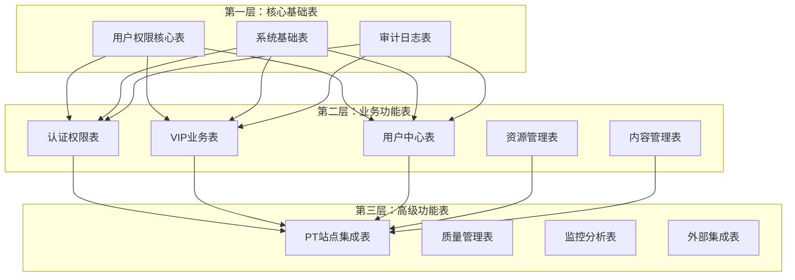
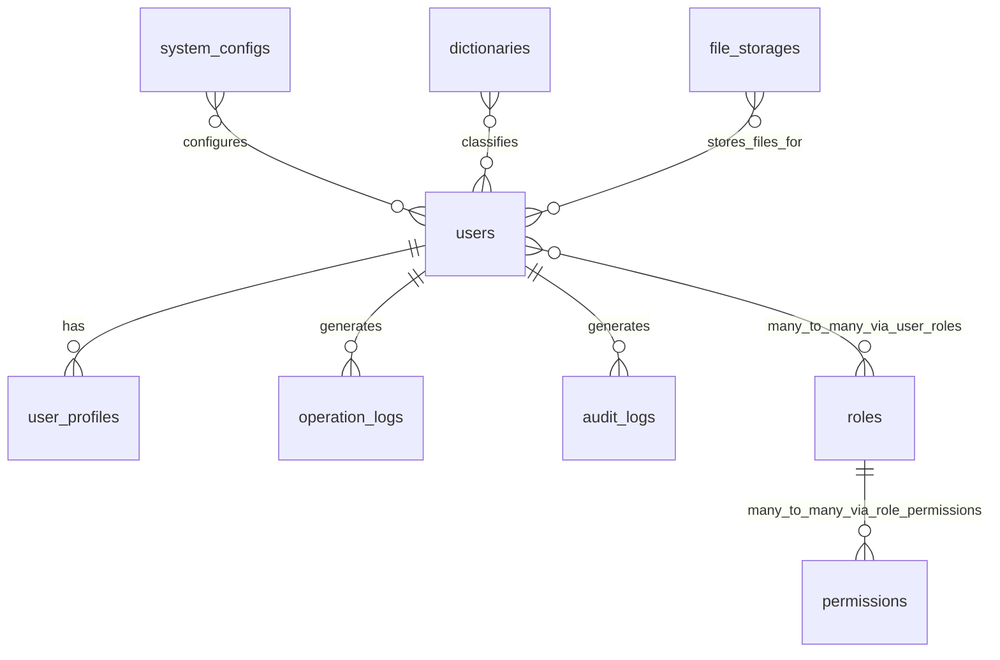

# 数据库分层设计原则

## 🏗️ 数据库分层设计架构

本文档基于《数据库架构规范制定》、《索引设计指导原则》、《数据库版本管理指南》、《数据完整性规则》和《数据库命名规范》制定影视资源下载网站的数据库分层设计原则，严格按照"规范先行，为所有数据库设计提供标准和约束"的核心原则进行设计。

---

## 🎯 设计目标与原则

### 1.1.2 阶段目标
为项目第一阶段建立清晰的数据库分层架构，包括：
- 三层数据库架构设计
- 核心基础表结构设计
- 业务表扩展策略
- 数据演进路径规划

### 分层设计原则

#### 依赖关系原则
- **基础优先**：核心基础表无依赖，必须最先设计
- **渐进扩展**：业务功能表基于核心表扩展设计
- **模块独立**：各业务模块表间减少直接依赖

#### 性能优化原则
- **读写分离准备**：为后期读写分离预留设计空间
- **索引前置**：在设计阶段就考虑索引优化策略
- **缓存友好**：表结构设计考虑缓存模式

#### 扩展性原则
- **垂直扩展**：支持表字段的增量扩展
- **水平扩展**：为后期分库分表预留设计空间
- **版本兼容**：支持数据库结构的平滑升级

---

## 📊 三层数据库架构设计

### 架构概览



---

## 🔧 第一层：核心基础表设计（第一阶段）

### 设计原则
遵循以下核心规范：
- **命名规范**：使用小写字母 + 下划线，采用复数形式
- **通用字段**：所有表都包含 id, created_at, updated_at, deleted_at
- **字段类型**：严格遵循字段类型规范和长度标准
- **约束规范**：按照字段约束规范设置 NOT NULL、DEFAULT、CHECK 等

### 1.1 用户权限核心表

#### users - 用户基础信息表
```sql
CREATE TABLE users (
    id BIGINT UNSIGNED NOT NULL AUTO_INCREMENT COMMENT '用户唯一标识',
    username VARCHAR(50) NOT NULL COMMENT '用户名',
    email VARCHAR(255) NOT NULL COMMENT '邮箱地址',
    password_hash VARCHAR(255) NOT NULL COMMENT '密码哈希值',
    phone VARCHAR(20) NULL COMMENT '手机号码',
    avatar_url VARCHAR(500) NULL COMMENT '头像URL',
    status ENUM('active', 'inactive', 'suspended', 'deleted') NOT NULL DEFAULT 'inactive' COMMENT '账户状态',
    email_verified BOOLEAN NOT NULL DEFAULT FALSE COMMENT '邮箱是否验证',
    phone_verified BOOLEAN NOT NULL DEFAULT FALSE COMMENT '手机是否验证',
    last_login_at TIMESTAMP NULL COMMENT '最后登录时间',
    last_login_ip VARCHAR(45) NULL COMMENT '最后登录IP',
    login_attempts TINYINT UNSIGNED NOT NULL DEFAULT 0 COMMENT '登录尝试次数',
    locked_until TIMESTAMP NULL COMMENT '账户锁定到期时间',
    created_at TIMESTAMP NOT NULL DEFAULT CURRENT_TIMESTAMP COMMENT '创建时间',
    updated_at TIMESTAMP NOT NULL DEFAULT CURRENT_TIMESTAMP ON UPDATE CURRENT_TIMESTAMP COMMENT '更新时间',
    deleted_at TIMESTAMP NULL COMMENT '删除时间',

    PRIMARY KEY (id),
    UNIQUE KEY uk_users_username (username),
    UNIQUE KEY uk_users_email (email),
    KEY idx_users_status (status),
    KEY idx_users_created_at (created_at),
    KEY idx_users_last_login_at (last_login_at),

    CONSTRAINT chk_users_username_length CHECK (CHAR_LENGTH(username) >= 3),
    CONSTRAINT chk_users_email_format CHECK (email REGEXP '^[A-Za-z0-9._%+-]+@[A-Za-z0-9.-]+\\.[A-Za-z]{2,}$'),
    CONSTRAINT chk_users_phone_format CHECK (phone IS NULL OR phone REGEXP '^1[3-9]\\d{9}$'),
    CONSTRAINT chk_users_status_valid CHECK (status IN ('active', 'inactive', 'suspended', 'deleted')),
    CONSTRAINT chk_users_login_attempts CHECK (login_attempts <= 10)
) ENGINE=InnoDB DEFAULT CHARSET=utf8mb4 COLLATE=utf8mb4_unicode_ci COMMENT='用户基础信息表';
```

#### user_profiles - 用户扩展信息表
```sql
CREATE TABLE user_profiles (
    id BIGINT UNSIGNED NOT NULL AUTO_INCREMENT COMMENT '主键ID',
    user_id BIGINT UNSIGNED NOT NULL COMMENT '用户ID',
    nickname VARCHAR(50) NULL COMMENT '昵称',
    gender ENUM('male', 'female', 'other', 'unknown') NULL DEFAULT 'unknown' COMMENT '性别',
    birthday DATE NULL COMMENT '生日',
    bio TEXT NULL COMMENT '个人简介',
    location VARCHAR(100) NULL COMMENT '所在地',
    website VARCHAR(255) NULL COMMENT '个人网站',
    company VARCHAR(100) NULL COMMENT '公司',
    occupation VARCHAR(100) NULL COMMENT '职业',
    preferences JSON NULL COMMENT '用户偏好设置',
    timezone VARCHAR(50) NOT NULL DEFAULT 'Asia/Shanghai' COMMENT '时区设置',
    language VARCHAR(10) NOT NULL DEFAULT 'zh-CN' COMMENT '语言设置',
    created_at TIMESTAMP NOT NULL DEFAULT CURRENT_TIMESTAMP COMMENT '创建时间',
    updated_at TIMESTAMP NOT NULL DEFAULT CURRENT_TIMESTAMP ON UPDATE CURRENT_TIMESTAMP COMMENT '更新时间',
    deleted_at TIMESTAMP NULL COMMENT '删除时间',

    PRIMARY KEY (id),
    UNIQUE KEY uk_user_profiles_user_id (user_id),
    KEY idx_user_profiles_nickname (nickname),
    KEY idx_user_profiles_location (location),
    KEY idx_user_profiles_created_at (created_at),

    CONSTRAINT fk_user_profiles_user_id FOREIGN KEY (user_id) REFERENCES users(id) ON DELETE CASCADE,
    CONSTRAINT chk_user_profiles_nickname_length CHECK (nickname IS NULL OR CHAR_LENGTH(nickname) >= 2),
    CONSTRAINT chk_user_profiles_birthday_range CHECK (birthday IS NULL OR birthday BETWEEN '1900-01-01' AND CURDATE()),
    CONSTRAINT chk_user_profiles_bio_length CHECK (bio IS NULL OR CHAR_LENGTH(bio) <= 1000)
) ENGINE=InnoDB DEFAULT CHARSET=utf8mb4 COLLATE=utf8mb4_unicode_ci COMMENT='用户扩展信息表';
```

#### roles - 角色定义表
```sql
CREATE TABLE roles (
    id BIGINT UNSIGNED NOT NULL AUTO_INCREMENT COMMENT '角色唯一标识',
    name VARCHAR(50) NOT NULL COMMENT '角色名称',
    display_name VARCHAR(100) NOT NULL COMMENT '角色显示名称',
    description TEXT NULL COMMENT '角色描述',
    level TINYINT UNSIGNED NOT NULL DEFAULT 0 COMMENT '角色等级，数字越大权限越高',
    is_system BOOLEAN NOT NULL DEFAULT FALSE COMMENT '是否为系统角色',
    is_active BOOLEAN NOT NULL DEFAULT TRUE COMMENT '是否启用',
    created_at TIMESTAMP NOT NULL DEFAULT CURRENT_TIMESTAMP COMMENT '创建时间',
    updated_at TIMESTAMP NOT NULL DEFAULT CURRENT_TIMESTAMP ON UPDATE CURRENT_TIMESTAMP COMMENT '更新时间',
    deleted_at TIMESTAMP NULL COMMENT '删除时间',

    PRIMARY KEY (id),
    UNIQUE KEY uk_roles_name (name),
    KEY idx_roles_level (level),
    KEY idx_roles_is_active (is_active),
    KEY idx_roles_created_at (created_at),

    CONSTRAINT chk_roles_name_length CHECK (CHAR_LENGTH(name) >= 2),
    CONSTRAINT chk_roles_display_name_length CHECK (CHAR_LENGTH(display_name) >= 2),
    CONSTRAINT chk_roles_level_range CHECK (level <= 100),
    CONSTRAINT chk_roles_description_length CHECK (description IS NULL OR CHAR_LENGTH(description) <= 1000)
) ENGINE=InnoDB DEFAULT CHARSET=utf8mb4 COLLATE=utf8mb4_unicode_ci COMMENT='角色定义表';
```

#### permissions - 权限定义表
```sql
CREATE TABLE permissions (
    id BIGINT UNSIGNED NOT NULL AUTO_INCREMENT COMMENT '权限唯一标识',
    name VARCHAR(100) NOT NULL COMMENT '权限名称',
    display_name VARCHAR(100) NOT NULL COMMENT '权限显示名称',
    description TEXT NULL COMMENT '权限描述',
    resource VARCHAR(50) NOT NULL COMMENT '资源标识',
    action VARCHAR(50) NOT NULL COMMENT '操作标识',
    module VARCHAR(50) NOT NULL COMMENT '模块标识',
    is_system BOOLEAN NOT NULL DEFAULT FALSE COMMENT '是否为系统权限',
    created_at TIMESTAMP NOT NULL DEFAULT CURRENT_TIMESTAMP COMMENT '创建时间',
    updated_at TIMESTAMP NOT NULL DEFAULT CURRENT_TIMESTAMP ON UPDATE CURRENT_TIMESTAMP COMMENT '更新时间',
    deleted_at TIMESTAMP NULL COMMENT '删除时间',

    PRIMARY KEY (id),
    UNIQUE KEY uk_permissions_name (name),
    UNIQUE KEY uk_permissions_resource_action (resource, action),
    KEY idx_permissions_module (module),
    KEY idx_permissions_resource (resource),
    KEY idx_permissions_action (action),
    KEY idx_permissions_created_at (created_at),

    CONSTRAINT chk_permissions_name_length CHECK (CHAR_LENGTH(name) >= 3),
    CONSTRAINT chk_permissions_display_name_length CHECK (CHAR_LENGTH(display_name) >= 2),
    CONSTRAINT chk_permissions_description_length CHECK (description IS NULL OR CHAR_LENGTH(description) <= 500)
) ENGINE=InnoDB DEFAULT CHARSET=utf8mb4 COLLATE=utf8mb4_unicode_ci COMMENT='权限定义表';
```

### 1.2 系统基础表

#### system_configs - 系统配置表
```sql
CREATE TABLE system_configs (
    -- 主键字段：遵循自增BIGINT主键规范
    id BIGINT UNSIGNED NOT NULL AUTO_INCREMENT COMMENT '配置ID',

    -- 配置基础信息：遵循字段命名规范
    config_key VARCHAR(100) NOT NULL COMMENT '配置键',
    config_value TEXT COMMENT '配置值',
    config_type ENUM('STRING', 'NUMBER', 'BOOLEAN', 'JSON') DEFAULT 'STRING' COMMENT '配置类型',
    module VARCHAR(50) NOT NULL DEFAULT 'default' COMMENT '所属模块',
    description VARCHAR(500) COMMENT '配置描述',

    -- 访问控制：支持公开/私有配置
    is_public TINYINT(1) DEFAULT 0 COMMENT '是否公开配置',
    is_encrypted TINYINT(1) DEFAULT 0 COMMENT '是否加密存储',
    sort_order INT DEFAULT 0 COMMENT '排序',

    -- 通用审计字段：遵循通用字段设计规范
    created_by BIGINT UNSIGNED NULL COMMENT '创建人ID',
    updated_by BIGINT UNSIGNED NULL COMMENT '更新人ID',
    version INT UNSIGNED NOT NULL DEFAULT 1 COMMENT '乐观锁版本号',
    created_at TIMESTAMP NOT NULL DEFAULT CURRENT_TIMESTAMP COMMENT '创建时间',
    updated_at TIMESTAMP NOT NULL DEFAULT CURRENT_TIMESTAMP ON UPDATE CURRENT_TIMESTAMP COMMENT '更新时间',
    deleted_at TIMESTAMP NULL COMMENT '删除时间',

    -- 主键约束：遵循主键设计规范
    PRIMARY KEY (id),

    -- 唯一性约束：保证配置键唯一性
    UNIQUE KEY uk_configs_key (config_key),

    -- 查询索引：遵循索引设计指导原则
    KEY idx_configs_module (module),
    KEY idx_configs_public (is_public),
    KEY idx_configs_encrypted (is_encrypted),
    KEY idx_configs_sort (sort_order),
    KEY idx_configs_created_at (created_at),
    KEY idx_configs_updated_by (updated_by),
    KEY idx_configs_version (version),

    -- 数据完整性约束：遵循CHECK约束规范
    CONSTRAINT chk_configs_key_format CHECK (config_key REGEXP '^[a-z][a-z0-9_]*$'),
    CONSTRAINT chk_configs_module_format CHECK (module REGEXP '^[a-z][a-z0-9_]*$'),
    CONSTRAINT chk_configs_sort_order CHECK (sort_order >= 0),
    CONSTRAINT chk_configs_not_delete_system CHECK (deleted_at IS NULL OR config_key NOT LIKE 'system.%')

) ENGINE=InnoDB DEFAULT CHARSET=utf8mb4 COLLATE=utf8mb4_unicode_ci COMMENT='系统配置表';
```

#### dictionaries - 数据字典表
```sql
CREATE TABLE dictionaries (
    -- 主键字段：遵循自增主键规范
    id BIGINT UNSIGNED NOT NULL AUTO_INCREMENT COMMENT '字典ID',

    -- 字典基础信息：遵循字段命名规范
    dict_type VARCHAR(50) NOT NULL COMMENT '字典类型',
    dict_key VARCHAR(100) NOT NULL COMMENT '字典键',
    dict_value VARCHAR(200) NOT NULL COMMENT '字典值',
    dict_label VARCHAR(100) COMMENT '字典标签',
    dict_group VARCHAR(50) COMMENT '字典分组',
    parent_key VARCHAR(100) COMMENT '父级键',

    -- 排序和状态：支持字典项排序和启用控制
    sort_order INT DEFAULT 0 COMMENT '排序',
    is_active TINYINT(1) DEFAULT 1 COMMENT '是否启用',
    remark VARCHAR(500) COMMENT '备注',

    -- 通用审计字段：遵循通用字段设计规范
    created_by BIGINT UNSIGNED NULL COMMENT '创建人ID',
    updated_by BIGINT UNSIGNED NULL COMMENT '更新人ID',
    version INT UNSIGNED NOT NULL DEFAULT 1 COMMENT '乐观锁版本号',
    created_at TIMESTAMP NOT NULL DEFAULT CURRENT_TIMESTAMP COMMENT '创建时间',
    updated_at TIMESTAMP NOT NULL DEFAULT CURRENT_TIMESTAMP ON UPDATE CURRENT_TIMESTAMP COMMENT '更新时间',
    deleted_at TIMESTAMP NULL COMMENT '删除时间',

    -- 主键约束
    PRIMARY KEY (id),

    -- 唯一性约束：保证字典类型和键的唯一性
    UNIQUE KEY uk_dict_type_key (dict_type, dict_key),

    -- 查询索引：支持常用查询场景
    KEY idx_dict_type (dict_type),
    KEY idx_dict_group (dict_group),
    KEY idx_dict_parent (parent_key),
    KEY idx_dict_sort (sort_order),
    KEY idx_dict_active (is_active),
    KEY idx_dict_created_at (created_at),
    KEY idx_dict_updated_by (updated_by),
    KEY idx_dict_version (version),

    -- 数据完整性约束：遵循CHECK约束规范
    CONSTRAINT chk_dict_type_format CHECK (dict_type REGEXP '^[a-z][a-z0-9_]*$'),
    CONSTRAINT chk_dict_key_format CHECK (dict_key REGEXP '^[a-z][a-z0-9_]*$'),
    CONSTRAINT chk_dict_group_format CHECK (dict_group IS NULL OR dict_group REGEXP '^[a-z][a-z0-9_]*$'),
    CONSTRAINT chk_dict_sort_order CHECK (sort_order >= 0),
    CONSTRAINT chk_dict_label_length CHECK (dict_label IS NULL OR CHAR_LENGTH(dict_label) <= 100),
    CONSTRAINT chk_dict_remark_length CHECK (remark IS NULL OR CHAR_LENGTH(remark) <= 500)

) ENGINE=InnoDB DEFAULT CHARSET=utf8mb4 COLLATE=utf8mb4_unicode_ci COMMENT='数据字典表';
```

#### file_storages - 文件存储配置表
```sql
CREATE TABLE file_storages (
    -- 主键字段：遵循自增主键规范
    id BIGINT UNSIGNED NOT NULL AUTO_INCREMENT COMMENT '存储ID',

    -- 存储基础信息：遵循字段命名规范
    storage_name VARCHAR(100) NOT NULL COMMENT '存储名称',
    storage_type ENUM('LOCAL', 'OSS', 'COS', 'QINIU', 'S3') NOT NULL COMMENT '存储类型',

    -- 存储配置信息：支持多种云存储
    access_key VARCHAR(200) COMMENT '访问密钥',
    secret_key VARCHAR(200) COMMENT '安全密钥',
    bucket_name VARCHAR(100) COMMENT '桶名称',
    endpoint VARCHAR(200) COMMENT '访问端点',
    domain_url VARCHAR(200) COMMENT '访问域名',
    region VARCHAR(50) COMMENT '区域',

    -- 存储限制和配置
    max_file_size BIGINT DEFAULT 104857600 COMMENT '最大文件大小(字节)',
    allowed_extensions JSON COMMENT '允许的文件扩展名',
    is_default TINYINT(1) DEFAULT 0 COMMENT '是否默认存储',
    is_active TINYINT(1) DEFAULT 1 COMMENT '是否启用',

    -- 通用审计字段：遵循通用字段设计规范
    created_by BIGINT UNSIGNED NULL COMMENT '创建人ID',
    updated_by BIGINT UNSIGNED NULL COMMENT '更新人ID',
    version INT UNSIGNED NOT NULL DEFAULT 1 COMMENT '乐观锁版本号',
    created_at TIMESTAMP NOT NULL DEFAULT CURRENT_TIMESTAMP COMMENT '创建时间',
    updated_at TIMESTAMP NOT NULL DEFAULT CURRENT_TIMESTAMP ON UPDATE CURRENT_TIMESTAMP COMMENT '更新时间',
    deleted_at TIMESTAMP NULL COMMENT '删除时间',

    -- 主键约束
    PRIMARY KEY (id),

    -- 唯一性约束：保证存储名称唯一性
    UNIQUE KEY uk_storage_name (storage_name),

    -- 查询索引：支持常用查询场景
    KEY idx_storage_type (storage_type),
    KEY idx_storage_default (is_default),
    KEY idx_storage_active (is_active),
    KEY idx_storage_region (region),
    KEY idx_storage_created_at (created_at),
    KEY idx_storage_updated_by (updated_by),
    KEY idx_storage_version (version),

    -- 数据完整性约束：遵循CHECK约束规范
    CONSTRAINT chk_storage_name_length CHECK (CHAR_LENGTH(storage_name) >= 2 AND CHAR_LENGTH(storage_name) <= 100),
    CONSTRAINT chk_storage_max_file_size CHECK (max_file_size > 0),
    CONSTRAINT chk_storage_not_delete_default CHECK (deleted_at IS NULL OR is_default = 0)

) ENGINE=InnoDB DEFAULT CHARSET=utf8mb4 COLLATE=utf8mb4_unicode_ci COMMENT='文件存储配置表';
```

### 1.3 审计日志表

#### operation_logs - 操作日志表
```sql
CREATE TABLE operation_logs (
    -- 主键字段：遵循自增主键规范
    id BIGINT UNSIGNED NOT NULL AUTO_INCREMENT COMMENT '日志ID',

    -- 用户信息：记录操作用户
    user_id BIGINT UNSIGNED NULL COMMENT '用户ID',
    username VARCHAR(50) COMMENT '用户名（冗余字段，防止用户删除后无法追溯）',

    -- 操作信息：记录操作详情
    operation_type VARCHAR(50) NOT NULL COMMENT '操作类型',
    operation_module VARCHAR(50) NOT NULL COMMENT '操作模块',
    operation_desc VARCHAR(200) COMMENT '操作描述',

    -- 请求信息：记录HTTP请求详情
    request_method VARCHAR(10) COMMENT '请求方法',
    request_url VARCHAR(500) COMMENT '请求URL',
    request_params TEXT COMMENT '请求参数',
    response_result TEXT COMMENT '响应结果',
    response_status INT COMMENT '响应状态码',

    -- 环境信息：记录操作环境
    ip_address VARCHAR(45) COMMENT 'IP地址',
    user_agent TEXT COMMENT '用户代理',
    browser VARCHAR(50) COMMENT '浏览器',
    os VARCHAR(50) COMMENT '操作系统',
    location VARCHAR(200) COMMENT '操作地点',

    -- 性能信息：记录操作性能
    execution_time INT COMMENT '执行时间(ms)',
    status ENUM('SUCCESS', 'FAILURE', 'ERROR') NOT NULL COMMENT '执行状态',
    error_code VARCHAR(50) COMMENT '错误代码',
    error_message TEXT COMMENT '错误信息',

    -- 会话信息：记录会话详情
    session_id VARCHAR(128) COMMENT '会话ID',
    trace_id VARCHAR(64) COMMENT '链路追踪ID',

    -- 审计字段：记录创建信息
    created_at TIMESTAMP NOT NULL DEFAULT CURRENT_TIMESTAMP COMMENT '创建时间',

    -- 主键约束
    PRIMARY KEY (id),

    -- 查询索引：支持常用查询场景
    KEY idx_op_logs_user (user_id),
    KEY idx_op_logs_username (username),
    KEY idx_op_logs_type (operation_type),
    KEY idx_op_logs_module (operation_module),
    KEY idx_op_logs_status (status),
    KEY idx_op_logs_created_at (created_at),
    KEY idx_op_logs_ip (ip_address),
    KEY idx_op_logs_user_time (user_id, created_at DESC),
    KEY idx_op_logs_type_status (operation_type, status),
    KEY idx_op_logs_module_status (operation_module, status),
    KEY idx_op_logs_trace (trace_id),
    KEY idx_op_logs_session (session_id),

    -- 外键约束：遵循引用完整性规则
    CONSTRAINT fk_op_logs_user_id FOREIGN KEY (user_id) REFERENCES users(id) ON DELETE SET NULL,

    -- 数据完整性约束：遵循CHECK约束规范
    CONSTRAINT chk_op_logs_username_length CHECK (username IS NULL OR (CHAR_LENGTH(username) >= 3 AND CHAR_LENGTH(username) <= 50)),
    CONSTRAINT chk_op_logs_operation_type_length CHECK (CHAR_LENGTH(operation_type) >= 2 AND CHAR_LENGTH(operation_type) <= 50),
    CONSTRAINT chk_op_logs_operation_module_length CHECK (CHAR_LENGTH(operation_module) >= 2 AND CHAR_LENGTH(operation_module) <= 50),
    CONSTRAINT chk_op_logs_operation_desc_length CHECK (operation_desc IS NULL OR CHAR_LENGTH(operation_desc) <= 200),
    CONSTRAINT chk_op_logs_request_url_length CHECK (request_url IS NULL OR CHAR_LENGTH(request_url) <= 500),
    CONSTRAINT chk_op_logs_response_status CHECK (response_status IS NULL OR (response_status >= 100 AND response_status <= 599)),
    CONSTRAINT chk_op_logs_execution_time CHECK (execution_time IS NULL OR execution_time >= 0),
    CONSTRAINT chk_op_logs_error_code_length CHECK (error_code IS NULL OR CHAR_LENGTH(error_code) <= 50),
    CONSTRAINT chk_op_logs_ip_format CHECK (ip_address IS NULL OR ip_address REGEXP '^([0-9]{1,3}\\.){3}[0-9]{1,3}$' OR ip_address REGEXP '^([0-9a-fA-F]{1,4}:){7}[0-9a-fA-F]{1,4}$'),
    CONSTRAINT chk_op_logs_browser_length CHECK (browser IS NULL OR CHAR_LENGTH(browser) <= 50),
    CONSTRAINT chk_op_logs_os_length CHECK (os IS NULL OR CHAR_LENGTH(os) <= 50),
    CONSTRAINT chk_op_logs_location_length CHECK (location IS NULL OR CHAR_LENGTH(location) <= 200)

) ENGINE=InnoDB DEFAULT CHARSET=utf8mb4 COLLATE=utf8mb4_unicode_ci COMMENT='操作日志表';
```

#### audit_logs - 审计日志表
```sql
CREATE TABLE audit_logs (
    -- 主键字段：遵循自增主键规范
    id BIGINT UNSIGNED NOT NULL AUTO_INCREMENT COMMENT '审计ID',

    -- 实体信息：记录被操作实体
    entity_type VARCHAR(50) NOT NULL COMMENT '实体类型',
    entity_id BIGINT NOT NULL COMMENT '实体ID',
    operation_type ENUM('CREATE', 'UPDATE', 'DELETE', 'RESTORE') NOT NULL COMMENT '操作类型',

    -- 变更信息：记录数据变更详情
    old_values JSON COMMENT '旧值',
    new_values JSON COMMENT '新值',
    changed_fields JSON COMMENT '变更字段',

    -- 操作用户信息：记录操作者
    user_id BIGINT UNSIGNED NULL COMMENT '操作用户ID',
    username VARCHAR(50) COMMENT '用户名（冗余字段）',
    ip_address VARCHAR(45) COMMENT 'IP地址',
    user_agent TEXT COMMENT '用户代理',

    -- 操作上下文：记录操作上下文信息
    reason VARCHAR(500) COMMENT '操作原因',
    batch_id VARCHAR(64) COMMENT '批次ID（批量操作）',
    rollback_possible TINYINT(1) DEFAULT 0 COMMENT '是否可回滚',
    rollback_data JSON COMMENT '回滚数据',

    -- 审计字段：记录创建信息
    created_at TIMESTAMP NOT NULL DEFAULT CURRENT_TIMESTAMP COMMENT '创建时间',

    -- 主键约束
    PRIMARY KEY (id),

    -- 查询索引：支持常用查询场景
    KEY idx_audit_entity (entity_type, entity_id),
    KEY idx_audit_operation (operation_type),
    KEY idx_audit_user (user_id),
    KEY idx_audit_username (username),
    KEY idx_audit_created_at (created_at),
    KEY idx_audit_batch (batch_id),
    KEY idx_audit_rollback (rollback_possible),
    KEY idx_audit_ip (ip_address),
    KEY idx_audit_entity_time (entity_type, created_at DESC),
    KEY idx_audit_user_time (user_id, created_at DESC),

    -- 外键约束：遵循引用完整性规则
    CONSTRAINT fk_audit_user_id FOREIGN KEY (user_id) REFERENCES users(id) ON DELETE SET NULL,

    -- 数据完整性约束：遵循CHECK约束规范
    CONSTRAINT chk_audit_entity_type_length CHECK (CHAR_LENGTH(entity_type) >= 2 AND CHAR_LENGTH(entity_type) <= 50),
    CONSTRAINT chk_audit_username_length CHECK (username IS NULL OR (CHAR_LENGTH(username) >= 3 AND CHAR_LENGTH(username) <= 50)),
    CONSTRAINT chk_audit_reason_length CHECK (reason IS NULL OR CHAR_LENGTH(reason) <= 500),
    CONSTRAINT chk_audit_batch_id_length CHECK (batch_id IS NULL OR CHAR_LENGTH(batch_id) <= 64),
    CONSTRAINT chk_audit_ip_format CHECK (ip_address IS NULL OR ip_address REGEXP '^([0-9]{1,3}\\.){3}[0-9]{1,3}$' OR ip_address REGEXP '^([0-9a-fA-F]{1,4}:){7}[0-9a-fA-F]{1,4}$')

) ENGINE=InnoDB DEFAULT CHARSET=utf8mb4 COLLATE=utf8mb4_unicode_ci COMMENT='审计日志表';
```

---

## 📈 第二层：业务功能表（按阶段设计）

### 设计原则
- **依赖核心表**：所有业务表都基于第一层核心表进行扩展
- **模块化设计**：每个业务模块的表相对独立
- **渐进式实现**：按照开发阶段逐步设计和实现

### 2.1 第二阶段：认证权限表（基于第一层用户权限核心表）
- user_roles - 用户角色关联表
- refresh_tokens - 刷新令牌表
- login_history - 登录历史表
- email_verifications - 邮箱验证表
- password_resets - 密码重置表

### 2.2 第三阶段：VIP业务表（基于第一层用户权限核心表）
- vip_memberships - 会员信息表
- vip_plans - 会员套餐表
- orders - 订单主表
- payment_records - 支付记录表

### 2.3 第四阶段：用户中心表（基于第一层用户权限核心表）
- favorites - 收藏主表
- download_history - 下载历史表
- user_comments - 用户评论表
- browse_history - 浏览历史表

---

## 🚀 第三层：高级功能表（按需设计）

### 设计原则
- **业务驱动**：根据具体业务需求设计
- **性能优先**：考虑大数据量场景的性能优化
- **可扩展性**：支持功能的持续扩展

### 3.1 PT站点集成表
- pt_sites - PT站点信息表
- pt_accounts - PT站点账户表
- torrent_files - 种子文件表

### 3.2 质量管理表
- quality_scores - 质量评分表
- duplicate_detection - 重复检测表
- integrity_checks - 完整性检查表

### 3.3 监控分析表
- user_statistics - 用户统计表
- resource_statistics - 资源统计表
- system_statistics - 系统统计表

---

## 🔗 表间关系设计

### 关系设计原则
1. **弱耦合**：减少不必要的表间依赖
2. **数据一致性**：通过外键约束保证数据一致性
3. **性能考虑**：避免过深的关联查询
4. **扩展空间**：为未来功能扩展预留接口

### 核心关系图


---

## 📋 数据迁移策略

### 迁移顺序
严格按照依赖关系进行数据迁移：

1. **V1.1.1__Create_core_tables.sql** - 创建第一层核心基础表
2. **V1.1.2__Insert_core_data.sql** - 插入核心基础数据
3. **V1.2.1__Create_auth_tables.sql** - 创建第二层认证权限表
4. **V1.2.2__Insert_auth_data.sql** - 插入认证权限基础数据
5. **V1.3.1__Create_business_tables.sql** - 创建第三层业务功能表

### 版本命名规范
遵循《Flyway版本管理指南》中的命名规范：
- V{major}.{minor}.{patch}__Description.sql
- 版本号严格递增
- 描述清晰明确

---

## ✅ 设计验证清单

### 规范符合性检查
- [x] 命名规范：严格遵循数据库命名规范
- [x] 字段类型：遵循字段类型规范和长度标准
- [x] 约束设置：按照字段约束规范设置约束
- [x] 索引设计：遵循索引设计指导原则
- [x] 完整性规则：遵循数据完整性规则
- [x] 版本管理：遵循Flyway迁移脚本规范

### 设计质量检查
- [x] 依赖关系清晰：表间依赖关系明确合理
- [x] 扩展性良好：为未来扩展预留空间
- [x] 性能优化：考虑查询性能和索引效率
- [x] 数据完整性：通过约束保证数据质量
- [x] 业务适用性：满足影视资源下载网站的业务需求

---

## 📝 下一步工作

### 1.1.3 核心基础表设计（4天）
基于本分层设计，下一步需要：
1. **详细设计每个表的字段**：根据业务需求细化字段定义
2. **创建索引策略**：为每个表设计合理的索引
3. **编写迁移脚本**：创建V1.1.1版本的Flyway迁移脚本
4. **准备测试数据**：为核心表准备50-100条测试数据

### 1.1.4 核心测试数据准备（1天）
- 基础配置数据：系统配置项、字典数据、默认角色权限
- 用户测试数据：管理员用户、普通用户数据
- 审计测试数据：操作日志、审计日志样本数据

---

*本文档严格遵循《数据库架构规范制定》、《索引设计指导原则》、《数据库版本管理指南》、《数据完整性规则》和《数据库命名规范》的要求，为影视资源下载网站项目提供清晰、可扩展、高性能的数据库分层架构设计。*