# 数据库分层设计原则

## 🏗️ 数据库分层设计架构

本文档基于《数据库架构规范制定》、《索引设计指导原则》、《数据库版本管理指南》、《数据完整性规则》和《数据库命名规范》制定影视资源下载网站的数据库分层设计原则，严格按照"规范先行，为所有数据库设计提供标准和约束"的核心原则进行设计。

---

## 🎯 设计目标与原则

### 1.1.2 阶段目标
为项目第一阶段建立清晰的数据库分层架构，包括：
- 三层数据库架构设计
- 核心基础表结构设计
- 业务表扩展策略
- 数据演进路径规划

### 分层设计原则

#### 依赖关系原则
- **基础优先**：核心基础表无依赖，必须最先设计
- **渐进扩展**：业务功能表基于核心表扩展设计
- **模块独立**：各业务模块表间减少直接依赖

#### 性能优化原则
- **读写分离准备**：为后期读写分离预留设计空间
- **索引前置**：在设计阶段就考虑索引优化策略
- **缓存友好**：表结构设计考虑缓存模式

#### 扩展性原则
- **垂直扩展**：支持表字段的增量扩展
- **水平扩展**：为后期分库分表预留设计空间
- **版本兼容**：支持数据库结构的平滑升级

---

## 📊 三层数据库架构设计

### 架构概览

```mermaid
graph TB
    subgraph "第一层：核心基础表"
        A[用户权限核心表]
        B[系统基础表]
        C[审计日志表]
    end

    subgraph "第二层：业务功能表"
        D[认证权限表]
        E[VIP业务表]
        F[用户中心表]
        G[资源管理表]
        H[内容管理表]
    end

    subgraph "第三层：高级功能表"
        I[PT站点集成表]
        J[质量管理表]
        K[监控分析表]
    end

    A --> D
    A --> E
    A --> F
    B --> D
    B --> E
    B --> F
    C --> D
    C --> E
    C --> F

    D --> I
    E --> I
    F --> I
    G --> I
    H --> I
```



---

## 🔧 第一层：核心基础表设计（第一阶段）

### 设计原则
遵循以下核心规范：
- **命名规范**：使用小写字母 + 下划线，采用复数形式
- **通用字段**：所有表都包含 id, created_at, updated_at, deleted_at
- **字段类型**：严格遵循字段类型规范和长度标准
- **约束规范**：按照字段约束规范设置 NOT NULL、DEFAULT、CHECK 等

### 1.1 用户权限核心表

#### users - 用户基础信息表
```sql
CREATE TABLE users (
    id BIGINT UNSIGNED NOT NULL AUTO_INCREMENT COMMENT '用户唯一标识',
    username VARCHAR(50) NOT NULL COMMENT '用户名',
    email VARCHAR(255) NOT NULL COMMENT '邮箱地址',
    password_hash VARCHAR(255) NOT NULL COMMENT '密码哈希值',
    phone VARCHAR(20) NULL COMMENT '手机号码',
    avatar_url VARCHAR(500) NULL COMMENT '头像URL',
    status ENUM('active', 'inactive', 'suspended', 'deleted') NOT NULL DEFAULT 'inactive' COMMENT '账户状态',
    email_verified BOOLEAN NOT NULL DEFAULT FALSE COMMENT '邮箱是否验证',
    phone_verified BOOLEAN NOT NULL DEFAULT FALSE COMMENT '手机是否验证',
    last_login_at TIMESTAMP NULL COMMENT '最后登录时间',
    last_login_ip VARCHAR(45) NULL COMMENT '最后登录IP',
    login_attempts TINYINT UNSIGNED NOT NULL DEFAULT 0 COMMENT '登录尝试次数',
    locked_until TIMESTAMP NULL COMMENT '账户锁定到期时间',
    created_at TIMESTAMP NOT NULL DEFAULT CURRENT_TIMESTAMP COMMENT '创建时间',
    updated_at TIMESTAMP NOT NULL DEFAULT CURRENT_TIMESTAMP ON UPDATE CURRENT_TIMESTAMP COMMENT '更新时间',
    deleted_at TIMESTAMP NULL COMMENT '删除时间',

    PRIMARY KEY (id),
    UNIQUE KEY uk_users_username (username),
    UNIQUE KEY uk_users_email (email),
    KEY idx_users_status (status),
    KEY idx_users_created_at (created_at),
    KEY idx_users_last_login_at (last_login_at),

    CONSTRAINT chk_users_username_length CHECK (CHAR_LENGTH(username) >= 3),
    CONSTRAINT chk_users_email_format CHECK (email REGEXP '^[A-Za-z0-9._%+-]+@[A-Za-z0-9.-]+\\.[A-Za-z]{2,}$'),
    CONSTRAINT chk_users_phone_format CHECK (phone IS NULL OR phone REGEXP '^1[3-9]\\d{9}$'),
    CONSTRAINT chk_users_status_valid CHECK (status IN ('active', 'inactive', 'suspended', 'deleted')),
    CONSTRAINT chk_users_login_attempts CHECK (login_attempts <= 10)
) ENGINE=InnoDB DEFAULT CHARSET=utf8mb4 COLLATE=utf8mb4_unicode_ci COMMENT='用户基础信息表';
```

#### user_profiles - 用户扩展信息表
```sql
CREATE TABLE user_profiles (
    id BIGINT UNSIGNED NOT NULL AUTO_INCREMENT COMMENT '主键ID',
    user_id BIGINT UNSIGNED NOT NULL COMMENT '用户ID',
    nickname VARCHAR(50) NULL COMMENT '昵称',
    gender ENUM('male', 'female', 'other', 'unknown') NULL DEFAULT 'unknown' COMMENT '性别',
    birthday DATE NULL COMMENT '生日',
    bio TEXT NULL COMMENT '个人简介',
    location VARCHAR(100) NULL COMMENT '所在地',
    website VARCHAR(255) NULL COMMENT '个人网站',
    company VARCHAR(100) NULL COMMENT '公司',
    occupation VARCHAR(100) NULL COMMENT '职业',
    preferences JSON NULL COMMENT '用户偏好设置',
    timezone VARCHAR(50) NOT NULL DEFAULT 'Asia/Shanghai' COMMENT '时区设置',
    language VARCHAR(10) NOT NULL DEFAULT 'zh-CN' COMMENT '语言设置',
    created_at TIMESTAMP NOT NULL DEFAULT CURRENT_TIMESTAMP COMMENT '创建时间',
    updated_at TIMESTAMP NOT NULL DEFAULT CURRENT_TIMESTAMP ON UPDATE CURRENT_TIMESTAMP COMMENT '更新时间',
    deleted_at TIMESTAMP NULL COMMENT '删除时间',

    PRIMARY KEY (id),
    UNIQUE KEY uk_user_profiles_user_id (user_id),
    KEY idx_user_profiles_nickname (nickname),
    KEY idx_user_profiles_location (location),
    KEY idx_user_profiles_created_at (created_at),

    CONSTRAINT fk_user_profiles_user_id FOREIGN KEY (user_id) REFERENCES users(id) ON DELETE CASCADE,
    CONSTRAINT chk_user_profiles_nickname_length CHECK (nickname IS NULL OR CHAR_LENGTH(nickname) >= 2),
    CONSTRAINT chk_user_profiles_birthday_range CHECK (birthday IS NULL OR birthday BETWEEN '1900-01-01' AND CURDATE()),
    CONSTRAINT chk_user_profiles_bio_length CHECK (bio IS NULL OR CHAR_LENGTH(bio) <= 1000)
) ENGINE=InnoDB DEFAULT CHARSET=utf8mb4 COLLATE=utf8mb4_unicode_ci COMMENT='用户扩展信息表';
```

#### roles - 角色定义表
```sql
CREATE TABLE roles (
    id BIGINT UNSIGNED NOT NULL AUTO_INCREMENT COMMENT '角色唯一标识',
    name VARCHAR(50) NOT NULL COMMENT '角色名称',
    display_name VARCHAR(100) NOT NULL COMMENT '角色显示名称',
    description TEXT NULL COMMENT '角色描述',
    level TINYINT UNSIGNED NOT NULL DEFAULT 0 COMMENT '角色等级，数字越大权限越高',
    is_system BOOLEAN NOT NULL DEFAULT FALSE COMMENT '是否为系统角色',
    is_active BOOLEAN NOT NULL DEFAULT TRUE COMMENT '是否启用',
    created_at TIMESTAMP NOT NULL DEFAULT CURRENT_TIMESTAMP COMMENT '创建时间',
    updated_at TIMESTAMP NOT NULL DEFAULT CURRENT_TIMESTAMP ON UPDATE CURRENT_TIMESTAMP COMMENT '更新时间',
    deleted_at TIMESTAMP NULL COMMENT '删除时间',

    PRIMARY KEY (id),
    UNIQUE KEY uk_roles_name (name),
    KEY idx_roles_level (level),
    KEY idx_roles_is_active (is_active),
    KEY idx_roles_created_at (created_at),

    CONSTRAINT chk_roles_name_length CHECK (CHAR_LENGTH(name) >= 2),
    CONSTRAINT chk_roles_display_name_length CHECK (CHAR_LENGTH(display_name) >= 2),
    CONSTRAINT chk_roles_level_range CHECK (level <= 100),
    CONSTRAINT chk_roles_description_length CHECK (description IS NULL OR CHAR_LENGTH(description) <= 1000)
) ENGINE=InnoDB DEFAULT CHARSET=utf8mb4 COLLATE=utf8mb4_unicode_ci COMMENT='角色定义表';
```

#### permissions - 权限定义表
```sql
CREATE TABLE permissions (
    id BIGINT UNSIGNED NOT NULL AUTO_INCREMENT COMMENT '权限唯一标识',
    name VARCHAR(100) NOT NULL COMMENT '权限名称',
    display_name VARCHAR(100) NOT NULL COMMENT '权限显示名称',
    description TEXT NULL COMMENT '权限描述',
    resource VARCHAR(50) NOT NULL COMMENT '资源标识',
    action VARCHAR(50) NOT NULL COMMENT '操作标识',
    module VARCHAR(50) NOT NULL COMMENT '模块标识',
    is_system BOOLEAN NOT NULL DEFAULT FALSE COMMENT '是否为系统权限',
    created_at TIMESTAMP NOT NULL DEFAULT CURRENT_TIMESTAMP COMMENT '创建时间',
    updated_at TIMESTAMP NOT NULL DEFAULT CURRENT_TIMESTAMP ON UPDATE CURRENT_TIMESTAMP COMMENT '更新时间',
    deleted_at TIMESTAMP NULL COMMENT '删除时间',

    PRIMARY KEY (id),
    UNIQUE KEY uk_permissions_name (name),
    UNIQUE KEY uk_permissions_resource_action (resource, action),
    KEY idx_permissions_module (module),
    KEY idx_permissions_resource (resource),
    KEY idx_permissions_action (action),
    KEY idx_permissions_created_at (created_at),

    CONSTRAINT chk_permissions_name_length CHECK (CHAR_LENGTH(name) >= 3),
    CONSTRAINT chk_permissions_display_name_length CHECK (CHAR_LENGTH(display_name) >= 2),
    CONSTRAINT chk_permissions_description_length CHECK (description IS NULL OR CHAR_LENGTH(description) <= 500)
) ENGINE=InnoDB DEFAULT CHARSET=utf8mb4 COLLATE=utf8mb4_unicode_ci COMMENT='权限定义表';
```

### 1.2 系统基础表

#### system_configs - 系统配置表
```sql
CREATE TABLE system_configs (
    -- 主键字段：遵循自增BIGINT主键规范
    id BIGINT UNSIGNED NOT NULL AUTO_INCREMENT COMMENT '配置ID',

    -- 配置基础信息：遵循字段命名规范
    config_key VARCHAR(100) NOT NULL COMMENT '配置键',
    config_value TEXT COMMENT '配置值',
    config_type ENUM('STRING', 'NUMBER', 'BOOLEAN', 'JSON') DEFAULT 'STRING' COMMENT '配置类型',
    module VARCHAR(50) NOT NULL DEFAULT 'default' COMMENT '所属模块',
    description VARCHAR(500) COMMENT '配置描述',

    -- 访问控制：支持公开/私有配置
    is_public TINYINT(1) DEFAULT 0 COMMENT '是否公开配置',
    is_encrypted TINYINT(1) DEFAULT 0 COMMENT '是否加密存储',
    sort_order INT DEFAULT 0 COMMENT '排序',

    -- 通用审计字段：遵循通用字段设计规范
    created_by BIGINT UNSIGNED NULL COMMENT '创建人ID',
    updated_by BIGINT UNSIGNED NULL COMMENT '更新人ID',
    version INT UNSIGNED NOT NULL DEFAULT 1 COMMENT '乐观锁版本号',
    created_at TIMESTAMP NOT NULL DEFAULT CURRENT_TIMESTAMP COMMENT '创建时间',
    updated_at TIMESTAMP NOT NULL DEFAULT CURRENT_TIMESTAMP ON UPDATE CURRENT_TIMESTAMP COMMENT '更新时间',
    deleted_at TIMESTAMP NULL COMMENT '删除时间',

    -- 主键约束：遵循主键设计规范
    PRIMARY KEY (id),

    -- 唯一性约束：保证配置键唯一性
    UNIQUE KEY uk_configs_key (config_key),

    -- 查询索引：遵循索引设计指导原则
    KEY idx_configs_module (module),
    KEY idx_configs_public (is_public),
    KEY idx_configs_encrypted (is_encrypted),
    KEY idx_configs_sort (sort_order),
    KEY idx_configs_created_at (created_at),
    KEY idx_configs_updated_by (updated_by),
    KEY idx_configs_version (version),

    -- 数据完整性约束：遵循CHECK约束规范
    CONSTRAINT chk_configs_key_format CHECK (config_key REGEXP '^[a-z][a-z0-9_]*$'),
    CONSTRAINT chk_configs_module_format CHECK (module REGEXP '^[a-z][a-z0-9_]*$'),
    CONSTRAINT chk_configs_sort_order CHECK (sort_order >= 0),
    CONSTRAINT chk_configs_not_delete_system CHECK (deleted_at IS NULL OR config_key NOT LIKE 'system.%')

) ENGINE=InnoDB DEFAULT CHARSET=utf8mb4 COLLATE=utf8mb4_unicode_ci COMMENT='系统配置表';
```

#### dictionaries - 数据字典表
```sql
CREATE TABLE dictionaries (
    -- 主键字段：遵循自增主键规范
    id BIGINT UNSIGNED NOT NULL AUTO_INCREMENT COMMENT '字典ID',

    -- 字典基础信息：遵循字段命名规范
    dict_type VARCHAR(50) NOT NULL COMMENT '字典类型',
    dict_key VARCHAR(100) NOT NULL COMMENT '字典键',
    dict_value VARCHAR(200) NOT NULL COMMENT '字典值',
    dict_label VARCHAR(100) COMMENT '字典标签',
    dict_group VARCHAR(50) COMMENT '字典分组',
    parent_key VARCHAR(100) COMMENT '父级键',

    -- 排序和状态：支持字典项排序和启用控制
    sort_order INT DEFAULT 0 COMMENT '排序',
    is_active TINYINT(1) DEFAULT 1 COMMENT '是否启用',
    remark VARCHAR(500) COMMENT '备注',

    -- 通用审计字段：遵循通用字段设计规范
    created_by BIGINT UNSIGNED NULL COMMENT '创建人ID',
    updated_by BIGINT UNSIGNED NULL COMMENT '更新人ID',
    version INT UNSIGNED NOT NULL DEFAULT 1 COMMENT '乐观锁版本号',
    created_at TIMESTAMP NOT NULL DEFAULT CURRENT_TIMESTAMP COMMENT '创建时间',
    updated_at TIMESTAMP NOT NULL DEFAULT CURRENT_TIMESTAMP ON UPDATE CURRENT_TIMESTAMP COMMENT '更新时间',
    deleted_at TIMESTAMP NULL COMMENT '删除时间',

    -- 主键约束
    PRIMARY KEY (id),

    -- 唯一性约束：保证字典类型和键的唯一性
    UNIQUE KEY uk_dict_type_key (dict_type, dict_key),

    -- 查询索引：支持常用查询场景
    KEY idx_dict_type (dict_type),
    KEY idx_dict_group (dict_group),
    KEY idx_dict_parent (parent_key),
    KEY idx_dict_sort (sort_order),
    KEY idx_dict_active (is_active),
    KEY idx_dict_created_at (created_at),
    KEY idx_dict_updated_by (updated_by),
    KEY idx_dict_version (version),

    -- 数据完整性约束：遵循CHECK约束规范
    CONSTRAINT chk_dict_type_format CHECK (dict_type REGEXP '^[a-z][a-z0-9_]*$'),
    CONSTRAINT chk_dict_key_format CHECK (dict_key REGEXP '^[a-z][a-z0-9_]*$'),
    CONSTRAINT chk_dict_group_format CHECK (dict_group IS NULL OR dict_group REGEXP '^[a-z][a-z0-9_]*$'),
    CONSTRAINT chk_dict_sort_order CHECK (sort_order >= 0),
    CONSTRAINT chk_dict_label_length CHECK (dict_label IS NULL OR CHAR_LENGTH(dict_label) <= 100),
    CONSTRAINT chk_dict_remark_length CHECK (remark IS NULL OR CHAR_LENGTH(remark) <= 500)

) ENGINE=InnoDB DEFAULT CHARSET=utf8mb4 COLLATE=utf8mb4_unicode_ci COMMENT='数据字典表';
```

#### file_storages - 文件存储配置表
```sql
CREATE TABLE file_storages (
    -- 主键字段：遵循自增主键规范
    id BIGINT UNSIGNED NOT NULL AUTO_INCREMENT COMMENT '存储ID',

    -- 存储基础信息：遵循字段命名规范
    storage_name VARCHAR(100) NOT NULL COMMENT '存储名称',
    storage_type ENUM('LOCAL', 'OSS', 'COS', 'QINIU', 'S3') NOT NULL COMMENT '存储类型',

    -- 存储配置信息：支持多种云存储
    access_key VARCHAR(200) COMMENT '访问密钥',
    secret_key VARCHAR(200) COMMENT '安全密钥',
    bucket_name VARCHAR(100) COMMENT '桶名称',
    endpoint VARCHAR(200) COMMENT '访问端点',
    domain_url VARCHAR(200) COMMENT '访问域名',
    region VARCHAR(50) COMMENT '区域',

    -- 存储限制和配置
    max_file_size BIGINT DEFAULT 104857600 COMMENT '最大文件大小(字节)',
    allowed_extensions JSON COMMENT '允许的文件扩展名',
    is_default TINYINT(1) DEFAULT 0 COMMENT '是否默认存储',
    is_active TINYINT(1) DEFAULT 1 COMMENT '是否启用',

    -- 通用审计字段：遵循通用字段设计规范
    created_by BIGINT UNSIGNED NULL COMMENT '创建人ID',
    updated_by BIGINT UNSIGNED NULL COMMENT '更新人ID',
    version INT UNSIGNED NOT NULL DEFAULT 1 COMMENT '乐观锁版本号',
    created_at TIMESTAMP NOT NULL DEFAULT CURRENT_TIMESTAMP COMMENT '创建时间',
    updated_at TIMESTAMP NOT NULL DEFAULT CURRENT_TIMESTAMP ON UPDATE CURRENT_TIMESTAMP COMMENT '更新时间',
    deleted_at TIMESTAMP NULL COMMENT '删除时间',

    -- 主键约束
    PRIMARY KEY (id),

    -- 唯一性约束：保证存储名称唯一性
    UNIQUE KEY uk_storage_name (storage_name),

    -- 查询索引：支持常用查询场景
    KEY idx_storage_type (storage_type),
    KEY idx_storage_default (is_default),
    KEY idx_storage_active (is_active),
    KEY idx_storage_region (region),
    KEY idx_storage_created_at (created_at),
    KEY idx_storage_updated_by (updated_by),
    KEY idx_storage_version (version),

    -- 数据完整性约束：遵循CHECK约束规范
    CONSTRAINT chk_storage_name_length CHECK (CHAR_LENGTH(storage_name) >= 2 AND CHAR_LENGTH(storage_name) <= 100),
    CONSTRAINT chk_storage_max_file_size CHECK (max_file_size > 0),
    CONSTRAINT chk_storage_not_delete_default CHECK (deleted_at IS NULL OR is_default = 0)

) ENGINE=InnoDB DEFAULT CHARSET=utf8mb4 COLLATE=utf8mb4_unicode_ci COMMENT='文件存储配置表';
```

### 1.3 审计日志表

#### operation_logs - 操作日志表
```sql
CREATE TABLE operation_logs (
    -- 主键字段：遵循自增主键规范
    id BIGINT UNSIGNED NOT NULL AUTO_INCREMENT COMMENT '日志ID',

    -- 用户信息：记录操作用户
    user_id BIGINT UNSIGNED NULL COMMENT '用户ID',
    username VARCHAR(50) COMMENT '用户名（冗余字段，防止用户删除后无法追溯）',

    -- 操作信息：记录操作详情
    operation_type VARCHAR(50) NOT NULL COMMENT '操作类型',
    operation_module VARCHAR(50) NOT NULL COMMENT '操作模块',
    operation_desc VARCHAR(200) COMMENT '操作描述',

    -- 请求信息：记录HTTP请求详情
    request_method VARCHAR(10) COMMENT '请求方法',
    request_url VARCHAR(500) COMMENT '请求URL',
    request_params TEXT COMMENT '请求参数',
    response_result TEXT COMMENT '响应结果',
    response_status INT COMMENT '响应状态码',

    -- 环境信息：记录操作环境
    ip_address VARCHAR(45) COMMENT 'IP地址',
    user_agent TEXT COMMENT '用户代理',
    browser VARCHAR(50) COMMENT '浏览器',
    os VARCHAR(50) COMMENT '操作系统',
    location VARCHAR(200) COMMENT '操作地点',

    -- 性能信息：记录操作性能
    execution_time INT COMMENT '执行时间(ms)',
    status ENUM('SUCCESS', 'FAILURE', 'ERROR') NOT NULL COMMENT '执行状态',
    error_code VARCHAR(50) COMMENT '错误代码',
    error_message TEXT COMMENT '错误信息',

    -- 会话信息：记录会话详情
    session_id VARCHAR(128) COMMENT '会话ID',
    trace_id VARCHAR(64) COMMENT '链路追踪ID',

    -- 审计字段：记录创建信息
    created_at TIMESTAMP NOT NULL DEFAULT CURRENT_TIMESTAMP COMMENT '创建时间',

    -- 主键约束
    PRIMARY KEY (id),

    -- 查询索引：支持常用查询场景
    KEY idx_op_logs_user (user_id),
    KEY idx_op_logs_username (username),
    KEY idx_op_logs_type (operation_type),
    KEY idx_op_logs_module (operation_module),
    KEY idx_op_logs_status (status),
    KEY idx_op_logs_created_at (created_at),
    KEY idx_op_logs_ip (ip_address),
    KEY idx_op_logs_user_time (user_id, created_at DESC),
    KEY idx_op_logs_type_status (operation_type, status),
    KEY idx_op_logs_module_status (operation_module, status),
    KEY idx_op_logs_trace (trace_id),
    KEY idx_op_logs_session (session_id),

    -- 外键约束：遵循引用完整性规则
    CONSTRAINT fk_op_logs_user_id FOREIGN KEY (user_id) REFERENCES users(id) ON DELETE SET NULL,

    -- 数据完整性约束：遵循CHECK约束规范
    CONSTRAINT chk_op_logs_username_length CHECK (username IS NULL OR (CHAR_LENGTH(username) >= 3 AND CHAR_LENGTH(username) <= 50)),
    CONSTRAINT chk_op_logs_operation_type_length CHECK (CHAR_LENGTH(operation_type) >= 2 AND CHAR_LENGTH(operation_type) <= 50),
    CONSTRAINT chk_op_logs_operation_module_length CHECK (CHAR_LENGTH(operation_module) >= 2 AND CHAR_LENGTH(operation_module) <= 50),
    CONSTRAINT chk_op_logs_operation_desc_length CHECK (operation_desc IS NULL OR CHAR_LENGTH(operation_desc) <= 200),
    CONSTRAINT chk_op_logs_request_url_length CHECK (request_url IS NULL OR CHAR_LENGTH(request_url) <= 500),
    CONSTRAINT chk_op_logs_response_status CHECK (response_status IS NULL OR (response_status >= 100 AND response_status <= 599)),
    CONSTRAINT chk_op_logs_execution_time CHECK (execution_time IS NULL OR execution_time >= 0),
    CONSTRAINT chk_op_logs_error_code_length CHECK (error_code IS NULL OR CHAR_LENGTH(error_code) <= 50),
    CONSTRAINT chk_op_logs_ip_format CHECK (ip_address IS NULL OR ip_address REGEXP '^([0-9]{1,3}\\.){3}[0-9]{1,3}$' OR ip_address REGEXP '^([0-9a-fA-F]{1,4}:){7}[0-9a-fA-F]{1,4}$'),
    CONSTRAINT chk_op_logs_browser_length CHECK (browser IS NULL OR CHAR_LENGTH(browser) <= 50),
    CONSTRAINT chk_op_logs_os_length CHECK (os IS NULL OR CHAR_LENGTH(os) <= 50),
    CONSTRAINT chk_op_logs_location_length CHECK (location IS NULL OR CHAR_LENGTH(location) <= 200)

) ENGINE=InnoDB DEFAULT CHARSET=utf8mb4 COLLATE=utf8mb4_unicode_ci COMMENT='操作日志表';
```

#### audit_logs - 审计日志表
```sql
CREATE TABLE audit_logs (
    -- 主键字段：遵循自增主键规范
    id BIGINT UNSIGNED NOT NULL AUTO_INCREMENT COMMENT '审计ID',

    -- 实体信息：记录被操作实体
    entity_type VARCHAR(50) NOT NULL COMMENT '实体类型',
    entity_id BIGINT NOT NULL COMMENT '实体ID',
    operation_type ENUM('CREATE', 'UPDATE', 'DELETE', 'RESTORE') NOT NULL COMMENT '操作类型',

    -- 变更信息：记录数据变更详情
    old_values JSON COMMENT '旧值',
    new_values JSON COMMENT '新值',
    changed_fields JSON COMMENT '变更字段',

    -- 操作用户信息：记录操作者
    user_id BIGINT UNSIGNED NULL COMMENT '操作用户ID',
    username VARCHAR(50) COMMENT '用户名（冗余字段）',
    ip_address VARCHAR(45) COMMENT 'IP地址',
    user_agent TEXT COMMENT '用户代理',

    -- 操作上下文：记录操作上下文信息
    reason VARCHAR(500) COMMENT '操作原因',
    batch_id VARCHAR(64) COMMENT '批次ID（批量操作）',
    rollback_possible TINYINT(1) DEFAULT 0 COMMENT '是否可回滚',
    rollback_data JSON COMMENT '回滚数据',

    -- 审计字段：记录创建信息
    created_at TIMESTAMP NOT NULL DEFAULT CURRENT_TIMESTAMP COMMENT '创建时间',

    -- 主键约束
    PRIMARY KEY (id),

    -- 查询索引：支持常用查询场景
    KEY idx_audit_entity (entity_type, entity_id),
    KEY idx_audit_operation (operation_type),
    KEY idx_audit_user (user_id),
    KEY idx_audit_username (username),
    KEY idx_audit_created_at (created_at),
    KEY idx_audit_batch (batch_id),
    KEY idx_audit_rollback (rollback_possible),
    KEY idx_audit_ip (ip_address),
    KEY idx_audit_entity_time (entity_type, created_at DESC),
    KEY idx_audit_user_time (user_id, created_at DESC),

    -- 外键约束：遵循引用完整性规则
    CONSTRAINT fk_audit_user_id FOREIGN KEY (user_id) REFERENCES users(id) ON DELETE SET NULL,

    -- 数据完整性约束：遵循CHECK约束规范
    CONSTRAINT chk_audit_entity_type_length CHECK (CHAR_LENGTH(entity_type) >= 2 AND CHAR_LENGTH(entity_type) <= 50),
    CONSTRAINT chk_audit_username_length CHECK (username IS NULL OR (CHAR_LENGTH(username) >= 3 AND CHAR_LENGTH(username) <= 50)),
    CONSTRAINT chk_audit_reason_length CHECK (reason IS NULL OR CHAR_LENGTH(reason) <= 500),
    CONSTRAINT chk_audit_batch_id_length CHECK (batch_id IS NULL OR CHAR_LENGTH(batch_id) <= 64),
    CONSTRAINT chk_audit_ip_format CHECK (ip_address IS NULL OR ip_address REGEXP '^([0-9]{1,3}\\.){3}[0-9]{1,3}$' OR ip_address REGEXP '^([0-9a-fA-F]{1,4}:){7}[0-9a-fA-F]{1,4}$')

) ENGINE=InnoDB DEFAULT CHARSET=utf8mb4 COLLATE=utf8mb4_unicode_ci COMMENT='审计日志表';
```

---

## 📈 第二层：业务功能表（按阶段设计）

### 设计原则
- **依赖核心表**：所有业务表都基于第一层核心表进行扩展
- **模块化设计**：每个业务模块的表相对独立
- **渐进式实现**：按照开发阶段逐步设计和实现

### 2.1 第二阶段：认证权限表（基于第一层用户权限核心表）
- user_roles - 用户角色关联表
- refresh_tokens - 刷新令牌表
- login_history - 登录历史表
- email_verifications - 邮箱验证表
- password_resets - 密码重置表

### 2.2 第三阶段：VIP业务表（基于第一层用户权限核心表）
- vip_memberships - 会员信息表
- vip_plans - 会员套餐表
- orders - 订单主表
- payment_records - 支付记录表

### 2.3 第四阶段：用户中心表（基于第一层用户权限核心表）
- favorites - 收藏主表
- download_history - 下载历史表
- user_comments - 用户评论表
- browse_history - 浏览历史表

---

## 🚀 第三层：高级功能表（已实现）

### 设计原则
- **业务驱动**：根据具体业务需求设计
- **性能优先**：考虑大数据量场景的性能优化
- **可扩展性**：支持功能的持续扩展
- **规范遵循**：严格遵循20个规范文档要求

### 3.1 PT站点集成表（V3.1.x - 已完成）

#### pt_sites - PT站点信息表
**文件位置**: `V3.1.1__Create_pt_site_tables.sql`

**核心功能**:
- 存储各个PT站点的基本信息和配置参数
- 支持站点健康度监控和爬虫配置管理
- 实现完整的爬虫参数和代理配置

**主要字段**:
```sql
CREATE TABLE `pt_sites` (
  `id` bigint NOT NULL AUTO_INCREMENT COMMENT '主键ID',
  `site_code` varchar(50) NOT NULL COMMENT '站点代码，如hdr,ttg等',
  `site_name` varchar(200) NOT NULL COMMENT '站点名称',
  `site_url` varchar(500) NOT NULL COMMENT '站点URL',
  `site_type` tinyint NOT NULL DEFAULT 1 COMMENT '站点类型：1-公开PT，2-私有PT',
  `crawl_enabled` tinyint(1) NOT NULL DEFAULT 1 COMMENT '是否启用爬虫',
  `health_score` decimal(3,1) DEFAULT 100.0 COMMENT '站点健康度评分(0-100)',
  `crawl_interval` int NOT NULL DEFAULT 3600 COMMENT '爬虫间隔(秒)',
  `success_count` int DEFAULT 0 COMMENT '成功爬取次数',
  `failure_count` int DEFAULT 0 COMMENT '失败爬取次数'
);
```

**设计特点**:
- 支持多种PT站点类型（公开、私有、半私有）
- 完整的爬虫配置管理（User-Agent、Cookies、代理等）
- 健康度监控和统计功能
- 限流和重试机制配置

#### torrent_files - 种子文件表
**文件位置**: `V3.1.1__Create_pt_site_tables.sql`

**核心功能**:
- 存储从各个PT站点爬取的种子详细信息
- 支持多维度质量评分和分类管理
- 实现完整的元数据关联（IMDB、豆瓣、TMDB）

**主要字段**:
```sql
CREATE TABLE `torrent_files` (
  `id` bigint NOT NULL AUTO_INCREMENT COMMENT '主键ID',
  `pt_site_id` bigint NOT NULL COMMENT 'PT站点ID',
  `site_torrent_id` varchar(100) NOT NULL COMMENT '站点内种子ID',
  `title` varchar(500) NOT NULL COMMENT '种子标题',
  `file_size` bigint NOT NULL DEFAULT 0 COMMENT '文件大小(字节)',
  `quality_level` tinyint DEFAULT 1 COMMENT '质量等级：1-普通，2-高清，3-超清，4-4K',
  `seed_count` int DEFAULT 0 COMMENT '做种数',
  `download_count` int DEFAULT 0 COMMENT '下载次数',
  `health_score` decimal(5,2) DEFAULT 100.00 COMMENT '健康度评分'
);
```

**设计特点**:
- 支持多种视频格式和质量等级
- 完整的元数据信息存储
- 健康度评估和可用性分析
- 支持JSON格式扩展信息存储

#### crawl_tasks - 爬虫任务表
**文件位置**: `V3.1.1__Create_pt_site_tables.sql`

**核心功能**:
- 管理爬虫任务的配置和执行状态
- 支持多种调度策略和重试机制
- 实现详细的执行统计和性能监控

**主要字段**:
```sql
CREATE TABLE `crawl_tasks` (
  `id` bigint NOT NULL AUTO_INCREMENT COMMENT '主键ID',
  `task_name` varchar(200) NOT NULL COMMENT '任务名称',
  `task_code` varchar(100) NOT NULL COMMENT '任务代码',
  `task_type` tinyint NOT NULL COMMENT '任务类型：1-站点爬取，2-分类爬取',
  `pt_site_id` bigint NOT NULL COMMENT 'PT站点ID',
  `status` tinyint NOT NULL DEFAULT 1 COMMENT '任务状态：1-待执行，2-执行中，3-成功',
  `success_rate` decimal(5,2) DEFAULT 0.00 COMMENT '成功率'
);
```

**设计特点**:
- 支持多种任务类型和调度策略
- 完整的错误处理和重试机制
- 详细的执行统计和性能分析
- 支持任务依赖和并发控制

### 3.2 质量管理表（V3.2.x - 已完成）

#### quality_scores - 质量评分表
**文件位置**: `V3.2.1__Create_quality_management_tables.sql`

**核心功能**:
- 实现多维度的资源质量评分体系
- 支持自动化质量评估和人工评分
- 提供质量趋势分析和统计功能

#### duplicate_detection - 重复检测表
**文件位置**: `V3.2.1__Create_quality_management_tables.sql`

**核心功能**:
- 基于相似度哈希的重复资源检测
- 支持多级重复判定和去重策略
- 实现重复资源的关联管理

#### similarity_hash - 相似度哈希表
**文件位置**: `V3.2.1__Create_quality_management_tables.sql`

**核心功能**:
- 存储资源的特征指纹和相似度哈希
- 支持快速相似度查询和匹配
- 实现增量哈希更新和版本管理

### 3.3 监控分析表（V3.3.x - 已完成）

#### search_logs - 搜索日志表
**文件位置**: `V3.3.1__Create_statistics_tables.sql`

**核心功能**:
- 记录用户搜索行为的详细日志
- 支持搜索性能分析和质量评估
- 实现搜索意图识别和个性化推荐

**主要字段**:
```sql
CREATE TABLE `search_logs` (
  `id` bigint NOT NULL AUTO_INCREMENT COMMENT '主键ID',
  `session_id` varchar(128) NOT NULL COMMENT '会话ID',
  `user_id` bigint COMMENT '用户ID',
  `search_keyword` varchar(200) NOT NULL COMMENT '搜索关键词',
  `search_type` tinyint NOT NULL COMMENT '搜索类型：1-基础搜索，2-高级搜索',
  `result_count` int DEFAULT 0 COMMENT '结果数量',
  `search_time_seconds` decimal(8,3) COMMENT '搜索耗时(秒)',
  `search_success` tinyint(1) DEFAULT 1 COMMENT '搜索是否成功'
);
```

**设计特点**:
- 支持多种搜索类型和场景分析
- 详细的搜索性能指标记录
- 用户行为分析和满意度评估
- 支持语义搜索和AI功能分析

#### user_statistics - 用户统计表
**文件位置**: `V3.3.1__Create_statistics_tables.sql`

**核心功能**:
- 提供多维度的用户行为统计分析
- 支持用户价值评估和流失预测
- 实现用户画像和分群管理

**主要字段**:
```sql
CREATE TABLE `user_statistics` (
  `id` bigint NOT NULL AUTO_INCREMENT COMMENT '主键ID',
  `user_id` bigint NOT NULL COMMENT '用户ID',
  `statistics_date` date NOT NULL COMMENT '统计日期',
  `activity_score` decimal(5,2) COMMENT '活跃度评分',
  `login_count` int DEFAULT 0 COMMENT '登录次数',
  `search_count` int DEFAULT 0 COMMENT '搜索次数',
  `download_count` int DEFAULT 0 COMMENT '下载次数',
  `user_engagement_score` decimal(5,2) COMMENT '用户参与度评分'
);
```

**设计特点**:
- 支持日、周、月多维度统计
- 完整的用户行为指标体系
- 用户价值评估和预测分析
- 支持实时统计和历史趋势分析

---

## 📊 第三层测试数据（已完成）

### PT站点集成测试数据（V3.1.2）
**文件位置**: `V3.1.2__Insert_pt_site_data.sql`

**测试数据内容**:
- 5个PT站点信息（HDR、TTG、HDC、PT之家、BDC）
- 5个种子文件详细信息（涵盖电影、剧集等不同类型）
- 5个爬虫任务配置（包括不同类型的爬取任务）

**数据特点**:
- 涵盖不同类型的PT站点（公开、私有、半私有）
- 包含不同质量的种子文件（1080p、2160p、4K等）
- 模拟真实的爬虫任务配置和执行状态

### 质量管理测试数据（V3.2.2）
**文件位置**: `V3.2.2__Insert_quality_management_data.sql`

**测试数据内容**:
- 多维度质量评分样本数据
- 重复检测和相似度哈希测试数据
- 质量评估算法验证数据

### 监控分析测试数据（V3.3.2）
**文件位置**: `V3.3.2__Insert_statistics_data.sql`

**测试数据内容**:
- 8条搜索日志数据，涵盖不同用户类型和搜索场景
- 8条用户统计数据，包含当日和昨日数据
- 多维度用户行为分析样本

**数据特点**:
- 涵盖不同用户类型（VIP、普通用户、游客、管理员）
- 模拟真实的搜索行为和用户活动模式
- 包含详细的搜索性能指标和质量评估

---

## 🔗 表间关系设计

### 关系设计原则
1. **弱耦合**：减少不必要的表间依赖
2. **数据一致性**：通过外键约束保证数据一致性
3. **性能考虑**：避免过深的关联查询
4. **扩展空间**：为未来功能扩展预留接口

### 核心关系图


---

## 📋 数据迁移策略

### 迁移顺序
严格按照依赖关系进行数据迁移：

**第一层：核心基础表（已完成）**
1. **V1.1.1__Create_core_tables.sql** - 创建第一层核心基础表
2. **V1.1.2__Insert_core_data.sql** - 插入核心基础数据

**第二层：业务功能表（已完成）**
3. **V2.1.1__Create_business_tables.sql** - 创建第二层业务功能表
4. **V2.1.2__Insert_business_data.sql** - 插入业务功能基础数据
5. **V2.1.3__Update_business_constraints.sql** - 更新业务表约束
6. **V2.1.4__Create_indexes_business.sql** - 创建业务表索引
7. **V2.1.5__Create_performance_optimization.sql** - 性能优化表
8. **V2.1.6__Insert_performance_test_data.sql** - 性能测试数据

**第三层：高级功能表（已完成）**
9. **V3.1.1__Create_pt_site_tables.sql** - 创建PT站点集成表
10. **V3.1.2__Insert_pt_site_data.sql** - 插入PT站点测试数据
11. **V3.2.1__Create_quality_management_tables.sql** - 创建质量管理表
12. **V3.2.2__Insert_quality_management_data.sql** - 插入质量管理测试数据
13. **V3.3.1__Create_statistics_tables.sql** - 创建监控分析表
14. **V3.3.2__Insert_statistics_data.sql** - 插入监控分析测试数据

### 版本命名规范
遵循《Flyway版本管理指南》中的命名规范：
- V{major}.{minor}.{patch}__Description.sql
- 版本号严格递增
- 描述清晰明确

---

## ✅ 设计验证清单

### 规范符合性检查
- [x] 命名规范：严格遵循数据库命名规范
- [x] 字段类型：遵循字段类型规范和长度标准
- [x] 约束设置：按照字段约束规范设置约束
- [x] 索引设计：遵循索引设计指导原则
- [x] 完整性规则：遵循数据完整性规则
- [x] 版本管理：遵循Flyway迁移脚本规范

### 设计质量检查
- [x] 依赖关系清晰：表间依赖关系明确合理
- [x] 扩展性良好：为未来扩展预留空间
- [x] 性能优化：考虑查询性能和索引效率
- [x] 数据完整性：通过约束保证数据质量
- [x] 业务适用性：满足影视资源下载网站的业务需求

---

## 📋 项目完成状态

### ✅ 已完成工作

**第一层：核心基础表（已完成）**
- [x] 用户权限核心表设计（users, user_profiles, roles, permissions）
- [x] 系统基础表设计（system_configs, dictionaries, file_storages）
- [x] 审计日志表设计（operation_logs, audit_logs）
- [x] 核心测试数据准备和插入

**第二层：业务功能表（已完成）**
- [x] 认证权限扩展表设计
- [x] VIP业务表设计
- [x] 用户中心表设计
- [x] 资源管理表设计
- [x] 性能优化表设计
- [x] 业务测试数据准备

**第三层：高级功能表（已完成）**
- [x] PT站点集成表设计（pt_sites, torrent_files, crawl_tasks）
- [x] 质量管理表设计（quality_scores, duplicate_detection, similarity_hash）
- [x] 监控分析表设计（search_logs, user_statistics）
- [x] 第三层测试数据准备
- [x] 严格遵循20个规范文档要求
- [x] 版本号规范化管理

### 🎯 架构特点

**设计规范遵循**
- 严格遵循20个规范文档要求
- 完整的命名规范和字段类型约束
- 全面的索引设计和性能优化
- 完善的数据完整性规则

**三层架构实现**
- 第一层：核心基础表，提供系统基础功能
- 第二层：业务功能表，实现核心业务逻辑
- 第三层：高级功能表，支持扩展功能和分析

**技术特色**
- 支持JSON格式扩展数据存储
- 实现软删除和审计追踪机制
- 包含完整的约束验证和错误处理
- 支持国际化和多语言需求
- 提供详细的测试数据和验证样本

### 📈 项目价值

**技术价值**
- 建立了完整的数据库架构规范体系
- 实现了可扩展的分层架构设计
- 提供了丰富的功能模块和数据模型

**业务价值**
- 支持影视资源下载网站的核心业务
- 提供PT站点集成和质量管理功能
- 实现用户行为分析和监控统计

**开发价值**
- 为后续开发提供了清晰的数据库基础
- 建立了标准化的开发流程和规范
- 提供了完整的测试数据验证环境

---

*本文档严格遵循《数据库架构规范制定》、《索引设计指导原则》、《数据库版本管理指南》、《数据完整性规则》和《数据库命名规范》的要求，为影视资源下载网站项目提供清晰、可扩展、高性能的数据库分层架构设计。*