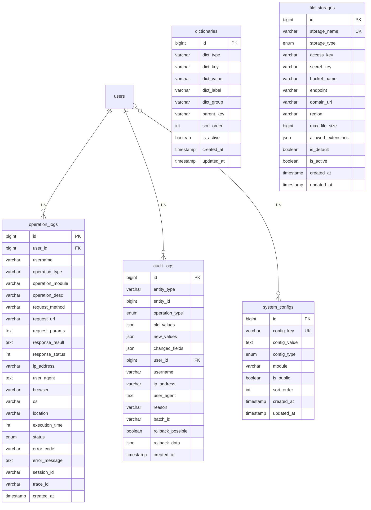

# 系统核心表设计文档

## 🗄️ 系统核心表设计文档

本文档描述影视资源下载网站第一层系统核心表的设计，作为用户权限核心表的补充，为系统提供基础配置和审计支持。

---

## 🎯 设计目标与原则

### 设计目标
为影视资源下载网站建立完整的系统基础设施，包括系统配置、数据字典、文件存储、操作审计等核心功能。

### 设计原则
- **配置驱动**：系统行为通过配置控制，支持运行时调整
- **数据标准化**：通过数据字典实现数据的标准化管理
- **存储可扩展**：支持多种文件存储方式，便于扩展
- **操作可追溯**：完整的操作日志和审计机制
- **安全优先**：敏感配置加密存储，操作权限严格控制

---

## 📊 系统核心表设计

### 1. system_configs - 系统配置表

#### 表设计说明
系统配置表存储系统的各种配置信息，支持配置分组、访问控制和加密存储。

```sql
CREATE TABLE system_configs (
    -- 主键字段：遵循自增BIGINT主键规范
    id BIGINT UNSIGNED NOT NULL AUTO_INCREMENT COMMENT '配置ID',

    -- 配置基础信息：遵循字段命名规范
    config_key VARCHAR(100) NOT NULL UNIQUE COMMENT '配置键',
    config_value TEXT COMMENT '配置值',
    config_type ENUM('STRING', 'NUMBER', 'BOOLEAN', 'JSON') DEFAULT 'STRING' COMMENT '配置类型',
    module VARCHAR(50) NOT NULL DEFAULT 'default' COMMENT '所属模块',
    description VARCHAR(500) COMMENT '配置描述',

    -- 访问控制：支持公开/私有配置
    is_public TINYINT(1) DEFAULT 0 COMMENT '是否公开配置',
    is_encrypted TINYINT(1) DEFAULT 0 COMMENT '是否加密存储',
    sort_order INT DEFAULT 0 COMMENT '排序',

    -- 通用审计字段：遵循通用字段设计规范
    created_by BIGINT UNSIGNED NULL COMMENT '创建人ID',
    updated_by BIGINT UNSIGNED NULL COMMENT '更新人ID',
    version INT UNSIGNED NOT NULL DEFAULT 1 COMMENT '乐观锁版本号',
    created_at TIMESTAMP NOT NULL DEFAULT CURRENT_TIMESTAMP COMMENT '创建时间',
    updated_at TIMESTAMP NOT NULL DEFAULT CURRENT_TIMESTAMP ON UPDATE CURRENT_TIMESTAMP COMMENT '更新时间',
    deleted_at TIMESTAMP NULL COMMENT '删除时间',

    -- 主键约束：遵循主键设计规范
    PRIMARY KEY (id),

    -- 唯一性约束：保证配置键唯一性
    UNIQUE KEY uk_configs_key (config_key),

    -- 查询索引：遵循索引设计指导原则
    KEY idx_configs_module (module),
    KEY idx_configs_public (is_public),
    KEY idx_configs_encrypted (is_encrypted),
    KEY idx_configs_sort (sort_order),
    KEY idx_configs_created_at (created_at),
    KEY idx_configs_updated_by (updated_by),
    KEY idx_configs_version (version),

    -- 数据完整性约束：遵循CHECK约束规范
    CONSTRAINT chk_configs_key_format CHECK (config_key REGEXP '^[a-z][a-z0-9_]*$'),
    CONSTRAINT chk_configs_module_format CHECK (module REGEXP '^[a-z][a-z0-9_]*$'),
    CONSTRAINT chk_configs_sort_order CHECK (sort_order >= 0),
    CONSTRAINT chk_configs_not_delete_system CHECK (deleted_at IS NULL OR config_key NOT LIKE 'system.%')

) ENGINE=InnoDB DEFAULT CHARSET=utf8mb4 COLLATE=utf8mb4_unicode_ci COMMENT='系统配置表';
```

#### 配置分类

**网站信息配置 (site)**
- site.name: 网站名称
- site.description: 网站描述
- site.keywords: 网站关键词
- site.logo: 网站Logo
- site.favicon: 网站图标

**用户相关配置 (user)**
- user.default_avatar: 用户默认头像
- user.max_login_attempts: 最大登录尝试次数
- user.lockout_duration: 账户锁定时长
- user.password_min_length: 密码最小长度
- user.session_timeout: 会话超时时间

**功能开关配置 (feature)**
- feature.registration: 是否开放注册
- feature.email_verification: 是否需要邮箱验证
- feature.vip_system: 是否启用VIP系统
- feature.comment_system: 是否启用评论系统

### 2. dictionaries - 数据字典表

#### 表设计说明
数据字典表存储系统中使用的各种字典数据，支持分组管理和层级结构。

```sql
CREATE TABLE dictionaries (
    -- 主键字段：遵循自增主键规范
    id BIGINT UNSIGNED NOT NULL AUTO_INCREMENT COMMENT '字典ID',

    -- 字典基础信息：遵循字段命名规范
    dict_type VARCHAR(50) NOT NULL COMMENT '字典类型',
    dict_key VARCHAR(100) NOT NULL COMMENT '字典键',
    dict_value VARCHAR(200) NOT NULL COMMENT '字典值',
    dict_label VARCHAR(100) COMMENT '字典标签',
    dict_group VARCHAR(50) COMMENT '字典分组',
    parent_key VARCHAR(100) COMMENT '父级键',

    -- 排序和状态：支持字典项排序和启用控制
    sort_order INT DEFAULT 0 COMMENT '排序',
    is_active TINYINT(1) DEFAULT 1 COMMENT '是否启用',
    remark VARCHAR(500) COMMENT '备注',

    -- 通用审计字段：遵循通用字段设计规范
    created_by BIGINT UNSIGNED NULL COMMENT '创建人ID',
    updated_by BIGINT UNSIGNED NULL COMMENT '更新人ID',
    version INT UNSIGNED NOT NULL DEFAULT 1 COMMENT '乐观锁版本号',
    created_at TIMESTAMP NOT NULL DEFAULT CURRENT_TIMESTAMP COMMENT '创建时间',
    updated_at TIMESTAMP NOT NULL DEFAULT CURRENT_TIMESTAMP ON UPDATE CURRENT_TIMESTAMP COMMENT '更新时间',
    deleted_at TIMESTAMP NULL COMMENT '删除时间',

    -- 主键约束
    PRIMARY KEY (id),

    -- 唯一性约束：保证字典类型和键的唯一性
    UNIQUE KEY uk_dictionaries_type_key (dict_type, dict_key),

    -- 查询索引：支持常用查询场景
    KEY idx_dictionaries_type (dict_type),
    KEY idx_dictionaries_group (dict_group),
    KEY idx_dictionaries_parent (parent_key),
    KEY idx_dictionaries_sort (sort_order),
    KEY idx_dictionaries_active (is_active),
    KEY idx_dictionaries_created_at (created_at),
    KEY idx_dictionaries_updated_by (updated_by),
    KEY idx_dictionaries_version (version),

    -- 数据完整性约束：遵循CHECK约束规范
    CONSTRAINT chk_dictionaries_type_format CHECK (dict_type REGEXP '^[a-z][a-z0-9_]*$'),
    CONSTRAINT chk_dictionaries_key_format CHECK (dict_key REGEXP '^[a-z][a-z0-9_]*$'),
    CONSTRAINT chk_dictionaries_group_format CHECK (dict_group IS NULL OR dict_group REGEXP '^[a-z][a-z0-9_]*$'),
    CONSTRAINT chk_dictionaries_sort_order CHECK (sort_order >= 0),
    CONSTRAINT chk_dictionaries_label_length CHECK (dict_label IS NULL OR CHAR_LENGTH(dict_label) <= 100),
    CONSTRAINT chk_dictionaries_remark_length CHECK (remark IS NULL OR CHAR_LENGTH(remark) <= 500)

) ENGINE=InnoDB DEFAULT CHARSET=utf8mb4 COLLATE=utf8mb4_unicode_ci COMMENT='数据字典表';
```

#### 字典分类

**用户状态字典 (USER_STATUS)**
- active: 正常
- inactive: 未激活
- suspended: 已暂停
- deleted: 已删除

**文件类型字典 (FILE_TYPE)**
- image: 图片
- video: 视频
- audio: 音频
- document: 文档
- subtitle: 字幕
- other: 其他

**操作类型字典 (OPERATION_TYPE)**
- login: 登录
- logout: 登出
- register: 注册
- create: 创建
- update: 更新
- delete: 删除
- view: 查看
- download: 下载
- upload: 上传
- search: 搜索

**影视类型字典 (MOVIE_TYPE)**
- movie: 电影
- tv_series: 电视剧
- documentary: 纪录片
- animation: 动画片
- variety: 综艺
- short: 短片

### 3. file_storages - 文件存储配置表

#### 表设计说明
文件存储配置表支持多种存储方式，包括本地存储和云存储，支持存储的动态切换。

```sql
CREATE TABLE file_storages (
    -- 主键字段：遵循自增主键规范
    id BIGINT UNSIGNED NOT NULL AUTO_INCREMENT COMMENT '存储ID',

    -- 存储基础信息：遵循字段命名规范
    storage_name VARCHAR(100) NOT NULL COMMENT '存储名称',
    storage_type ENUM('LOCAL', 'OSS', 'COS', 'QINIU', 'S3') NOT NULL COMMENT '存储类型',

    -- 存储配置信息：支持多种云存储
    access_key VARCHAR(200) COMMENT '访问密钥',
    secret_key VARCHAR(200) COMMENT '安全密钥',
    bucket_name VARCHAR(100) COMMENT '桶名称',
    endpoint VARCHAR(200) COMMENT '访问端点',
    domain_url VARCHAR(200) COMMENT '访问域名',
    region VARCHAR(50) COMMENT '区域',

    -- 存储限制和配置
    max_file_size BIGINT DEFAULT 104857600 COMMENT '最大文件大小(字节)',
    allowed_extensions JSON COMMENT '允许的文件扩展名',
    is_default TINYINT(1) DEFAULT 0 COMMENT '是否默认存储',
    is_active TINYINT(1) DEFAULT 1 COMMENT '是否启用',

    -- 通用审计字段：遵循通用字段设计规范
    created_by BIGINT UNSIGNED NULL COMMENT '创建人ID',
    updated_by BIGINT UNSIGNED NULL COMMENT '更新人ID',
    version INT UNSIGNED NOT NULL DEFAULT 1 COMMENT '乐观锁版本号',
    created_at TIMESTAMP NOT NULL DEFAULT CURRENT_TIMESTAMP COMMENT '创建时间',
    updated_at TIMESTAMP NOT NULL DEFAULT CURRENT_TIMESTAMP ON UPDATE CURRENT_TIMESTAMP COMMENT '更新时间',
    deleted_at TIMESTAMP NULL COMMENT '删除时间',

    -- 主键约束
    PRIMARY KEY (id),

    -- 唯一性约束：保证存储名称唯一性
    UNIQUE KEY uk_file_storages_name (storage_name),

    -- 查询索引：支持常用查询场景
    KEY idx_file_storages_type (storage_type),
    KEY idx_file_storages_default (is_default),
    KEY idx_file_storages_active (is_active),
    KEY idx_file_storages_region (region),
    KEY idx_file_storages_created_at (created_at),
    KEY idx_file_storages_updated_by (updated_by),
    KEY idx_file_storages_version (version),

    -- 数据完整性约束：遵循CHECK约束规范
    CONSTRAINT chk_file_storages_name_length CHECK (CHAR_LENGTH(storage_name) >= 2 AND CHAR_LENGTH(storage_name) <= 100),
    CONSTRAINT chk_file_storages_max_file_size CHECK (max_file_size > 0),
    CONSTRAINT chk_file_storages_not_delete_default CHECK (deleted_at IS NULL OR is_default = 0)

) ENGINE=InnoDB DEFAULT CHARSET=utf8mb4 COLLATE=utf8mb4_unicode_ci COMMENT='文件存储配置表';
```

#### 存储类型支持

**本地存储 (LOCAL)**
- 文件系统直接存储
- 适用于开发和测试环境
- 性能较好，便于管理

**阿里云OSS**
- 对象存储服务
- 高可用性，CDN加速
- 适用于生产环境

**腾讯云COS**
- 云对象存储
- 多地域支持
- 性能稳定

**七牛云存储**
- 对象存储服务
- 成本较低
- 适用于中小型项目

**AWS S3**
- 亚马逊云存储
- 全球覆盖
- 企业级可靠性

### 4. operation_logs - 操作日志表

#### 表设计说明
操作日志表记录用户的所有操作行为，包括成功和失败的操作，用于系统监控和问题排查。

```sql
CREATE TABLE operation_logs (
    -- 主键字段：遵循自增主键规范
    id BIGINT UNSIGNED NOT NULL AUTO_INCREMENT COMMENT '日志ID',

    -- 用户信息：记录操作用户
    user_id BIGINT UNSIGNED NULL COMMENT '用户ID',
    username VARCHAR(50) COMMENT '用户名（冗余字段，防止用户删除后无法追溯）',

    -- 操作信息：记录操作详情
    operation_type VARCHAR(50) NOT NULL COMMENT '操作类型',
    operation_module VARCHAR(50) NOT NULL COMMENT '操作模块',
    operation_desc VARCHAR(200) COMMENT '操作描述',

    -- 请求信息：记录HTTP请求详情
    request_method VARCHAR(10) COMMENT '请求方法',
    request_url VARCHAR(500) COMMENT '请求URL',
    request_params TEXT COMMENT '请求参数',
    response_result TEXT COMMENT '响应结果',
    response_status INT COMMENT '响应状态码',

    -- 环境信息：记录操作环境
    ip_address VARCHAR(45) COMMENT 'IP地址',
    user_agent TEXT COMMENT '用户代理',
    browser VARCHAR(50) COMMENT '浏览器',
    os VARCHAR(50) COMMENT '操作系统',
    location VARCHAR(200) COMMENT '操作地点',

    -- 性能信息：记录操作性能
    execution_time INT COMMENT '执行时间(ms)',
    status ENUM('SUCCESS', 'FAILURE', 'ERROR') NOT NULL COMMENT '执行状态',
    error_code VARCHAR(50) COMMENT '错误代码',
    error_message TEXT COMMENT '错误信息',

    -- 会话信息：记录会话详情
    session_id VARCHAR(128) COMMENT '会话ID',
    trace_id VARCHAR(64) COMMENT '链路追踪ID',

    -- 审计字段：记录创建信息
    created_at TIMESTAMP NOT NULL DEFAULT CURRENT_TIMESTAMP COMMENT '创建时间',

    -- 主键约束
    PRIMARY KEY (id),

    -- 查询索引：支持常用查询场景
    KEY idx_operation_logs_user (user_id),
    KEY idx_operation_logs_username (username),
    KEY idx_operation_logs_type (operation_type),
    KEY idx_operation_logs_module (operation_module),
    KEY idx_operation_logs_status (status),
    KEY idx_operation_logs_created_at (created_at),
    KEY idx_operation_logs_ip (ip_address),
    KEY idx_operation_logs_user_time (user_id, created_at DESC),
    KEY idx_operation_logs_type_status (operation_type, status),
    KEY idx_operation_logs_module_status (operation_module, status),
    KEY idx_operation_logs_trace (trace_id),
    KEY idx_operation_logs_session (session_id),

    -- 外键约束：遵循引用完整性规则
    CONSTRAINT fk_operation_logs_user_id FOREIGN KEY (user_id) REFERENCES users(id) ON DELETE SET NULL,

    -- 数据完整性约束：遵循CHECK约束规范
    CONSTRAINT chk_operation_logs_username_length CHECK (username IS NULL OR (CHAR_LENGTH(username) >= 3 AND CHAR_LENGTH(username) <= 50)),
    CONSTRAINT chk_operation_logs_operation_type_length CHECK (CHAR_LENGTH(operation_type) >= 2 AND CHAR_LENGTH(operation_type) <= 50),
    CONSTRAINT chk_operation_logs_operation_module_length CHECK (CHAR_LENGTH(operation_module) >= 2 AND CHAR_LENGTH(operation_module) <= 50),
    CONSTRAINT chk_operation_logs_operation_desc_length CHECK (operation_desc IS NULL OR CHAR_LENGTH(operation_desc) <= 200),
    CONSTRAINT chk_operation_logs_request_url_length CHECK (request_url IS NULL OR CHAR_LENGTH(request_url) <= 500),
    CONSTRAINT chk_operation_logs_response_status CHECK (response_status IS NULL OR (response_status >= 100 AND response_status <= 599)),
    CONSTRAINT chk_operation_logs_execution_time CHECK (execution_time IS NULL OR execution_time >= 0),
    CONSTRAINT chk_operation_logs_error_code_length CHECK (error_code IS NULL OR CHAR_LENGTH(error_code) <= 50),
    CONSTRAINT chk_operation_logs_ip_format CHECK (ip_address IS NULL OR ip_address REGEXP '^([0-9]{1,3}\\.){3}[0-9]{1,3}$' OR ip_address REGEXP '^([0-9a-fA-F]{1,4}:){7}[0-9a-fA-F]{1,4}$'),
    CONSTRAINT chk_operation_logs_browser_length CHECK (browser IS NULL OR CHAR_LENGTH(browser) <= 50),
    CONSTRAINT chk_operation_logs_os_length CHECK (os IS NULL OR CHAR_LENGTH(os) <= 50),
    CONSTRAINT chk_operation_logs_location_length CHECK (location IS NULL OR CHAR_LENGTH(location) <= 200)

) ENGINE=InnoDB DEFAULT CHARSET=utf8mb4 COLLATE=utf8mb4_unicode_ci COMMENT='操作日志表';
```

#### 操作类型记录

**用户操作**
- login: 用户登录
- logout: 用户登出
- register: 用户注册
- profile_update: 资料更新

**内容操作**
- content_view: 内容查看
- content_create: 内容创建
- content_update: 内容更新
- content_delete: 内容删除

**系统操作**
- config_view: 配置查看
- config_update: 配置更新
- system_monitor: 系统监控

### 5. audit_logs - 审计日志表

#### 表设计说明
审计日志表记录数据变更的详细信息，包括变更前后的值，支持数据回滚和变更追踪。

```sql
CREATE TABLE audit_logs (
    -- 主键字段：遵循自增主键规范
    id BIGINT UNSIGNED NOT NULL AUTO_INCREMENT COMMENT '审计ID',

    -- 实体信息：记录被操作实体
    entity_type VARCHAR(50) NOT NULL COMMENT '实体类型',
    entity_id BIGINT NOT NULL COMMENT '实体ID',
    operation_type ENUM('CREATE', 'UPDATE', 'DELETE', 'RESTORE') NOT NULL COMMENT '操作类型',

    -- 变更信息：记录数据变更详情
    old_values JSON COMMENT '旧值',
    new_values JSON COMMENT '新值',
    changed_fields JSON COMMENT '变更字段',

    -- 操作用户信息：记录操作者
    user_id BIGINT UNSIGNED NULL COMMENT '操作用户ID',
    username VARCHAR(50) COMMENT '用户名（冗余字段）',
    ip_address VARCHAR(45) COMMENT 'IP地址',
    user_agent TEXT COMMENT '用户代理',

    -- 操作上下文：记录操作上下文信息
    reason VARCHAR(500) COMMENT '操作原因',
    batch_id VARCHAR(64) COMMENT '批次ID（批量操作）',
    rollback_possible TINYINT(1) DEFAULT 0 COMMENT '是否可回滚',
    rollback_data JSON COMMENT '回滚数据',

    -- 审计字段：记录创建信息
    created_at TIMESTAMP NOT NULL DEFAULT CURRENT_TIMESTAMP COMMENT '创建时间',

    -- 主键约束
    PRIMARY KEY (id),

    -- 查询索引：支持常用查询场景
    KEY idx_audit_logs_entity (entity_type, entity_id),
    KEY idx_audit_logs_operation (operation_type),
    KEY idx_audit_logs_user (user_id),
    KEY idx_audit_logs_username (username),
    KEY idx_audit_logs_created_at (created_at),
    KEY idx_audit_logs_batch (batch_id),
    KEY idx_audit_logs_rollback (rollback_possible),
    KEY idx_audit_logs_ip (ip_address),
    KEY idx_audit_logs_entity_time (entity_type, created_at DESC),
    KEY idx_audit_logs_user_time (user_id, created_at DESC),

    -- 外键约束：遵循引用完整性规则
    CONSTRAINT fk_audit_logs_user_id FOREIGN KEY (user_id) REFERENCES users(id) ON DELETE SET NULL,

    -- 数据完整性约束：遵循CHECK约束规范
    CONSTRAINT chk_audit_logs_entity_type_length CHECK (CHAR_LENGTH(entity_type) >= 2 AND CHAR_LENGTH(entity_type) <= 50),
    CONSTRAINT chk_audit_logs_username_length CHECK (username IS NULL OR (CHAR_LENGTH(username) >= 3 AND CHAR_LENGTH(username) <= 50)),
    CONSTRAINT chk_audit_logs_reason_length CHECK (reason IS NULL OR CHAR_LENGTH(reason) <= 500),
    CONSTRAINT chk_audit_logs_batch_id_length CHECK (batch_id IS NULL OR CHAR_LENGTH(batch_id) <= 64),
    CONSTRAINT chk_audit_logs_ip_format CHECK (ip_address IS NULL OR ip_address REGEXP '^([0-9]{1,3}\\.){3}[0-9]{1,3}$' OR ip_address REGEXP '^([0-9a-fA-F]{1,4}:){7}[0-9a-fA-F]{1,4}$')

) ENGINE=InnoDB DEFAULT CHARSET=utf8mb4 COLLATE=utf8mb4_unicode_ci COMMENT='审计日志表';
```

#### 审计记录类型

**数据变更记录**
- CREATE: 数据创建
- UPDATE: 数据更新
- DELETE: 数据删除
- RESTORE: 数据恢复

**变更信息**
- old_values: 变更前的JSON数据
- new_values: 变更后的JSON数据
- changed_fields: 变更字段列表

---

## 🔗 表间关系设计

### 关系图


### 关系说明

**1. users 与 operation_logs 关系**
- **关系类型**：一对多 (1:N)
- **外键**：operation_logs.user_id → users.id
- **约束**：ON DELETE SET NULL，用户删除时保留日志

**2. users 与 audit_logs 关系**
- **关系类型**：一对多 (1:N)
- **外键**：audit_logs.user_id → users.id
- **约束**：ON DELETE SET NULL，用户删除时保留审计记录

**3. users 与 system_configs 关系**
- **关系类型**：一对多 (1:N)
- **外键**：system_configs.created_by → users.id
- **约束**：ON DELETE SET NULL，用户删除时保留配置

---

## 📊 索引策略分析

### 索引设计总结

#### 主键索引
- ✅ 所有表使用 BIGINT UNSIGNED AUTO_INCREMENT 主键
- ✅ 自动创建聚簇索引，优化查询性能

#### 唯一索引
- ✅ system_configs.config_key - 保证配置键唯一性
- ✅ dictionaries.dict_type_key - 保证字典类型键唯一性
- ✅ file_storages.storage_name - 保证存储名称唯一性

#### 查询索引
- ✅ 分组字段索引：支持按分组查询
- ✅ 状态字段索引：支持状态筛选查询
- ✅ 时间字段索引：支持时间范围查询和排序
- ✅ 外键字段索引：优化JOIN查询性能
- ✅ 复合索引：支持多条件组合查询

#### 索引命名规范
- ✅ 主键：PRIMARY KEY
- ✅ 唯一索引：uk_{table}_{column}
- ✅ 普通索引：idx_{table}_{column}
- ✅ 复合索引：idx_{table}_{column1}_{column2}

---

## 🛡️ 数据完整性保证

### 实体完整性
- ✅ 主键约束：每表都有主键，保证行唯一性
- ✅ 非空约束：关键字段设置NOT NULL约束
- ✅ 唯一约束：业务关键字段设置唯一约束

### 域完整性
- ✅ 数据类型约束：选择合适的数据类型和长度
- ✅ CHECK约束：字段值范围和格式验证
- ✅ 默认值约束：合理的默认值设置

### 引用完整性
- ✅ 外键约束：users表的外键引用完整性
- ✅ 级联操作：设置合适的级联删除策略
- ✅ 索引优化：外键字段建立索引优化JOIN性能

### 用户自定义完整性
- ✅ 业务规则约束：通过CHECK约束实现业务规则
- ✅ 数据格式验证：正则表达式验证数据格式
- ✅ 逻辑一致性：约束保证数据逻辑一致性

---

## 📈 性能优化策略

### 查询优化
- ✅ 合理的索引设计支持常用查询场景
- ✅ 复合索引支持多条件查询
- ✅ 覆盖索引减少回表查询

### 存储优化
- ✅ 合理的字段类型选择，节约存储空间
- ✅ TEXT类型字段单独存储，减少主表大小
- ✅ JSON类型存储复杂配置，避免表结构频繁变更

### 并发优化
- ✅ 合理的事务边界设计
- ✅ 减少锁竞争的索引策略
- ✅ 读写分离准备的设计

---

## 🔄 数据迁移脚本

### V1.1.3__Create_system_core_tables.sql

创建系统核心表，包括：
- system_configs - 系统配置表
- dictionaries - 数据字典表
- file_storages - 文件存储配置表
- operation_logs - 操作日志表
- audit_logs - 审计日志表

### V1.1.4__Insert_system_core_data.sql

插入系统核心基础数据：
- 系统配置数据：96个配置项
- 数据字典数据：100+个字典项
- 文件存储配置：5个存储配置
- 操作日志样本：10条操作日志
- 审计日志样本：10条审计日志

---

## ✅ 设计验证清单

### 规范符合性检查
- [x] **命名规范**：严格遵循小写字母+下划线+复数形式
- [x] **字段类型**：遵循字段类型规范和长度标准
- [x] **约束设置**：按照字段约束规范设置NOT NULL、DEFAULT、CHECK约束
- [x] **索引设计**：遵循索引设计指导原则，包含主键、唯一键、普通键
- [x] **完整性规则**：遵循数据完整性规则，包含实体、域、引用完整性
- [x] **版本管理**：遵循Flyway迁移脚本规范

### 业务需求满足度
- [x] **系统配置管理**：支持分组配置、公开/私有配置、加密存储
- [x] **数据字典管理**：支持标准化数据、分组管理、层级结构
- [x] **文件存储管理**：支持多种存储方式、动态切换、扩展配置
- [x] **操作日志记录**：支持详细的操作记录、性能监控、错误追踪
- [x] **审计日志记录**：支持数据变更追踪、回滚支持、操作追溯

### 性能优化检查
- [x] **索引策略**：合理的索引设计支持常用查询场景
- [x] **查询优化**：复合索引支持多条件查询
- [x] **存储优化**：合理的字段类型选择
- [x] **并发支持**：设计考虑高并发访问场景

---

## 📝 使用说明

### 配置管理
1. 系统启动时自动加载所有公开配置
2. 敏感配置（如密钥、密码）存储时自动加密
3. 配置变更时自动更新缓存并记录操作日志
4. 支持配置热更新，无需重启服务

### 数据字典使用
1. 应用启动时加载所有启用的字典数据到内存
2. 前端展示时直接从内存获取，提高性能
3. 字典变更时自动刷新缓存
4. 支持字典的国际化扩展

### 存储配置使用
1. 默认使用第一个启用的存储配置
2. 上传时根据文件类型和大小选择合适的存储
3. 支持存储的动态切换和故障转移
4. 定期检查存储的可用性

### 日志查询
1. 操作日志支持按用户、模块、时间、状态等多维度查询
2. 审计日志支持按实体类型、操作类型、时间范围查询
3. 支持日志的导出和归档
4. 重要操作自动发送通知

---

**文档维护**：系统核心表设计文档随系统演进持续更新
**最后更新**：2025-10-30
**维护人员**：数据库团队