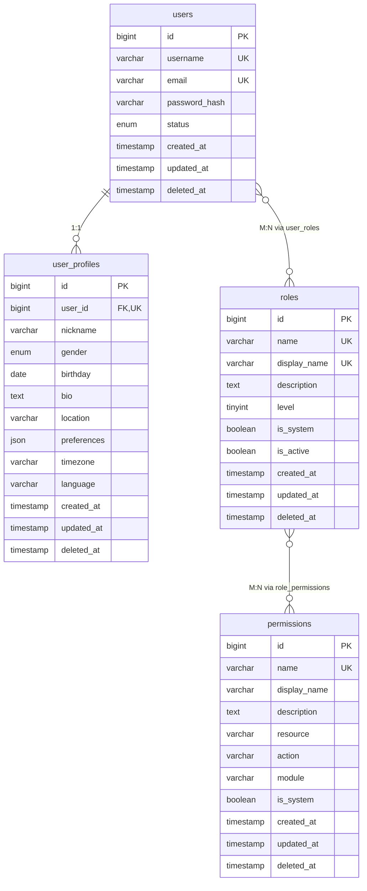

# 用户权限核心表设计

## 👥 用户权限核心表设计文档

本文档严格遵循《数据库命名规范》、《数据库架构规范制定》、《数据完整性规则》、《索引设计指导原则》和《数据库分层设计原则》，设计影视资源下载网站第一层用户权限核心表：users、user_profiles、roles、permissions。

---

## 🎯 设计目标与原则

### 设计目标
为影视资源下载网站建立完整的用户权限管理体系，支撑所有业务功能的用户认证、授权和管理需求。

### 设计原则
- **严格遵循规范**：严格按照所有已制定的数据库规范进行设计
- **数据完整性**：通过约束保证数据的准确性和一致性
- **性能优化**：合理的索引设计保证查询性能
- **扩展性**：为未来功能扩展预留空间
- **安全性**：支持密码加密、账户锁定等安全机制

---

## 📊 用户权限核心表设计

### 1. users - 用户基础信息表

#### 表设计说明
用户基础信息表是整个系统的核心表，存储用户的基本账户信息和认证数据。

```sql
CREATE TABLE users (
    -- 主键字段：遵循自增BIGINT主键规范
    id BIGINT UNSIGNED NOT NULL AUTO_INCREMENT COMMENT '用户唯一标识',

    -- 基础认证信息：遵循唯一性约束和字段命名规范
    username VARCHAR(50) NOT NULL COMMENT '用户名',
    email VARCHAR(255) NOT NULL COMMENT '邮箱地址',
    password_hash VARCHAR(255) NOT NULL COMMENT '密码哈希值',

    -- 可选联系信息：遵循字段命名规范和类型规范
    phone VARCHAR(20) NULL COMMENT '手机号码',
    avatar_url VARCHAR(500) NULL COMMENT '头像URL',

    -- 用户状态管理：遵循ENUM类型使用规范
    status ENUM('active', 'inactive', 'suspended', 'deleted') NOT NULL DEFAULT 'inactive' COMMENT '账户状态',
    email_verified BOOLEAN NOT NULL DEFAULT FALSE COMMENT '邮箱是否验证',
    phone_verified BOOLEAN NOT NULL DEFAULT FALSE COMMENT '手机是否验证',

    -- 登录安全信息：遵循时间字段命名规范
    last_login_at TIMESTAMP NULL COMMENT '最后登录时间',
    last_login_ip VARCHAR(45) NULL COMMENT '最后登录IP',
    login_attempts TINYINT UNSIGNED NOT NULL DEFAULT 0 COMMENT '登录尝试次数',
    locked_until TIMESTAMP NULL COMMENT '账户锁定到期时间',

    -- 通用审计字段：遵循通用字段设计规范
    created_by BIGINT UNSIGNED NULL COMMENT '创建人ID',
    updated_by BIGINT UNSIGNED NULL COMMENT '更新人ID',
    version INT UNSIGNED NOT NULL DEFAULT 1 COMMENT '乐观锁版本号',
    created_at TIMESTAMP NOT NULL DEFAULT CURRENT_TIMESTAMP COMMENT '创建时间',
    updated_at TIMESTAMP NOT NULL DEFAULT CURRENT_TIMESTAMP ON UPDATE CURRENT_TIMESTAMP COMMENT '更新时间',
    deleted_at TIMESTAMP NULL COMMENT '删除时间',

    -- 主键约束：遵循主键设计规范
    PRIMARY KEY (id),

    -- 唯一性约束：遵循业务唯一性规则
    UNIQUE KEY uk_users_username (username),
    UNIQUE KEY uk_users_email (email),

    -- 查询索引：遵循索引设计指导原则
    KEY idx_users_status (status),
    KEY idx_users_created_at (created_at),
    KEY idx_users_last_login_at (last_login_at),
    KEY idx_users_email_verified (email_verified),
    KEY idx_users_locked_until (locked_until),
    KEY idx_users_created_by (created_by),
    KEY idx_users_updated_by (updated_by),
    KEY idx_users_version (version),

    -- 数据完整性约束：遵循CHECK约束规范
    CONSTRAINT chk_users_username_length CHECK (CHAR_LENGTH(username) >= 3 AND CHAR_LENGTH(username) <= 50),
    CONSTRAINT chk_users_email_format CHECK (email REGEXP '^[A-Za-z0-9._%+-]+@[A-Za-z0-9.-]+\\.[A-Za-z]{2,}$'),
    CONSTRAINT chk_users_phone_format CHECK (phone IS NULL OR phone REGEXP '^1[3-9]\\d{9}$'),
    CONSTRAINT chk_users_status_valid CHECK (status IN ('active', 'inactive', 'suspended', 'deleted')),
    CONSTRAINT chk_users_login_attempts CHECK (login_attempts <= 10),
    CONSTRAINT chk_users_password_hash_length CHECK (CHAR_LENGTH(password_hash) >= 60)

) ENGINE=InnoDB DEFAULT CHARSET=utf8mb4 COLLATE=utf8mb4_unicode_ci COMMENT='用户基础信息表';
```

#### 设计要点说明

**字段设计规范遵循**：
- ✅ 使用`BIGINT UNSIGNED`作为主键，支持大数据量
- ✅ 用户名长度限制为3-50字符，符合用户名规范
- ✅ 邮箱使用正则表达式验证格式
- ✅ 手机号支持中国大陆手机号格式验证
- ✅ 密码哈希长度检查，确保使用BCrypt等安全哈希

**索引设计原则遵循**：
- ✅ 用户名、邮箱建立唯一索引，保证业务唯一性
- ✅ 状态字段建立索引，支持状态筛选查询
- ✅ 创建时间建立索引，支持时间范围查询
- ✅ 登录时间建立索引，支持活跃用户分析

**数据完整性规则遵循**：
- ✅ 所有业务字段设置NOT NULL约束
- ✅ 状态字段使用ENUM类型，限制取值范围
- ✅ 登录尝试次数限制，防止暴力破解
- ✅ 密码哈希长度检查，确保密码安全性

### 2. user_profiles - 用户扩展信息表

#### 表设计说明
用户扩展信息表存储用户的详细个人信息，与用户基础信息表一对一关联。

```sql
CREATE TABLE user_profiles (
    -- 主键字段：遵循自增主键规范
    id BIGINT UNSIGNED NOT NULL AUTO_INCREMENT COMMENT '主键ID',

    -- 用户关联：遵循外键约束规范
    user_id BIGINT UNSIGNED NOT NULL COMMENT '用户ID',

    -- 基本个人信息：遵循字段命名规范
    nickname VARCHAR(50) NULL COMMENT '昵称',
    gender ENUM('male', 'female', 'other', 'unknown') NULL DEFAULT 'unknown' COMMENT '性别',
    birthday DATE NULL COMMENT '生日',
    bio TEXT NULL COMMENT '个人简介',
    location VARCHAR(100) NULL COMMENT '所在地',
    website VARCHAR(255) NULL COMMENT '个人网站',
    company VARCHAR(100) NULL COMMENT '公司',
    occupation VARCHAR(100) NULL COMMENT '职业',

    -- 用户偏好设置：使用JSON类型存储复杂配置
    preferences JSON NULL COMMENT '用户偏好设置',

    -- 系统设置：遵循默认值规范
    timezone VARCHAR(50) NOT NULL DEFAULT 'Asia/Shanghai' COMMENT '时区设置',
    language VARCHAR(10) NOT NULL DEFAULT 'zh-CN' COMMENT '语言设置',

    -- 通用审计字段：遵循通用字段设计规范
    created_by BIGINT UNSIGNED NULL COMMENT '创建人ID',
    updated_by BIGINT UNSIGNED NULL COMMENT '更新人ID',
    version INT UNSIGNED NOT NULL DEFAULT 1 COMMENT '乐观锁版本号',
    created_at TIMESTAMP NOT NULL DEFAULT CURRENT_TIMESTAMP COMMENT '创建时间',
    updated_at TIMESTAMP NOT NULL DEFAULT CURRENT_TIMESTAMP ON UPDATE CURRENT_TIMESTAMP COMMENT '更新时间',
    deleted_at TIMESTAMP NULL COMMENT '删除时间',

    -- 主键约束
    PRIMARY KEY (id),

    -- 唯一性约束：保证与用户表的一对一关系
    UNIQUE KEY uk_user_profiles_user_id (user_id),

    -- 查询索引：支持常用查询场景
    KEY idx_user_profiles_nickname (nickname),
    KEY idx_user_profiles_location (location),
    KEY idx_user_profiles_created_at (created_at),
    KEY idx_user_profiles_gender (gender),
    KEY idx_user_profiles_timezone (timezone),

    -- 外键约束：遵循引用完整性规则
    CONSTRAINT fk_user_profiles_user_id FOREIGN KEY (user_id) REFERENCES users(id) ON DELETE CASCADE,

    -- 数据完整性约束：遵循CHECK约束规范
    CONSTRAINT chk_user_profiles_nickname_length CHECK (nickname IS NULL OR (CHAR_LENGTH(nickname) >= 2 AND CHAR_LENGTH(nickname) <= 50)),
    CONSTRAINT chk_user_profiles_birthday_range CHECK (birthday IS NULL OR birthday BETWEEN '1900-01-01' AND CURDATE()),
    CONSTRAINT chk_user_profiles_bio_length CHECK (bio IS NULL OR CHAR_LENGTH(bio) <= 1000),
    CONSTRAINT chk_user_profiles_location_length CHECK (location IS NULL OR CHAR_LENGTH(location) <= 100),
    CONSTRAINT chk_user_profiles_website_format CHECK (website IS NULL OR website REGEXP '^https?://.+'),
    CONSTRAINT chk_user_profiles_company_length CHECK (company IS NULL OR CHAR_LENGTH(company) <= 100),
    CONSTRAINT chk_user_profiles_occupation_length CHECK (occupation IS NULL OR CHAR_LENGTH(occupation) <= 100),
    CONSTRAINT chk_user_profiles_timezone_valid CHECK (timezone IN (SELECT name FROM mysql.time_zone_name)),
    CONSTRAINT chk_user_profiles_language_valid CHECK (language REGEXP '^[a-z]{2}-[A-Z]{2}$')

) ENGINE=InnoDB DEFAULT CHARSET=utf8mb4 COLLATE=utf8mb4_unicode_ci COMMENT='用户扩展信息表';
```

#### 设计要点说明

**关联关系设计**：
- ✅ 使用`user_id`外键关联users表，保证引用完整性
- ✅ 设置`ON DELETE CASCADE`，用户删除时自动删除扩展信息
- ✅ 建立唯一索引，确保一对一关系

**字段设计规范**：
- ✅ 性别使用ENUM类型，支持多种性别选择
- ✅ 生日使用DATE类型，支持日期范围验证
- ✅ 个人简介使用TEXT类型，支持长文本内容
- ✅ 网站使用正则表达式验证URL格式

**偏好设置设计**：
- ✅ 使用JSON类型存储复杂偏好设置，支持灵活扩展
- ✅ 时区设置验证，确保时区有效性
- ✅ 语言设置验证，使用标准语言代码格式

### 3. roles - 角色定义表

#### 表设计说明
角色定义表存储系统的角色信息，支持基于角色的访问控制(RBAC)。

```sql
CREATE TABLE roles (
    -- 主键字段：遵循自增主键规范
    id BIGINT UNSIGNED NOT NULL AUTO_INCREMENT COMMENT '角色唯一标识',

    -- 角色基本信息：遵循字段命名规范
    name VARCHAR(50) NOT NULL COMMENT '角色名称',
    display_name VARCHAR(100) NOT NULL COMMENT '角色显示名称',
    description TEXT NULL COMMENT '角色描述',

    -- 角色等级：支持角色层次结构
    level TINYINT UNSIGNED NOT NULL DEFAULT 0 COMMENT '角色等级，数字越大权限越高',

    -- 系统标识：区分系统角色和自定义角色
    is_system BOOLEAN NOT NULL DEFAULT FALSE COMMENT '是否为系统角色',
    is_active BOOLEAN NOT NULL DEFAULT TRUE COMMENT '是否启用',

    -- 通用审计字段：遵循通用字段设计规范
    created_by BIGINT UNSIGNED NULL COMMENT '创建人ID',
    updated_by BIGINT UNSIGNED NULL COMMENT '更新人ID',
    version INT UNSIGNED NOT NULL DEFAULT 1 COMMENT '乐观锁版本号',
    created_at TIMESTAMP NOT NULL DEFAULT CURRENT_TIMESTAMP COMMENT '创建时间',
    updated_at TIMESTAMP NOT NULL DEFAULT CURRENT_TIMESTAMP ON UPDATE CURRENT_TIMESTAMP COMMENT '更新时间',
    deleted_at TIMESTAMP NULL COMMENT '删除时间',

    -- 主键约束
    PRIMARY KEY (id),

    -- 唯一性约束：保证角色名称唯一性
    UNIQUE KEY uk_roles_name (name),
    UNIQUE KEY uk_roles_display_name (display_name),

    -- 查询索引：支持角色管理查询
    KEY idx_roles_level (level),
    KEY idx_roles_is_active (is_active),
    KEY idx_roles_is_system (is_system),
    KEY idx_roles_created_at (created_at),
    KEY idx_roles_level_active (level, is_active),

    -- 数据完整性约束：遵循CHECK约束规范
    CONSTRAINT chk_roles_name_length CHECK (CHAR_LENGTH(name) >= 2 AND CHAR_LENGTH(name) <= 50),
    CONSTRAINT chk_roles_display_name_length CHECK (CHAR_LENGTH(display_name) >= 2 AND CHAR_LENGTH(display_name) <= 100),
    CONSTRAINT chk_roles_description_length CHECK (description IS NULL OR CHAR_LENGTH(description) <= 1000),
    CONSTRAINT chk_roles_level_range CHECK (level <= 100),
    CONSTRAINT chk_roles_name_format CHECK (name REGEXP '^[a-z][a-z0-9_]*$'),
    CONSTRAINT chk_roles_not_delete_system CHECK (deleted_at IS NULL OR is_system = FALSE)

) ENGINE=InnoDB DEFAULT CHARSET=utf8mb4 COLLATE=utf8mb4_unicode_ci COMMENT='角色定义表';
```

#### 设计要点说明

**角色层次设计**：
- ✅ 使用level字段支持角色等级，数字越大权限越高
- ✅ 建立等级和状态复合索引，支持高效的角色筛选
- ✅ 系统角色保护，防止删除系统关键角色

**字段设计规范**：
- ✅ 角色名称使用小写字母和下划线，便于程序处理
- ✅ 显示名称支持中文，便于用户理解
- ✅ 描述使用TEXT类型，支持详细的角色说明

**完整性约束**：
- ✅ 角色名称格式验证，确保符合程序处理规范
- ✅ 系统角色删除保护，保证系统稳定性
- ✅ 等级范围限制，防止等级设置错误

### 4. permissions - 权限定义表

#### 表设计说明
权限定义表存储系统的权限信息，采用资源-操作模型定义权限。

```sql
CREATE TABLE permissions (
    -- 主键字段：遵循自增主键规范
    id BIGINT UNSIGNED NOT NULL AUTO_INCREMENT COMMENT '权限唯一标识',

    -- 权限基本信息：遵循字段命名规范
    name VARCHAR(100) NOT NULL COMMENT '权限名称',
    display_name VARCHAR(100) NOT NULL COMMENT '权限显示名称',
    description TEXT NULL COMMENT '权限描述',

    -- 权限模型：资源-操作模型
    resource VARCHAR(50) NOT NULL COMMENT '资源标识',
    action VARCHAR(50) NOT NULL COMMENT '操作标识',
    module VARCHAR(50) NOT NULL COMMENT '模块标识',

    -- 系统标识：区分系统权限和自定义权限
    is_system BOOLEAN NOT NULL DEFAULT FALSE COMMENT '是否为系统权限',

    -- 通用审计字段：遵循通用字段设计规范
    created_by BIGINT UNSIGNED NULL COMMENT '创建人ID',
    updated_by BIGINT UNSIGNED NULL COMMENT '更新人ID',
    version INT UNSIGNED NOT NULL DEFAULT 1 COMMENT '乐观锁版本号',
    created_at TIMESTAMP NOT NULL DEFAULT CURRENT_TIMESTAMP COMMENT '创建时间',
    updated_at TIMESTAMP NOT NULL DEFAULT CURRENT_TIMESTAMP ON UPDATE CURRENT_TIMESTAMP COMMENT '更新时间',
    deleted_at TIMESTAMP NULL COMMENT '删除时间',

    -- 主键约束
    PRIMARY KEY (id),

    -- 唯一性约束：保证权限的唯一性
    UNIQUE KEY uk_permissions_name (name),
    UNIQUE KEY uk_permissions_resource_action (resource, action),

    -- 查询索引：支持权限管理查询
    KEY idx_permissions_module (module),
    KEY idx_permissions_resource (resource),
    KEY idx_permissions_action (action),
    KEY idx_permissions_is_system (is_system),
    KEY idx_permissions_created_at (created_at),
    KEY idx_permissions_module_resource (module, resource),
    KEY idx_permissions_resource_action (resource, action),

    -- 数据完整性约束：遵循CHECK约束规范
    CONSTRAINT chk_permissions_name_length CHECK (CHAR_LENGTH(name) >= 3 AND CHAR_LENGTH(name) <= 100),
    CONSTRAINT chk_permissions_display_name_length CHECK (CHAR_LENGTH(display_name) >= 2 AND CHAR_LENGTH(display_name) <= 100),
    CONSTRAINT chk_permissions_description_length CHECK (description IS NULL OR CHAR_LENGTH(description) <= 500),
    CONSTRAINT chk_permissions_resource_format CHECK (resource REGEXP '^[a-z][a-z0-9_]*$'),
    CONSTRAINT chk_permissions_action_format CHECK (action REGEXP '^[a-z][a-z0-9_]*$'),
    CONSTRAINT chk_permissions_module_format CHECK (module REGEXP '^[a-z][a-z0-9_]*$'),
    CONSTRAINT chk_permissions_not_delete_system CHECK (deleted_at IS NULL OR is_system = FALSE)

) ENGINE=InnoDB DEFAULT CHARSET=utf8mb4 COLLATE=utf8mb4_unicode_ci COMMENT='权限定义表';

-- ========================================
-- 2.5 用户角色关联表 (User Roles Association Table)
-- ========================================
CREATE TABLE user_roles (
    -- 主键字段：遵循自增主键规范
    id BIGINT UNSIGNED NOT NULL AUTO_INCREMENT COMMENT '关联ID',

    -- 关联字段：用户和角色的多对多关系
    user_id BIGINT UNSIGNED NOT NULL COMMENT '用户ID',
    role_id BIGINT UNSIGNED NOT NULL COMMENT '角色ID',

    -- 授权管理：记录授权信息
    granted_by BIGINT UNSIGNED NOT NULL COMMENT '授权人ID',
    granted_at TIMESTAMP NOT NULL DEFAULT CURRENT_TIMESTAMP COMMENT '授权时间',
    expires_at TIMESTAMP NULL COMMENT '过期时间（NULL表示永不过期）',

    -- 状态管理：支持关联状态控制
    status ENUM('ACTIVE', 'INACTIVE', 'EXPIRED') NOT NULL DEFAULT 'ACTIVE' COMMENT '状态',
    remarks VARCHAR(500) NULL COMMENT '备注',

    -- 通用审计字段：遵循通用字段设计规范
    created_by BIGINT UNSIGNED NULL COMMENT '创建人ID',
    updated_by BIGINT UNSIGNED NULL COMMENT '更新人ID',
    version INT UNSIGNED NOT NULL DEFAULT 1 COMMENT '乐观锁版本号',
    created_at TIMESTAMP NOT NULL DEFAULT CURRENT_TIMESTAMP COMMENT '创建时间',
    updated_at TIMESTAMP NOT NULL DEFAULT CURRENT_TIMESTAMP ON UPDATE CURRENT_TIMESTAMP COMMENT '更新时间',
    deleted_at TIMESTAMP NULL COMMENT '删除时间',

    -- 主键约束
    PRIMARY KEY (id),

    -- 唯一性约束：防止重复授权
    UNIQUE KEY uk_user_roles_user_role (user_id, role_id),

    -- 查询索引：支持常用查询场景
    KEY idx_user_roles_user (user_id),
    KEY idx_user_roles_role (role_id),
    KEY idx_user_roles_granted_by (granted_by),
    KEY idx_user_roles_status (status),
    KEY idx_user_roles_expires (expires_at),
    KEY idx_user_roles_granted_at (granted_at),
    KEY idx_user_roles_user_status (user_id, status),
    KEY idx_user_roles_role_status (role_id, status),

    -- 外键约束：遵循引用完整性规则
    CONSTRAINT fk_user_roles_user_id FOREIGN KEY (user_id) REFERENCES users(id) ON DELETE CASCADE,
    CONSTRAINT fk_user_roles_role_id FOREIGN KEY (role_id) REFERENCES roles(id) ON DELETE CASCADE,
    CONSTRAINT fk_user_roles_granted_by FOREIGN KEY (granted_by) REFERENCES users(id) ON DELETE RESTRICT,

    -- 数据完整性约束：遵循CHECK约束规范
    CONSTRAINT chk_user_roles_remarks_length CHECK (remarks IS NULL OR CHAR_LENGTH(remarks) <= 500),
    CONSTRAINT chk_user_roles_expires_future CHECK (expires_at IS NULL OR expires_at >= granted_at),
    CONSTRAINT chk_user_roles_status_valid CHECK (status IN ('ACTIVE', 'INACTIVE', 'EXPIRED')),
    CONSTRAINT chk_user_roles_not_delete_active CHECK (deleted_at IS NULL OR status != 'ACTIVE')

) ENGINE=InnoDB DEFAULT CHARSET=utf8mb4 COLLATE=utf8mb4_unicode_ci COMMENT='用户角色关联表';

-- ========================================
-- 2.6 角色权限关联表 (Role Permissions Association Table)
-- ========================================
CREATE TABLE role_permissions (
    -- 主键字段：遵循自增主键规范
    id BIGINT UNSIGNED NOT NULL AUTO_INCREMENT COMMENT '关联ID',

    -- 关联字段：角色和权限的多对多关系
    role_id BIGINT UNSIGNED NOT NULL COMMENT '角色ID',
    permission_id BIGINT UNSIGNED NOT NULL COMMENT '权限ID',

    -- 授权管理：记录授权信息
    granted_by BIGINT UNSIGNED NOT NULL COMMENT '授权人ID',
    granted_at TIMESTAMP NOT NULL DEFAULT CURRENT_TIMESTAMP COMMENT '授权时间',

    -- 条件限制：支持权限的条件限制
    conditions JSON NULL COMMENT '权限条件限制（如数据范围、时间限制等）',

    -- 状态管理：支持关联状态控制
    status ENUM('ACTIVE', 'INACTIVE') NOT NULL DEFAULT 'ACTIVE' COMMENT '状态',
    remarks VARCHAR(500) NULL COMMENT '备注',

    -- 通用审计字段：遵循通用字段设计规范
    created_by BIGINT UNSIGNED NULL COMMENT '创建人ID',
    updated_by BIGINT UNSIGNED NULL COMMENT '更新人ID',
    version INT UNSIGNED NOT NULL DEFAULT 1 COMMENT '乐观锁版本号',
    created_at TIMESTAMP NOT NULL DEFAULT CURRENT_TIMESTAMP COMMENT '创建时间',
    updated_at TIMESTAMP NOT NULL DEFAULT CURRENT_TIMESTAMP ON UPDATE CURRENT_TIMESTAMP COMMENT '更新时间',
    deleted_at TIMESTAMP NULL COMMENT '删除时间',

    -- 主键约束
    PRIMARY KEY (id),

    -- 唯一性约束：防止重复授权
    UNIQUE KEY uk_role_permissions_role_permission (role_id, permission_id),

    -- 查询索引：支持常用查询场景
    KEY idx_role_permissions_role (role_id),
    KEY idx_role_permissions_permission (permission_id),
    KEY idx_role_permissions_granted_by (granted_by),
    KEY idx_role_permissions_status (status),
    KEY idx_role_permissions_granted_at (granted_at),
    KEY idx_role_permissions_role_status (role_id, status),
    KEY idx_role_permissions_permission_status (permission_id, status),

    -- 外键约束：遵循引用完整性规则
    CONSTRAINT fk_role_permissions_role_id FOREIGN KEY (role_id) REFERENCES roles(id) ON DELETE CASCADE,
    CONSTRAINT fk_role_permissions_permission_id FOREIGN KEY (permission_id) REFERENCES permissions(id) ON DELETE CASCADE,
    CONSTRAINT fk_role_permissions_granted_by FOREIGN KEY (granted_by) REFERENCES users(id) ON DELETE RESTRICT,

    -- 数据完整性约束：遵循CHECK约束规范
    CONSTRAINT chk_role_permissions_remarks_length CHECK (remarks IS NULL OR CHAR_LENGTH(remarks) <= 500),
    CONSTRAINT chk_role_permissions_status_valid CHECK (status IN ('ACTIVE', 'INACTIVE')),
    CONSTRAINT chk_role_permissions_not_delete_active CHECK (deleted_at IS NULL OR status != 'ACTIVE')

) ENGINE=InnoDB DEFAULT CHARSET=utf8mb4 COLLATE=utf8mb4_unicode_ci COMMENT='角色权限关联表';

-- ========================================
-- 2.7 用户登录历史表 (User Login History Table)
-- ========================================
CREATE TABLE user_login_history (
    -- 主键字段：遵循自增主键规范
    id BIGINT UNSIGNED NOT NULL AUTO_INCREMENT COMMENT '登录记录ID',

    -- 用户信息：记录登录用户
    user_id BIGINT UNSIGNED NOT NULL COMMENT '用户ID',
    username VARCHAR(50) NOT NULL COMMENT '用户名（冗余字段，防止用户删除后无法追溯）',

    -- 登录信息：记录登录详情
    login_type ENUM('PASSWORD', 'OAUTH', 'SSO', 'API') NOT NULL DEFAULT 'PASSWORD' COMMENT '登录类型',
    login_status ENUM('SUCCESS', 'FAILED', 'LOCKED', 'DISABLED') NOT NULL COMMENT '登录状态',
    failure_reason VARCHAR(100) NULL COMMENT '失败原因',

    -- 环境信息：记录登录环境
    ip_address VARCHAR(45) NOT NULL COMMENT 'IP地址',
    user_agent TEXT NULL COMMENT '用户代理',
    device_fingerprint VARCHAR(255) NULL COMMENT '设备指纹',
    browser VARCHAR(50) NULL COMMENT '浏览器',
    os VARCHAR(50) NULL COMMENT '操作系统',
    location VARCHAR(200) NULL COMMENT '登录地点',

    -- 时间信息：记录登录和登出时间
    login_at TIMESTAMP NOT NULL DEFAULT CURRENT_TIMESTAMP COMMENT '登录时间',
    logout_at TIMESTAMP NULL COMMENT '登出时间（NULL表示仍在会话中）',
    session_duration INT UNSIGNED NULL COMMENT '会话持续时间（秒）',

    -- 会话信息：记录会话详情
    session_id VARCHAR(128) NULL COMMENT '会话ID',
    is_current_session BOOLEAN NOT NULL DEFAULT FALSE COMMENT '是否为当前会话',

    -- 安全信息：记录安全相关
    risk_score TINYINT UNSIGNED NOT NULL DEFAULT 0 COMMENT '风险评分（0-100）',
    is_suspicious BOOLEAN NOT NULL DEFAULT FALSE COMMENT '是否为可疑登录',
    security_flags JSON NULL COMMENT '安全标记（如异地登录、新设备等）',

    -- 审计字段：记录创建信息
    created_at TIMESTAMP NOT NULL DEFAULT CURRENT_TIMESTAMP COMMENT '创建时间',

    -- 主键约束
    PRIMARY KEY (id),

    -- 查询索引：支持常用查询场景
    KEY idx_user_login_history_user (user_id),
    KEY idx_user_login_history_username (username),
    KEY idx_user_login_history_status (login_status),
    KEY idx_user_login_history_login_at (login_at),
    KEY idx_user_login_history_ip (ip_address),
    KEY idx_user_login_history_type (login_type),
    KEY idx_user_login_history_session (session_id),
    KEY idx_user_login_history_user_time (user_id, login_at DESC),
    KEY idx_user_login_history_ip_time (ip_address, login_at DESC),
    KEY idx_user_login_history_suspicious (is_suspicious, login_at DESC),
    KEY idx_user_login_history_risk (risk_score, login_at DESC),

    -- 外键约束：遵循引用完整性规则
    CONSTRAINT fk_user_login_history_user_id FOREIGN KEY (user_id) REFERENCES users(id) ON DELETE CASCADE,

    -- 数据完整性约束：遵循CHECK约束规范
    CONSTRAINT chk_user_login_history_username_length CHECK (CHAR_LENGTH(username) >= 3 AND CHAR_LENGTH(username) <= 50),
    CONSTRAINT chk_user_login_history_failure_reason_length CHECK (failure_reason IS NULL OR CHAR_LENGTH(failure_reason) <= 100),
    CONSTRAINT chk_user_login_history_ip_format CHECK (ip_address REGEXP '^([0-9]{1,3}\\.){3}[0-9]{1,3}$' OR ip_address REGEXP '^([0-9a-fA-F]{1,4}:){7}[0-9a-fA-F]{1,4}$'),
    CONSTRAINT chk_user_login_history_session_duration CHECK (session_duration IS NULL OR session_duration >= 0),
    CONSTRAINT chk_user_login_history_risk_score CHECK (risk_score <= 100),
    CONSTRAINT chk_user_login_history_browser_length CHECK (browser IS NULL OR CHAR_LENGTH(browser) <= 50),
    CONSTRAINT chk_user_login_history_os_length CHECK (os IS NULL OR CHAR_LENGTH(os) <= 50),
    CONSTRAINT chk_user_login_history_location_length CHECK (location IS NULL OR CHAR_LENGTH(location) <= 200),
    CONSTRAINT chk_user_login_history_logout_after_login CHECK (logout_at IS NULL OR logout_at >= login_at)

) ENGINE=InnoDB DEFAULT CHARSET=utf8mb4 COLLATE=utf8mb4_unicode_ci COMMENT='用户登录历史表';
```

#### 设计要点说明

**用户角色关联设计**：
- ✅ 支持用户拥有多个角色的多对多关系
- ✅ 记录授权人、授权时间，便于审计追踪
- ✅ 支持角色过期时间，实现临时授权功能
- ✅ 状态管理支持角色激活、停用、过期状态
- ✅ 防止重复授权的唯一约束设计
- ✅ 级联删除保证数据一致性

**角色权限关联设计**：
- ✅ 支持角色拥有多个权限的多对多关系
- ✅ JSON条件字段支持复杂的权限限制逻辑
- ✅ 记录授权信息，便于权限审计
- ✅ 状态管理支持权限的动态启用/禁用
- ✅ 防止重复授权的唯一约束设计

**登录历史设计**：
- ✅ 完整记录用户登录行为，支持安全审计
- ✅ 支持多种登录类型：密码、OAuth、SSO、API
- ✅ 详细记录登录环境信息：IP、设备、浏览器等
- ✅ 风险评分机制，识别可疑登录行为
- ✅ 会话管理，记录登录/登出时间和持续时间
- ✅ 用户名冗余存储，防止用户删除后无法追溯
- ✅ 复合索引优化登录历史查询性能

**权限模型设计**：
- ✅ 采用资源-操作模型，resource标识操作对象，action标识操作类型
- ✅ module字段支持权限按模块分组管理
- ✅ 建立resource-action复合唯一索引，保证权限唯一性

**字段设计规范**：
- ✅ 权限名称采用点分隔格式：module.resource.action
- ✅ 资源、操作、模块都使用小写字母和下划线格式
- ✅ 显示名称支持中文，便于用户理解

**索引优化设计**：
- ✅ 模块-资源复合索引，支持按模块查询权限
- ✅ 资源-操作复合索引，支持快速权限匹配
- ✅ 单独的字段索引，支持各种查询场景

---

## 🔗 表间关系设计

### 关系图


### 关系说明

**1. users 与 user_profiles 关系**
- **关系类型**：一对一 (1:1)
- **外键**：user_profiles.user_id → users.id
- **约束**：ON DELETE CASCADE，用户删除时删除扩展信息
- **索引**：user_profiles.user_id 建立唯一索引

**2. users 与 roles 关系**
- **关系类型**：多对多 (M:N)
- **实现方式**：通过 user_roles 中间表
- **设计说明**：支持用户拥有多个角色

**3. roles 与 permissions 关系**
- **关系类型**：多对多 (M:N)
- **实现方式**：通过 role_permissions 中间表
- **设计说明**：支持角色拥有多个权限

---

## 📊 索引策略分析

### 索引设计总结

#### 主键索引
- ✅ 所有表使用 BIGINT UNSIGNED AUTO_INCREMENT 主键
- ✅ 自动创建聚簇索引，优化查询性能

#### 唯一索引
- ✅ users.username, users.email - 保证用户唯一性
- ✅ user_profiles.user_id - 保证一对一关系
- ✅ roles.name, roles.display_name - 保证角色唯一性
- ✅ permissions.name, permissions.resource_action - 保证权限唯一性

#### 查询索引
- ✅ 状态字段索引：支持状态筛选查询
- ✅ 时间字段索引：支持时间范围查询和排序
- ✅ 外键字段索引：优化JOIN查询性能
- ✅ 复合索引：支持多条件组合查询

#### 索引命名规范
- ✅ 主键：PRIMARY KEY
- ✅ 唯一索引：uk_{table}_{column}
- ✅ 普通索引：idx_{table}_{column}
- ✅ 复合索引：idx_{table}_{column1}_{column2}

---

## 🛡️ 数据完整性保证

### 实体完整性
- ✅ 主键约束：每表都有主键，保证行唯一性
- ✅ 非空约束：关键字段设置NOT NULL约束
- ✅ 唯一约束：业务关键字段设置唯一约束

### 域完整性
- ✅ 数据类型约束：选择合适的数据类型和长度
- ✅ CHECK约束：字段值范围和格式验证
- ✅ 默认值约束：合理的默认值设置

### 引用完整性
- ✅ 外键约束：user_profiles.user_id 引用 users.id
- ✅ 级联操作：设置合适的级联删除和更新策略
- ✅ 索引优化：外键字段建立索引优化JOIN性能

### 用户自定义完整性
- ✅ 业务规则约束：通过CHECK约束实现业务规则
- ✅ 数据格式验证：正则表达式验证数据格式
- ✅ 逻辑一致性：约束保证数据逻辑一致性

---

## 📈 性能优化策略

### 查询优化
- ✅ 合理的索引设计支持常用查询场景
- ✅ 复合索引支持多条件查询
- ✅ 覆盖索引减少回表查询

### 存储优化
- ✅ 合理的字段类型选择，节约存储空间
- ✅ TEXT类型字段单独存储，减少主表大小
- ✅ JSON类型存储复杂配置，避免表结构频繁变更

### 并发优化
- ✅ 合理的事务边界设计
- ✅ 减少锁竞争的索引策略
- ✅ 读写分离准备的设计

---

## 🔄 数据迁移脚本

### V1.1.1__Create_user_permission_core_tables.sql

```sql
-- 创建用户权限核心表
-- 版本：V1.1.1
-- 描述：创建用户基础信息表、用户扩展信息表、角色定义表、权限定义表
-- 作者：数据库团队
-- 日期：2025-10-30

-- 创建用户基础信息表
CREATE TABLE users (
    id BIGINT UNSIGNED NOT NULL AUTO_INCREMENT COMMENT '用户唯一标识',
    username VARCHAR(50) NOT NULL COMMENT '用户名',
    email VARCHAR(255) NOT NULL COMMENT '邮箱地址',
    password_hash VARCHAR(255) NOT NULL COMMENT '密码哈希值',
    phone VARCHAR(20) NULL COMMENT '手机号码',
    avatar_url VARCHAR(500) NULL COMMENT '头像URL',
    status ENUM('active', 'inactive', 'suspended', 'deleted') NOT NULL DEFAULT 'inactive' COMMENT '账户状态',
    email_verified BOOLEAN NOT NULL DEFAULT FALSE COMMENT '邮箱是否验证',
    phone_verified BOOLEAN NOT NULL DEFAULT FALSE COMMENT '手机是否验证',
    last_login_at TIMESTAMP NULL COMMENT '最后登录时间',
    last_login_ip VARCHAR(45) NULL COMMENT '最后登录IP',
    login_attempts TINYINT UNSIGNED NOT NULL DEFAULT 0 COMMENT '登录尝试次数',
    locked_until TIMESTAMP NULL COMMENT '账户锁定到期时间',
    created_by BIGINT UNSIGNED NULL COMMENT '创建人ID',
    updated_by BIGINT UNSIGNED NULL COMMENT '更新人ID',
    version INT UNSIGNED NOT NULL DEFAULT 1 COMMENT '乐观锁版本号',
    created_at TIMESTAMP NOT NULL DEFAULT CURRENT_TIMESTAMP COMMENT '创建时间',
    updated_at TIMESTAMP NOT NULL DEFAULT CURRENT_TIMESTAMP ON UPDATE CURRENT_TIMESTAMP COMMENT '更新时间',
    deleted_at TIMESTAMP NULL COMMENT '删除时间',

    PRIMARY KEY (id),
    UNIQUE KEY uk_users_username (username),
    UNIQUE KEY uk_users_email (email),
    KEY idx_users_status (status),
    KEY idx_users_created_at (created_at),
    KEY idx_users_last_login_at (last_login_at),
    KEY idx_users_email_verified (email_verified),
    KEY idx_users_locked_until (locked_until),
    KEY idx_users_created_by (created_by),
    KEY idx_users_updated_by (updated_by),
    KEY idx_users_version (version),

    CONSTRAINT chk_users_username_length CHECK (CHAR_LENGTH(username) >= 3 AND CHAR_LENGTH(username) <= 50),
    CONSTRAINT chk_users_email_format CHECK (email REGEXP '^[A-Za-z0-9._%+-]+@[A-Za-z0-9.-]+\\.[A-Za-z]{2,}$'),
    CONSTRAINT chk_users_phone_format CHECK (phone IS NULL OR phone REGEXP '^1[3-9]\\d{9}$'),
    CONSTRAINT chk_users_status_valid CHECK (status IN ('active', 'inactive', 'suspended', 'deleted')),
    CONSTRAINT chk_users_login_attempts CHECK (login_attempts <= 10),
    CONSTRAINT chk_users_password_hash_length CHECK (CHAR_LENGTH(password_hash) >= 60)
) ENGINE=InnoDB DEFAULT CHARSET=utf8mb4 COLLATE=utf8mb4_unicode_ci COMMENT='用户基础信息表';

-- 创建用户扩展信息表
CREATE TABLE user_profiles (
    id BIGINT UNSIGNED NOT NULL AUTO_INCREMENT COMMENT '主键ID',
    user_id BIGINT UNSIGNED NOT NULL COMMENT '用户ID',
    nickname VARCHAR(50) NULL COMMENT '昵称',
    gender ENUM('male', 'female', 'other', 'unknown') NULL DEFAULT 'unknown' COMMENT '性别',
    birthday DATE NULL COMMENT '生日',
    bio TEXT NULL COMMENT '个人简介',
    location VARCHAR(100) NULL COMMENT '所在地',
    website VARCHAR(255) NULL COMMENT '个人网站',
    company VARCHAR(100) NULL COMMENT '公司',
    occupation VARCHAR(100) NULL COMMENT '职业',
    preferences JSON NULL COMMENT '用户偏好设置',
    timezone VARCHAR(50) NOT NULL DEFAULT 'Asia/Shanghai' COMMENT '时区设置',
    language VARCHAR(10) NOT NULL DEFAULT 'zh-CN' COMMENT '语言设置',
    created_by BIGINT UNSIGNED NULL COMMENT '创建人ID',
    updated_by BIGINT UNSIGNED NULL COMMENT '更新人ID',
    version INT UNSIGNED NOT NULL DEFAULT 1 COMMENT '乐观锁版本号',
    created_at TIMESTAMP NOT NULL DEFAULT CURRENT_TIMESTAMP COMMENT '创建时间',
    updated_at TIMESTAMP NOT NULL DEFAULT CURRENT_TIMESTAMP ON UPDATE CURRENT_TIMESTAMP COMMENT '更新时间',
    deleted_at TIMESTAMP NULL COMMENT '删除时间',

    PRIMARY KEY (id),
    UNIQUE KEY uk_user_profiles_user_id (user_id),
    KEY idx_user_profiles_nickname (nickname),
    KEY idx_user_profiles_location (location),
    KEY idx_user_profiles_created_at (created_at),
    KEY idx_user_profiles_gender (gender),
    KEY idx_user_profiles_timezone (timezone),

    CONSTRAINT fk_user_profiles_user_id FOREIGN KEY (user_id) REFERENCES users(id) ON DELETE CASCADE,
    CONSTRAINT chk_user_profiles_nickname_length CHECK (nickname IS NULL OR (CHAR_LENGTH(nickname) >= 2 AND CHAR_LENGTH(nickname) <= 50)),
    CONSTRAINT chk_user_profiles_birthday_range CHECK (birthday IS NULL OR birthday BETWEEN '1900-01-01' AND CURDATE()),
    CONSTRAINT chk_user_profiles_bio_length CHECK (bio IS NULL OR CHAR_LENGTH(bio) <= 1000),
    CONSTRAINT chk_user_profiles_location_length CHECK (location IS NULL OR CHAR_LENGTH(location) <= 100),
    CONSTRAINT chk_user_profiles_website_format CHECK (website IS NULL OR website REGEXP '^https?://.+'),
    CONSTRAINT chk_user_profiles_company_length CHECK (company IS NULL OR CHAR_LENGTH(company) <= 100),
    CONSTRAINT chk_user_profiles_occupation_length CHECK (occupation IS NULL OR CHAR_LENGTH(occupation) <= 100),
    CONSTRAINT chk_user_profiles_timezone_valid CHECK (timezone IN (SELECT name FROM mysql.time_zone_name)),
    CONSTRAINT chk_user_profiles_language_valid CHECK (language REGEXP '^[a-z]{2}-[A-Z]{2}$')
) ENGINE=InnoDB DEFAULT CHARSET=utf8mb4 COLLATE=utf8mb4_unicode_ci COMMENT='用户扩展信息表';

-- 创建角色定义表
CREATE TABLE roles (
    id BIGINT UNSIGNED NOT NULL AUTO_INCREMENT COMMENT '角色唯一标识',
    name VARCHAR(50) NOT NULL COMMENT '角色名称',
    display_name VARCHAR(100) NOT NULL COMMENT '角色显示名称',
    description TEXT NULL COMMENT '角色描述',
    level TINYINT UNSIGNED NOT NULL DEFAULT 0 COMMENT '角色等级，数字越大权限越高',
    is_system BOOLEAN NOT NULL DEFAULT FALSE COMMENT '是否为系统角色',
    is_active BOOLEAN NOT NULL DEFAULT TRUE COMMENT '是否启用',
    created_at TIMESTAMP NOT NULL DEFAULT CURRENT_TIMESTAMP COMMENT '创建时间',
    updated_at TIMESTAMP NOT NULL DEFAULT CURRENT_TIMESTAMP ON UPDATE CURRENT_TIMESTAMP COMMENT '更新时间',
    deleted_at TIMESTAMP NULL COMMENT '删除时间',

    PRIMARY KEY (id),
    UNIQUE KEY uk_roles_name (name),
    UNIQUE KEY uk_roles_display_name (display_name),
    KEY idx_roles_level (level),
    KEY idx_roles_is_active (is_active),
    KEY idx_roles_is_system (is_system),
    KEY idx_roles_created_at (created_at),
    KEY idx_roles_level_active (level, is_active),

    CONSTRAINT chk_roles_name_length CHECK (CHAR_LENGTH(name) >= 2 AND CHAR_LENGTH(name) <= 50),
    CONSTRAINT chk_roles_display_name_length CHECK (CHAR_LENGTH(display_name) >= 2 AND CHAR_LENGTH(display_name) <= 100),
    CONSTRAINT chk_roles_description_length CHECK (description IS NULL OR CHAR_LENGTH(description) <= 1000),
    CONSTRAINT chk_roles_level_range CHECK (level <= 100),
    CONSTRAINT chk_roles_name_format CHECK (name REGEXP '^[a-z][a-z0-9_]*$'),
    CONSTRAINT chk_roles_not_delete_system CHECK (deleted_at IS NULL OR is_system = FALSE)
) ENGINE=InnoDB DEFAULT CHARSET=utf8mb4 COLLATE=utf8mb4_unicode_ci COMMENT='角色定义表';

-- 创建权限定义表
CREATE TABLE permissions (
    id BIGINT UNSIGNED NOT NULL AUTO_INCREMENT COMMENT '权限唯一标识',
    name VARCHAR(100) NOT NULL COMMENT '权限名称',
    display_name VARCHAR(100) NOT NULL COMMENT '权限显示名称',
    description TEXT NULL COMMENT '权限描述',
    resource VARCHAR(50) NOT NULL COMMENT '资源标识',
    action VARCHAR(50) NOT NULL COMMENT '操作标识',
    module VARCHAR(50) NOT NULL COMMENT '模块标识',
    is_system BOOLEAN NOT NULL DEFAULT FALSE COMMENT '是否为系统权限',
    created_at TIMESTAMP NOT NULL DEFAULT CURRENT_TIMESTAMP COMMENT '创建时间',
    updated_at TIMESTAMP NOT NULL DEFAULT CURRENT_TIMESTAMP ON UPDATE CURRENT_TIMESTAMP COMMENT '更新时间',
    deleted_at TIMESTAMP NULL COMMENT '删除时间',

    PRIMARY KEY (id),
    UNIQUE KEY uk_permissions_name (name),
    UNIQUE KEY uk_permissions_resource_action (resource, action),
    KEY idx_permissions_module (module),
    KEY idx_permissions_resource (resource),
    KEY idx_permissions_action (action),
    KEY idx_permissions_is_system (is_system),
    KEY idx_permissions_created_at (created_at),
    KEY idx_permissions_module_resource (module, resource),
    KEY idx_permissions_resource_action (resource, action),

    CONSTRAINT chk_permissions_name_length CHECK (CHAR_LENGTH(name) >= 3 AND CHAR_LENGTH(name) <= 100),
    CONSTRAINT chk_permissions_display_name_length CHECK (CHAR_LENGTH(display_name) >= 2 AND CHAR_LENGTH(display_name) <= 100),
    CONSTRAINT chk_permissions_description_length CHECK (description IS NULL OR CHAR_LENGTH(description) <= 500),
    CONSTRAINT chk_permissions_resource_format CHECK (resource REGEXP '^[a-z][a-z0-9_]*$'),
    CONSTRAINT chk_permissions_action_format CHECK (action REGEXP '^[a-z][a-z0-9_]*$'),
    CONSTRAINT chk_permissions_module_format CHECK (module REGEXP '^[a-z][a-z0-9_]*$'),
    CONSTRAINT chk_permissions_not_delete_system CHECK (deleted_at IS NULL OR is_system = FALSE)
) ENGINE=InnoDB DEFAULT CHARSET=utf8mb4 COLLATE=utf8mb4_unicode_ci COMMENT='权限定义表';

-- 创建用户角色关联表
CREATE TABLE user_roles (
    id BIGINT UNSIGNED NOT NULL AUTO_INCREMENT COMMENT '关联ID',
    user_id BIGINT UNSIGNED NOT NULL COMMENT '用户ID',
    role_id BIGINT UNSIGNED NOT NULL COMMENT '角色ID',
    granted_by BIGINT UNSIGNED NOT NULL COMMENT '授权人ID',
    granted_at TIMESTAMP NOT NULL DEFAULT CURRENT_TIMESTAMP COMMENT '授权时间',
    expires_at TIMESTAMP NULL COMMENT '过期时间（NULL表示永不过期）',
    status ENUM('ACTIVE', 'INACTIVE', 'EXPIRED') NOT NULL DEFAULT 'ACTIVE' COMMENT '状态',
    remarks VARCHAR(500) NULL COMMENT '备注',
    created_by BIGINT UNSIGNED NULL COMMENT '创建人ID',
    updated_by BIGINT UNSIGNED NULL COMMENT '更新人ID',
    version INT UNSIGNED NOT NULL DEFAULT 1 COMMENT '乐观锁版本号',
    created_at TIMESTAMP NOT NULL DEFAULT CURRENT_TIMESTAMP COMMENT '创建时间',
    updated_at TIMESTAMP NOT NULL DEFAULT CURRENT_TIMESTAMP ON UPDATE CURRENT_TIMESTAMP COMMENT '更新时间',
    deleted_at TIMESTAMP NULL COMMENT '删除时间',

    PRIMARY KEY (id),
    UNIQUE KEY uk_user_roles_user_role (user_id, role_id),
    KEY idx_user_roles_user (user_id),
    KEY idx_user_roles_role (role_id),
    KEY idx_user_roles_granted_by (granted_by),
    KEY idx_user_roles_status (status),
    KEY idx_user_roles_expires (expires_at),
    KEY idx_user_roles_granted_at (granted_at),
    KEY idx_user_roles_user_status (user_id, status),
    KEY idx_user_roles_role_status (role_id, status),

    CONSTRAINT fk_user_roles_user_id FOREIGN KEY (user_id) REFERENCES users(id) ON DELETE CASCADE,
    CONSTRAINT fk_user_roles_role_id FOREIGN KEY (role_id) REFERENCES roles(id) ON DELETE CASCADE,
    CONSTRAINT fk_user_roles_granted_by FOREIGN KEY (granted_by) REFERENCES users(id) ON DELETE RESTRICT,
    CONSTRAINT chk_user_roles_remarks_length CHECK (remarks IS NULL OR CHAR_LENGTH(remarks) <= 500),
    CONSTRAINT chk_user_roles_expires_future CHECK (expires_at IS NULL OR expires_at >= granted_at),
    CONSTRAINT chk_user_roles_status_valid CHECK (status IN ('ACTIVE', 'INACTIVE', 'EXPIRED')),
    CONSTRAINT chk_user_roles_not_delete_active CHECK (deleted_at IS NULL OR status != 'ACTIVE')
) ENGINE=InnoDB DEFAULT CHARSET=utf8mb4 COLLATE=utf8mb4_unicode_ci COMMENT='用户角色关联表';

-- 创建角色权限关联表
CREATE TABLE role_permissions (
    id BIGINT UNSIGNED NOT NULL AUTO_INCREMENT COMMENT '关联ID',
    role_id BIGINT UNSIGNED NOT NULL COMMENT '角色ID',
    permission_id BIGINT UNSIGNED NOT NULL COMMENT '权限ID',
    granted_by BIGINT UNSIGNED NOT NULL COMMENT '授权人ID',
    granted_at TIMESTAMP NOT NULL DEFAULT CURRENT_TIMESTAMP COMMENT '授权时间',
    conditions JSON NULL COMMENT '权限条件限制（如数据范围、时间限制等）',
    status ENUM('ACTIVE', 'INACTIVE') NOT NULL DEFAULT 'ACTIVE' COMMENT '状态',
    remarks VARCHAR(500) NULL COMMENT '备注',
    created_by BIGINT UNSIGNED NULL COMMENT '创建人ID',
    updated_by BIGINT UNSIGNED NULL COMMENT '更新人ID',
    version INT UNSIGNED NOT NULL DEFAULT 1 COMMENT '乐观锁版本号',
    created_at TIMESTAMP NOT NULL DEFAULT CURRENT_TIMESTAMP COMMENT '创建时间',
    updated_at TIMESTAMP NOT NULL DEFAULT CURRENT_TIMESTAMP ON UPDATE CURRENT_TIMESTAMP COMMENT '更新时间',
    deleted_at TIMESTAMP NULL COMMENT '删除时间',

    PRIMARY KEY (id),
    UNIQUE KEY uk_role_permissions_role_permission (role_id, permission_id),
    KEY idx_role_permissions_role (role_id),
    KEY idx_role_permissions_permission (permission_id),
    KEY idx_role_permissions_granted_by (granted_by),
    KEY idx_role_permissions_status (status),
    KEY idx_role_permissions_granted_at (granted_at),
    KEY idx_role_permissions_role_status (role_id, status),
    KEY idx_role_permissions_permission_status (permission_id, status),

    CONSTRAINT fk_role_permissions_role_id FOREIGN KEY (role_id) REFERENCES roles(id) ON DELETE CASCADE,
    CONSTRAINT fk_role_permissions_permission_id FOREIGN KEY (permission_id) REFERENCES permissions(id) ON DELETE CASCADE,
    CONSTRAINT fk_role_permissions_granted_by FOREIGN KEY (granted_by) REFERENCES users(id) ON DELETE RESTRICT,
    CONSTRAINT chk_role_permissions_remarks_length CHECK (remarks IS NULL OR CHAR_LENGTH(remarks) <= 500),
    CONSTRAINT chk_role_permissions_status_valid CHECK (status IN ('ACTIVE', 'INACTIVE')),
    CONSTRAINT chk_role_permissions_not_delete_active CHECK (deleted_at IS NULL OR status != 'ACTIVE')
) ENGINE=InnoDB DEFAULT CHARSET=utf8mb4 COLLATE=utf8mb4_unicode_ci COMMENT='角色权限关联表';

-- 创建用户登录历史表
CREATE TABLE user_login_history (
    id BIGINT UNSIGNED NOT NULL AUTO_INCREMENT COMMENT '登录记录ID',
    user_id BIGINT UNSIGNED NOT NULL COMMENT '用户ID',
    username VARCHAR(50) NOT NULL COMMENT '用户名（冗余字段，防止用户删除后无法追溯）',
    login_type ENUM('PASSWORD', 'OAUTH', 'SSO', 'API') NOT NULL DEFAULT 'PASSWORD' COMMENT '登录类型',
    login_status ENUM('SUCCESS', 'FAILED', 'LOCKED', 'DISABLED') NOT NULL COMMENT '登录状态',
    failure_reason VARCHAR(100) NULL COMMENT '失败原因',
    ip_address VARCHAR(45) NOT NULL COMMENT 'IP地址',
    user_agent TEXT NULL COMMENT '用户代理',
    device_fingerprint VARCHAR(255) NULL COMMENT '设备指纹',
    browser VARCHAR(50) NULL COMMENT '浏览器',
    os VARCHAR(50) NULL COMMENT '操作系统',
    location VARCHAR(200) NULL COMMENT '登录地点',
    login_at TIMESTAMP NOT NULL DEFAULT CURRENT_TIMESTAMP COMMENT '登录时间',
    logout_at TIMESTAMP NULL COMMENT '登出时间（NULL表示仍在会话中）',
    session_duration INT UNSIGNED NULL COMMENT '会话持续时间（秒）',
    session_id VARCHAR(128) NULL COMMENT '会话ID',
    is_current_session BOOLEAN NOT NULL DEFAULT FALSE COMMENT '是否为当前会话',
    risk_score TINYINT UNSIGNED NOT NULL DEFAULT 0 COMMENT '风险评分（0-100）',
    is_suspicious BOOLEAN NOT NULL DEFAULT FALSE COMMENT '是否为可疑登录',
    security_flags JSON NULL COMMENT '安全标记（如异地登录、新设备等）',
    created_at TIMESTAMP NOT NULL DEFAULT CURRENT_TIMESTAMP COMMENT '创建时间',

    PRIMARY KEY (id),
    KEY idx_user_login_history_user (user_id),
    KEY idx_user_login_history_username (username),
    KEY idx_user_login_history_status (login_status),
    KEY idx_user_login_history_login_at (login_at),
    KEY idx_user_login_history_ip (ip_address),
    KEY idx_user_login_history_type (login_type),
    KEY idx_user_login_history_session (session_id),
    KEY idx_user_login_history_user_time (user_id, login_at DESC),
    KEY idx_user_login_history_ip_time (ip_address, login_at DESC),
    KEY idx_user_login_history_suspicious (is_suspicious, login_at DESC),
    KEY idx_user_login_history_risk (risk_score, login_at DESC),

    CONSTRAINT fk_user_login_history_user_id FOREIGN KEY (user_id) REFERENCES users(id) ON DELETE CASCADE,
    CONSTRAINT chk_user_login_history_username_length CHECK (CHAR_LENGTH(username) >= 3 AND CHAR_LENGTH(username) <= 50),
    CONSTRAINT chk_user_login_history_failure_reason_length CHECK (failure_reason IS NULL OR CHAR_LENGTH(failure_reason) <= 100),
    CONSTRAINT chk_user_login_history_ip_format CHECK (ip_address REGEXP '^([0-9]{1,3}\\.){3}[0-9]{1,3}$' OR ip_address REGEXP '^([0-9a-fA-F]{1,4}:){7}[0-9a-fA-F]{1,4}$'),
    CONSTRAINT chk_user_login_history_session_duration CHECK (session_duration IS NULL OR session_duration >= 0),
    CONSTRAINT chk_user_login_history_risk_score CHECK (risk_score <= 100),
    CONSTRAINT chk_user_login_history_browser_length CHECK (browser IS NULL OR CHAR_LENGTH(browser) <= 50),
    CONSTRAINT chk_user_login_history_os_length CHECK (os IS NULL OR CHAR_LENGTH(os) <= 50),
    CONSTRAINT chk_user_login_history_location_length CHECK (location IS NULL OR CHAR_LENGTH(location) <= 200),
    CONSTRAINT chk_user_login_history_logout_after_login CHECK (logout_at IS NULL OR logout_at >= login_at)
) ENGINE=InnoDB DEFAULT CHARSET=utf8mb4 COLLATE=utf8mb4_unicode_ci COMMENT='用户登录历史表';
```

---

## ✅ 设计验证清单

### 规范符合性检查
- [x] **命名规范**：严格遵循小写字母+下划线+复数形式
- [x] **字段类型**：遵循字段类型规范和长度标准
- [x] **约束设置**：按照字段约束规范设置NOT NULL、DEFAULT、CHECK约束
- [x] **索引设计**：遵循索引设计指导原则，包含主键、唯一键、普通键
- [x] **完整性规则**：遵循数据完整性规则，包含实体、域、引用完整性
- [x] **版本管理**：遵循Flyway迁移脚本规范

### 业务需求满足度
- [x] **用户认证**：支持用户名/邮箱登录，密码加密存储
- [x] **账户安全**：支持登录失败锁定、邮箱验证、手机验证
- [x] **角色管理**：支持多角色、角色等级、系统角色保护
- [x] **权限控制**：采用资源-操作模型，支持细粒度权限控制
- [x] **用户信息**：支持丰富的用户个人信息和偏好设置
- [x] **扩展性**：JSON字段支持灵活扩展，预留接口设计

### 性能优化检查
- [x] **索引策略**：合理的索引设计支持常用查询场景
- [x] **查询优化**：复合索引支持多条件查询
- [x] **存储优化**：合理的字段类型选择
- [x] **并发支持**：设计考虑高并发访问场景

---

## 📝 下一步工作

### 1.1.3 核心基础表设计（剩余工作）
- ✅ 用户权限核心表设计 - 已完成
- ⏳ 系统基础表设计 - 待完成
- ⏳ 审计日志表设计 - 待完成

### 1.1.4 核心测试数据准备
- ⏳ 基础配置数据：系统配置项、字典数据、默认角色权限
- ⏳ 用户测试数据：管理员用户、普通用户数据
- ⏳ 审计测试数据：操作日志、审计日志样本数据

### 1.1.4 核心测试数据准备

#### V1.1.2__Insert_user_permission_test_data.sql

```sql
-- 插入用户权限核心表测试数据
-- 版本：V1.1.2
-- 描述：插入用户基础信息、角色权限、关联关系的测试数据
-- 作者：数据库团队
-- 日期：2025-10-30

-- ========================================
-- 1. 角色测试数据
-- ========================================

-- 系统管理员角色
INSERT INTO roles (name, display_name, description, level, is_system, is_active, created_by, updated_by, version, created_at, updated_at) VALUES
('super_admin', '超级管理员', '拥有系统所有权限的超级管理员', 100, TRUE, TRUE, 1, 1, 1, NOW(), NOW()),
('admin', '管理员', '拥有大部分管理权限的管理员', 90, TRUE, TRUE, 1, 1, 1, NOW(), NOW()),
('moderator', '版主', '负责内容管理的版主', 50, FALSE, TRUE, 1, 1, 1, NOW(), NOW()),
('vip_user', 'VIP用户', '拥有高级功能的VIP用户', 30, FALSE, TRUE, 1, 1, 1, NOW(), NOW()),
('user', '普通用户', '系统普通用户', 10, FALSE, TRUE, 1, 1, 1, NOW(), NOW());

-- ========================================
-- 2. 权限测试数据
-- ========================================

-- 用户管理权限
INSERT INTO permissions (name, display_name, description, resource, action, module, is_system, created_by, updated_by, version, created_at, updated_at) VALUES
('user.create', '创建用户', '创建新用户账号', 'user', 'create', 'user', TRUE, 1, 1, 1, NOW(), NOW()),
('user.read', '查看用户', '查看用户信息', 'user', 'read', 'user', TRUE, 1, 1, 1, NOW(), NOW()),
('user.update', '更新用户', '更新用户信息', 'user', 'update', 'user', TRUE, 1, 1, 1, NOW(), NOW()),
('user.delete', '删除用户', '删除用户账号', 'user', 'delete', 'user', TRUE, 1, 1, 1, NOW(), NOW()),
('user.list', '用户列表', '查看用户列表', 'user', 'list', 'user', TRUE, 1, 1, 1, NOW(), NOW()),

-- 角色管理权限
('role.create', '创建角色', '创建新角色', 'role', 'create', 'role', TRUE, 1, 1, 1, NOW(), NOW()),
('role.read', '查看角色', '查看角色信息', 'role', 'read', 'role', TRUE, 1, 1, 1, NOW(), NOW()),
('role.update', '更新角色', '更新角色信息', 'role', 'update', 'role', TRUE, 1, 1, 1, NOW(), NOW()),
('role.delete', '删除角色', '删除角色', 'role', 'delete', 'role', TRUE, 1, 1, 1, NOW(), NOW()),
('role.assign', '分配角色', '为用户分配角色', 'role', 'assign', 'role', TRUE, 1, 1, 1, NOW(), NOW()),

-- 内容管理权限
('content.create', '创建内容', '创建新内容', 'content', 'create', 'content', FALSE, 1, 1, 1, NOW(), NOW()),
('content.read', '查看内容', '查看内容详情', 'content', 'read', 'content', FALSE, 1, 1, 1, NOW(), NOW()),
('content.update', '更新内容', '更新内容信息', 'content', 'update', 'content', FALSE, 1, 1, 1, NOW(), NOW()),
('content.delete', '删除内容', '删除内容', 'content', 'delete', 'content', FALSE, 1, 1, 1, NOW(), NOW()),
('content.audit', '审核内容', '审核用户提交的内容', 'content', 'audit', 'content', FALSE, 1, 1, 1, NOW(), NOW()),

-- 系统管理权限
('system.config', '系统配置', '修改系统配置', 'system', 'config', 'system', TRUE, 1, 1, 1, NOW(), NOW()),
('system.monitor', '系统监控', '查看系统监控信息', 'system', 'monitor', 'system', TRUE, 1, 1, 1, NOW(), NOW()),
('system.log', '系统日志', '查看系统日志', 'system', 'log', 'system', TRUE, 1, 1, 1, NOW(), NOW());

-- ========================================
-- 3. 角色权限关联数据
-- ========================================

-- 超级管理员拥有所有权限
INSERT INTO role_permissions (role_id, permission_id, granted_by, status, created_by, updated_by, version, created_at, updated_at)
SELECT 1, id, 1, 'ACTIVE', 1, 1, 1, NOW(), NOW() FROM permissions;

-- 管理员拥有大部分权限（除了系统配置）
INSERT INTO role_permissions (role_id, permission_id, granted_by, status, created_by, updated_by, version, created_at, updated_at)
SELECT 2, id, 1, 'ACTIVE', 1, 1, 1, NOW(), NOW() FROM permissions WHERE name NOT IN ('system.config');

-- 版主拥有内容管理权限
INSERT INTO role_permissions (role_id, permission_id, granted_by, status, created_by, updated_by, version, created_at, updated_at)
SELECT 3, id, 1, 'ACTIVE', 1, 1, 1, NOW(), NOW() FROM permissions WHERE module IN ('content');

-- VIP用户拥有高级功能权限
INSERT INTO role_permissions (role_id, permission_id, granted_by, status, created_by, updated_by, version, created_at, updated_at)
VALUES
(4, (SELECT id FROM permissions WHERE name = 'content.read'), 1, 'ACTIVE', 1, 1, 1, NOW(), NOW()),
(4, (SELECT id FROM permissions WHERE name = 'content.create'), 1, 'ACTIVE', 1, 1, 1, NOW(), NOW());

-- 普通用户拥有基本权限
INSERT INTO role_permissions (role_id, permission_id, granted_by, status, created_by, updated_by, version, created_at, updated_at)
VALUES
(5, (SELECT id FROM permissions WHERE name = 'content.read'), 1, 'ACTIVE', 1, 1, 1, NOW(), NOW());

-- ========================================
-- 4. 用户测试数据
-- ========================================

-- 创建系统管理员用户
INSERT INTO users (username, email, password_hash, phone, avatar_url, status, email_verified, phone_verified, created_by, updated_by, version, created_at, updated_at) VALUES
('admin', 'admin@movie2025.com', '$2a$10$92IXUNpkjO0rOQ5byMi.Ye4oKoEa3Ro9llC/.og/at2.uheWG/igi', NULL, 'https://example.com/avatars/admin.jpg', 'active', TRUE, FALSE, 1, 1, 1, NOW(), NOW()),
('superadmin', 'superadmin@movie2025.com', '$2a$10$92IXUNpkjO0rOQ5byMi.Ye4oKoEa3Ro9llC/.og/at2.uheWG/igi', '13800138001', 'https://example.com/avatars/superadmin.jpg', 'active', TRUE, TRUE, 1, 1, 1, NOW(), NOW()),
('moderator1', 'moderator1@movie2025.com', '$2a$10$92IXUNpkjO0rOQ5byMi.Ye4oKoEa3Ro9llC/.og/at2.uheWG/igi', '13800138002', 'https://example.com/avatars/moderator1.jpg', 'active', TRUE, TRUE, 1, 1, 1, NOW(), NOW()),
('vipuser1', 'vipuser1@movie2025.com', '$2a$10$92IXUNpkjO0rOQ5byMi.Ye4oKoEa3Ro9llC/.og/at2.uheWG/igi', '13800138003', 'https://example.com/avatars/vipuser1.jpg', 'active', TRUE, TRUE, 1, 1, 1, NOW(), NOW()),
('user1', 'user1@movie2025.com', '$2a$10$92IXUNpkjO0rOQ5byMi.Ye4oKoEa3Ro9llC/.og/at2.uheWG/igi', '13800138004', NULL, 'active', FALSE, FALSE, 1, 1, 1, NOW(), NOW()),
('user2', 'user2@movie2025.com', '$2a$10$92IXUNpkjO0rOQ5byMi.Ye4oKoEa3Ro9llC/.og/at2.uheWG/igi', NULL, NULL, 'inactive', FALSE, FALSE, 1, 1, 1, NOW(), NOW());

-- 创建用户扩展信息
INSERT INTO user_profiles (user_id, nickname, gender, birthday, bio, location, website, company, occupation, preferences, timezone, language, created_by, updated_by, version, created_at, updated_at) VALUES
(1, '系统管理员', 'male', '1990-01-01', '系统超级管理员，负责系统维护和管理', '北京', 'https://movie2025.com', 'Movie2025', '系统管理员', '{"theme": "dark", "notifications": {"email": true, "push": true}}', 'Asia/Shanghai', 'zh-CN', 1, 1, 1, NOW(), NOW()),
(2, '超级管理员', 'male', '1985-05-15', '系统超级管理员，拥有最高权限', '上海', 'https://movie2025.com', 'Movie2025', '超级管理员', '{"theme": "light", "notifications": {"email": true, "push": false}}', 'Asia/Shanghai', 'zh-CN', 1, 1, 1, NOW(), NOW()),
(3, '版主小李', 'female', '1992-08-20', '内容版主，负责内容审核', '广州', NULL, NULL, 'Movie2025', '内容版主', '{"theme": "auto", "notifications": {"email": false, "push": true}}', 'Asia/Shanghai', 'zh-CN', 1, 1, 1, NOW(), NOW()),
(4, 'VIP用户小王', 'male', '1995-03-10', 'VIP用户，电影爱好者', '深圳', 'https://myblog.com', NULL, '自由职业', '{"theme": "dark", "notifications": {"email": true, "push": true}, "vip_features": {"download_4k": true}}', 'Asia/Shanghai', 'zh-CN', 1, 1, 1, NOW(), NOW()),
(5, '普通用户小张', 'female', '1998-11-25', '电影爱好者，喜欢看科幻电影', '杭州', NULL, NULL, '学生', '{"theme": "light", "notifications": {"email": false, "push": false}}', 'Asia/Shanghai', 'zh-CN', 1, 1, 1, NOW(), NOW()),
(6, '待激活用户', 'unknown', NULL, NULL, NULL, NULL, NULL, NULL, NULL, '{"theme": "light"}', 'Asia/Shanghai', 'zh-CN', 1, 1, 1, NOW(), NOW());

-- ========================================
-- 5. 用户角色关联数据
-- ========================================

INSERT INTO user_roles (user_id, role_id, granted_by, expires_at, status, remarks, created_by, updated_by, version, created_at, updated_at) VALUES
(1, 1, 1, NULL, 'ACTIVE', '系统管理员拥有超级管理员角色', 1, 1, 1, NOW(), NOW()),
(2, 1, 1, NULL, 'ACTIVE', '超级管理员拥有超级管理员角色', 1, 1, 1, NOW(), NOW()),
(3, 3, 1, NULL, 'ACTIVE', '版主拥有版主角色', 1, 1, 1, NOW(), NOW()),
(4, 4, 1, DATE_ADD(NOW(), INTERVAL 1 YEAR), 'ACTIVE', 'VIP用户拥有VIP角色，有效期1年', 1, 1, 1, NOW(), NOW()),
(5, 5, 1, NULL, 'ACTIVE', '普通用户拥有用户角色', 1, 1, 1, NOW(), NOW());

-- ========================================
-- 6. 登录历史测试数据
-- ========================================

INSERT INTO user_login_history (user_id, username, login_type, login_status, failure_reason, ip_address, user_agent, browser, os, location, login_at, logout_at, session_duration, session_id, is_current_session, risk_score, is_suspicious, security_flags, created_at) VALUES
(1, 'admin', 'PASSWORD', 'SUCCESS', NULL, '192.168.1.100', 'Mozilla/5.0 (Windows NT 10.0; Win64; x64) AppleWebKit/537.36', 'Chrome', 'Windows', '北京', DATE_SUB(NOW(), INTERVAL 1 HOUR), DATE_SUB(NOW(), INTERVAL 30 MINUTE), 1800, 'sess_abc123', FALSE, 0, FALSE, '{"location": "familiar", "device": "familiar"}', DATE_SUB(NOW(), INTERVAL 1 HOUR)),
(1, 'admin', 'PASSWORD', 'SUCCESS', NULL, '192.168.1.100', 'Mozilla/5.0 (Windows NT 10.0; Win64; x64) AppleWebKit/537.36', 'Chrome', 'Windows', '北京', DATE_SUB(NOW(), INTERVAL 30 MINUTE), NULL, NULL, 'sess_def456', TRUE, 0, FALSE, '{"location": "familiar", "device": "familiar"}', DATE_SUB(NOW(), INTERVAL 30 MINUTE)),
(2, 'superadmin', 'PASSWORD', 'SUCCESS', NULL, '10.0.0.50', 'Mozilla/5.0 (Macintosh; Intel Mac OS X 10_15_7) AppleWebKit/537.36', 'Safari', 'macOS', '上海', DATE_SUB(NOW(), INTERVAL 2 HOUR), DATE_SUB(NOW(), INTERVAL 1 HOUR), 3600, 'sess_ghi789', FALSE, 5, FALSE, '{"location": "office", "device": "familiar"}', DATE_SUB(NOW(), INTERVAL 2 HOUR)),
(3, 'moderator1', 'PASSWORD', 'FAILED', '密码错误', '180.150.200.88', 'Mozilla/5.0 (iPhone; CPU iPhone OS 15_0 like Mac OS X) AppleWebKit/605.1.15', 'Safari', 'iOS', '广州', DATE_SUB(NOW(), INTERVAL 3 HOUR), NULL, NULL, NULL, FALSE, 15, TRUE, '{"location": "unfamiliar", "device": "mobile", "multiple_failures": true}', DATE_SUB(NOW(), INTERVAL 3 HOUR)),
(3, 'moderator1', 'PASSWORD', 'SUCCESS', NULL, '180.150.200.88', 'Mozilla/5.0 (iPhone; CPU iPhone OS 15_0 like Mac OS X) AppleWebKit/605.1.15', 'Safari', 'iOS', '广州', DATE_SUB(NOW(), INTERVAL 2.5 HOUR), DATE_SUB(NOW(), INTERVAL 1.5 HOUR), 1800, 'sess_jkl012', FALSE, 10, FALSE, '{"location": "unfamiliar", "device": "mobile"}', DATE_SUB(NOW(), INTERVAL 2.5 HOUR)),
(5, 'user1', 'OAUTH', 'SUCCESS', NULL, '210.30.20.45', 'Mozilla/5.0 (Windows NT 10.0; Win64; x64) AppleWebKit/537.36', 'Edge', 'Windows', '杭州', DATE_SUB(NOW(), INTERVAL 5 HOUR), DATE_SUB(NOW(), INTERVAL 4 HOUR), 3600, 'sess_mno345', FALSE, 20, TRUE, '{"location": "new_location", "oauth_login": true}', DATE_SUB(NOW(), INTERVAL 5 HOUR));

-- ========================================
-- 7. 审计和监控测试数据（示例）
-- ========================================

-- 注意：实际生产环境中，这些数据会由系统自动记录
-- 这里仅作为测试数据示例，展示完整的权限体系结构

-- 验证数据插入
SELECT
    'Users' as table_name, COUNT(*) as record_count FROM users
UNION ALL
SELECT
    'User Profiles' as table_name, COUNT(*) as record_count FROM user_profiles
UNION ALL
SELECT
    'Roles' as table_name, COUNT(*) as record_count FROM roles
UNION ALL
SELECT
    'Permissions' as table_name, COUNT(*) as record_count FROM permissions
UNION ALL
SELECT
    'User Roles' as table_name, COUNT(*) as record_count FROM user_roles
UNION ALL
SELECT
    'Role Permissions' as table_name, COUNT(*) as record_count FROM role_permissions
UNION ALL
SELECT
    'Login History' as table_name, COUNT(*) as record_count FROM user_login_history;
```

---

### 关联表设计
- ✅ user_roles - 用户角色关联表
- ✅ role_permissions - 角色权限关联表
- ⏳ user_permissions - 用户权限关联表（特殊权限直接分配）

### 测试数据设计
- ✅ 基础配置数据：系统角色、权限定义
- ✅ 用户测试数据：管理员、版主、VIP用户、普通用户
- ✅ 关联关系数据：用户角色分配、角色权限分配
- ✅ 登录历史数据：成功的登录、失败的登录、可疑登录记录

---

*本文档严格遵循《数据库命名规范》、《数据库架构规范制定》、《数据完整性规则》、《索引设计指导原则》和《数据库分层设计原则》的要求，为影视资源下载网站项目提供完整、规范、高性能的用户权限核心表设计。*